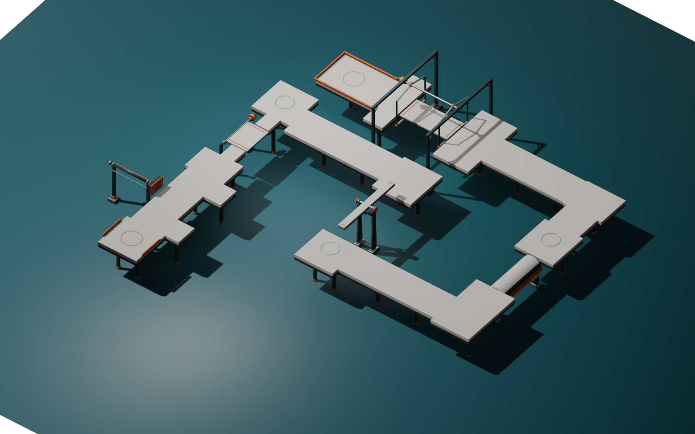

# 第三关“机关试炼”· 静态模型交付

2026-09-14。固定台面、安全岛、转向连接、推墙等待袋、护栏与支撑已按LEVEL统一布局制作并导出。五种机关复用已有共享库，以集合实例出现在Blender和制作预览中；本静态GLB不包含它们。**本轮按用户要求没有test/build、自动几何验收或试玩；模型图不是实际通关或动力通过证据。**

## 当前长窄板与45°吊桥接岸（intense-v2）

当前制作几何源 `3e3e7b8681b2ee066c42d76bd2454a4fee03010bb34904d1e0909e8e7256c44a`。跷跷板7米长/.7米宽，轴心Y4.743217748；两端岸内沿localZ±3.39，入口岛Z[-5.85,-1.39]、CP2岛Z[5.39,9.35]，CP7保持。止挡/窄轴架和接岸按同一数据配套。

吊桥45°/3秒，塔柱±4.35/横梁8.94，入口宽6.8，出口两翼扩至Z[-14.4,-13]和[-9,-7.6]。为给新门架留空间，仅将trapdoor-to-seesaw-link及其两支撑中心Z从-5.2移到-4。其余整体路线和三个CP保持。21面/5栏/33撑数量不变，12独立低垫中的对应库脚位置和足印同步。

当前源、同名GLB和两张制作预览已更新交CODE/LEVEL。LEVEL已成套恢复track引用，最终TS SHA为 `4e2f616d2c3ad2497c8a8e4eb227ad2ca931de92b093a6a9182a2fa4a16d2c3d`，当前JSON元数据SHA为 `ef42244e2ca0569873a6e72b4b9efebc201fb136e1ac90860ff7715309d6fded`；制作几何快照3e3e7b86不变。下文初版历史哈希仅作来源，不代表本轮。未运行测试、构建、扫掠验收或试玩。

## 文件与坐标

- [mechanism-trial.blend](../../art/mechanism-trial.blend)：唯一第三关源文件，首次创建后原位维护，无版本后缀或备份。五机关通过obstacle-library.blend的链接集合实例复用，保持该文件同目录可访问；编辑台面、支撑与护栏在本源内完成，机关本体仍由共享库维护。
- [mechanism-trial-track.glb](../../public/models/mechanism-trial-track.glb)：唯一静态GLB，节点 **TrackStatic**，世界原点 **[0,0,0]**，旋转identity、缩放[1,1,1]。完整尺寸 **36.800×4.0815×33.750米**；包围盒min≈[-20.800,-.400,-15.750]，max≈[16.000,3.6815,18.000]。**42,792三角面 / 5材质 / 794,956字节**。
- [mechanism-trial-report.json](../../art/mechanism-trial-report.json)：导出统计、制作数据校验值、库实例位姿、12个小脚垫、三层平面构造信息与未验证状态。
- [mechanism_trial_assets.py](../../art/mechanism_trial_assets.py)：本次制作脚本，读取唯一LEVEL JSON；检测到第三关源/GLB已存在就拒绝重新创建，后续须依据当前文件定向编辑。

单位米，尺寸按完整X/Y/Z。glTF/游戏+Y向上，Blender为Z-up，游戏(x,y,z)对应Blender(x,-z,y)。台面顶Y3.4，五库根Y0保持；动态原点仍按[共享库交付](obstacle-library-delivery.md)。实例行进方向由库默认-Z与各自yaw共同决定。GLB仅用于外观，不从模型自动生成玩法碰撞。

## 已制作静态内容

- **21个台面控制体**：入口、推墙通道及两个侧袋、翻板观察岛和两舌、CP1岛、跷跷板前后岛、CP2岛、滚筒前后岛、CP3岛、北侧转向、吊桥前岛与终点，以及对应L形/折返连接。控制体保留独立可编辑，几何位置来自LEVEL。
- **5段护栏**：入口两栏和终点三栏，依原给定尺寸收口，含固定件，不延长越过转角。
- **33组台面支撑**：按指定positionXZ与顶限Y2.83布置，同款脚垫、合金脚板、立柱、橙套环、上法兰、斜撑和锚钉，脚底Y-.4。
- **12个独立库脚下垫座**：只在各库静态脚实际足印下从Y-.4接至0，没有在动板或翻板缺口下铺连续底板，也没有移动机关根高度。

白台面、橙夹层、深灰底座分别通过“二维约束三角化→按原多边形覆盖筛选→挤出”形成连续面，未采用长链共面Boolean。白层Y3.10–3.40，夹层Y3.0625–3.1075，底座Y2.83–3.07；层间交接仅用于外观，原台面代理仍由LEVEL保存。三层沿原台面轮廓收边，尤其吊桥岸口不把底架延入缺口。

继续第一关象牙色台面、橙色识别件、石墨结构、合金固定件、深色脚垫，不制作新主题。5种材质为Ivory polymer、Safety terracotta、Graphite chassis、Brushed alloy、Rubber pads；不新增外部贴图或解码器。

## 五机关装配引用

- PistonWall：根[-14,0,10]，yaw0°，向-Z通行。通道宽3.2、长8，等待袋按JSON实际补齐，危险带对侧不铺连通旁路。
- TimedTrapdoor：根[-14,0,0]，yaw0°。两舌在机关局部X[-.4,1.0]、|Z|1.62至3.2；宽岛从|Z|3.2开始，给现库侧铰轴和驱动器留位置。
- WeightSeesaw：根[0,0,2]，yaw180°，向+Z通行。前后完整固定岛保留，源预览采用库中性水平姿态，未烘焙负载动作。
- AxialRoller：根[14,0,0]，yaw0°。两岸接在Z±2.62，岸下底架Y≥2.83；指定轴承区域不增加柱，现有轴承与轴仍属于库。
- SwayCradleBridge：根[-3,0,-11]，yaw90°，向-X通行。吊篮、上轴、门架全来自同一库根，岸口不填平动桥缺口。

全部scale=[1,1,1]，只引用现有obstacle-library.glb一份资源，不为各实例复制GLB。本源中的Runtime references集合包含链接机关和圆环位置参照，不纳入静态导出；水面在保存/导出完成后只为PNG加入，源与GLB都没有池水或池体。3CP、起终点圈与实际环境由运行时创建。

## 预览与来源

[整体斜视](mechanism-trial-preview.png) / [完整俯视](mechanism-trial-top.png) 均为Blender制作图，五机关为零姿态装配参照，不代表游戏启动时相位或已可通行。

首份LEVEL几何交接SHA为 `0a378e8b4dd0b9f603eb2e836ed1c7e17f135beb6cacaae37583802adf6d6e69`。脚本实际开读时JSON已补充CODE映射，制作快照采用 `88e82fc3fce516f53c6b7716d4b7c9edecc955b5dac6b53eb417dca4ccbad0fa`；LEVEL说明台面/栏/支撑与五根位姿未变化。报告将制作快照与后续元数据校验值分开保存，不因正式TS/状态字段更新自动重导。

- 源文件SHA-256：`02c615c12777f8c9ab3cd629db1b4a6888d3df9eb151df15854799bf3d94a3b0`。
- 静态GLB SHA-256：`5d56e7739479d8ba62b89e0c926421ff368ed53976ad3938c92b68946e4f8a5f`。
- 复用库GLB SHA-256：`8281551e662b13d240a1f5ffa64bcfb43d3687cc37ddd0ae605e28f8575f4b68`。

## 接入与未验证项

LEVEL已完成正式配置 [mechanism-trial.ts](../../src/levels/mechanism-trial.ts)，SHA-256为 `9cc37be109d846a81410ce91ac15d105af176a122c4d0eef4b291342681f60bb`，引用当前静态GLB。当前JSON状态/配置元数据SHA-256为 `6e20eb124a4df07c80ccb973863c46c0f07b0f2982824bd4ebdc86f398609929`；制作几何快照仍为88e82fc3，模型未重导。LEVEL回传五类行为已由CODE实现，正式配置已交CODE注册第三关；此状态交接不代表通过运行或通关验收。

已将同名静态资源、节点及校验值直接交CODE/LEVEL，按[第三关协议](../integration/level-03-contract.md)使用visuals.track；不等本文排版才交接。正式TS与第三关入口/动力由对应任务完成，本任务不修改这些文件，也不把美术完成写成第三关可玩性通过。

五种动力、接触/全行程、接缝通行、检查点重生和手机体验均未在本轮实测。建模只完成必要API阅读、部件构造、GLB导出统计和制作预览，未运行自动验证或测试构建。没有Git写操作、推送或部署。

按统筹插入的明确修复授权，第二关白层缺面已另在原文件修复，见[原交付追加](water-rush-delivery.md)及[修复预览](water-rush-surface-repair.png)；这不是第三关生成器重建旧关卡。第一关与五机关库文件保持，用户原Blender未保存窗口没有重载或保存。
