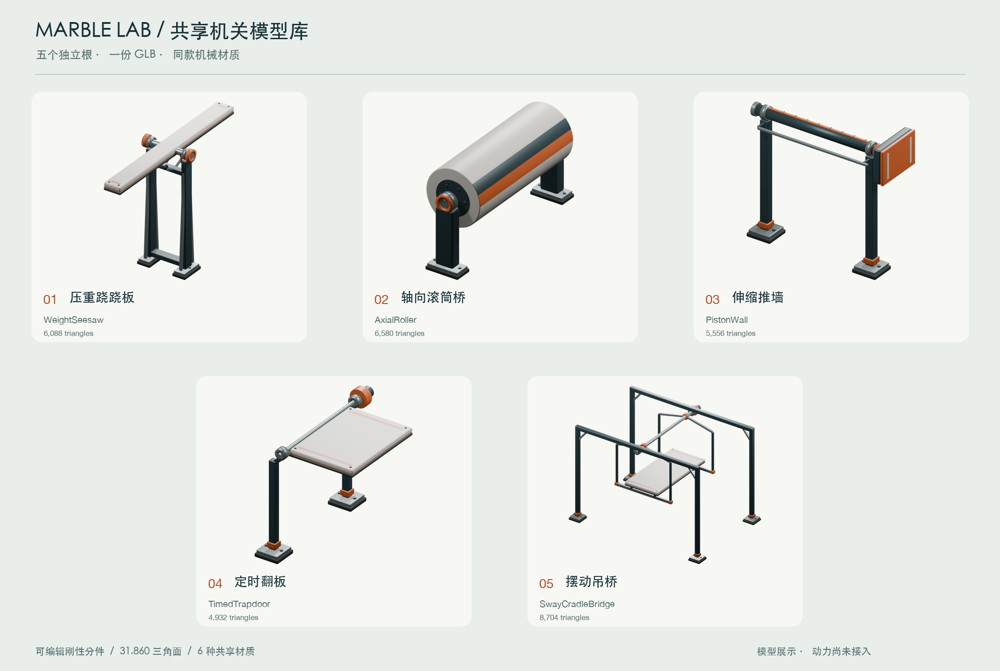

# 五机关共享模型库 · 美术交付

2026-09-14。五项实际可编辑模型已完成，统一在一个Blender源文件和一个GLB内，按稳定根名分别取用。共享6种材质，保留动静分件、真实枢轴和独立活塞杆。**本任务只负责模型与资源协议；CODE已另行接入动力、加载器与图鉴，具体能力以代码交付为准；未运行test/build、自动几何验收或浏览器试玩。**

## 本轮长窄板与45°吊桥（intense-v2）

按LEVEL冻结几何 `3e3e7b8681b2ee066c42d76bd2454a4fee03010bb34904d1e0909e8e7256c44a` 定向修改当前源。跷跷板主体 **[.7,.30,7]**，板心=Pivot，X轴心Y **4.743217748**，±25°；柱X±.75、脚印.54×1、簧壳X±.93、spindle1.98、pointer±.53，carrier宽1.25/顶≤h−.70。止挡中心X±.22、Y4.287254320、Z±.504576409，尺寸[.1,.1,.16]、Rx±25°。主体质量候选.65、弹簧4/阻尼3由CODE实施，玩家参数保持。

吊桥采用 **45°/3秒**，原Pivot/Deck/Hanger及动U架保持，塔X±4.35、横梁8.94宽、脚印.8×.8；完整外观宽9.5米。岸宽6.8与邻接连接道局部平移由第三关静态配套。两项中位/极值PNG及拼图更新；其余三项模型和图片未改。

推墙外观本轮未修改，只在parts的 **PistonWall_Rod** 新增 **collisionRadius:.08** 米；缸口position、extensionAxis[1,0,0]、referenceLength:.3保持，不给杆添加主bodySize。CODE已实现同源位姿控制伸缩杆碰撞及显示，实际效果未经本轮测试。

## 唯一资源与制作场景

- [obstacle-library.blend](../../art/obstacle-library.blend)：当前字节数见文件；Library assets场景包含五个规范集合/根及独立装配参考，Library display场景通过集合实例排开，方便编辑，不复制五套网格。
- [obstacle-library.glb](../../public/models/obstacle-library.glb)：**619,092字节，31,860三角面，18个语义网格，6种共享PBR材质**。一个默认scene、五个独立顶级根，未焊合不同机关或活动件。
- [obstacle-library.json](../../public/models/obstacle-library.json)：小型的小清单，包含五个稳定id、根名、完整关键节点相对路径、局部TRS、轴心、候选主体尺寸、各子树包围盒/材质/面数、未实施design参数与runtimeSupported:false。
- [obstacle_library_assets.py](../../art/obstacle_library_assets.py)：本次程序建模/导出脚本。首次创建后拒绝覆盖已有库；维护使用当前保存源，--finish-current路径只从现有文件导出并做已知局部装配调整，不重新搭建或覆盖其他资产。运行前仍需核对窗口未保存内容与清单哈希，不根据时间戳判断安全。

当前GUI仍是用户带未保存标记的water-rush.blend，本任务未载入、保存、关闭或覆盖该窗口；库由独立后台Blender制作。已有两关和图鉴资源未迁移、未覆盖，没有生成版本后缀或备份文件，没有Git写入/推送或服务器操作。

## 坐标、原点和材质

统一米制，尺寸为完整 **X/Y/Z**，glTF **+Y向上、-Z为默认行进方向**；Blender为Z-up，游戏(x,y,z)对应Blender(x,-z,y)。每个GLB顶级根位置[0,0,0]、旋转identity、缩放[1,1,1]；Y0是共同装配基准，固定岸参考顶高Y3.4。将来接到岸高H时，只把实例根Y设为H−3.4。

五根在运行包内独立但共享局部装配坐标，不能直接把整包五根同时显示。陈列偏移只在源文件展示场景的集合实例上；两岸、推墙地面/等待袋只保留在Assembly references中，不导进GLB。GLB没有水面、陈列地面、标牌、CP圆环、相机/灯光、皮肤骨骼、动画片段或物理脚本。

共用第一关同款Ivory polymer、Graphite chassis、Safety terracotta、Brushed alloy、Rubber pads、Printed markings。保留少量倒角、紧固件、轴承圈和指示刻度；滚筒条纹通过圆筒同面材质分区，不加凸齿。没有外部贴图、纹理下载或额外解码器。

统计口径：每项三角面为该根完整子树之和，材质数按该子树去重；整包6材质为全包去重，不能相加五项材质数。parts的父组统计已经包含子组，不能再与叶组累计。清单geometryBufferBytes按子树去重的bufferView字节统计，不含JSON/材质描述等包开销，不是各机关独立GLB的文件大小。下列完整尺寸为零姿态包围盒，包含轴座、脚座等；不是碰撞主体、扫掠边界或玩法代理。

## 五项节点与尺寸

1. **压重跷跷板 / weight-seesaw / WeightSeesaw**：主体板 **0.7×.30×7米**，完整外观约 **2.040×4.983×7.000米**，**6,088三角面 / 6材质**。Static下Base和AxleFrame，Pivot下DeckVisual；Pivot=[0,4.743217748,0]、绕X。高度按h=3.4+3.5sin25°−.15cos25°，以0°水平板导出。静架有同轴弹簧/阻尼壳、板下限位块；板、内轴、指针同动。候选±25°、质量.65及弹簧4/阻尼3只记design，未实施重量反馈。
2. **轴向滚筒桥 / axial-roller / AxialRoller**：圆柱主体 **2×2×5米、R1米**，完整外观约 **2.000×3.400×6.250米**，**6,580三角面 / 5材质**。Static下BearingNear/Far，Rotor下DrumVisual；Rotor=[0,2.4,0]、绕Z。筒面及端轴同动，外轴承静止，冠部Y3.4。候选角速度−.45rad/s对应顶面朝+X，不代表引擎已产生切向接触。
3. **伸缩推墙 / piston-wall / PistonWall**：推头主体 **.35×1.1×1.6米**，回收装配完整约 **4.958×4.500×1.600米**，**5,556三角面 / 6材质**。Static下CylinderBody/Guide，Head和Rod为根下独立兄弟节点。Head=[−2.025,3.95,0]，全伸中心[1.675,3.95,0]，行程3.7；HeadVisual前面朝+X，含薄面部识别条与后耦合件的完整头厚约.388米，主体仍.35。Rod固定缸口[−2.5,3.95,0]，RodShaft网格从局部X0到.30、半径.08、导出scale1；仅Shaft沿X按(.30+3.70u)/.30伸长，u∈[0,1]。全伸露杆长4米，不能把杆再跟Head平移。缸壳X=[−6.7,−2.5]，内/外半径.10/.16；端盖及接头不被轴向拉长。
4. **定时翻板 / timed-trapdoor / TimedTrapdoor**：板主体 **2.2×.24×3米**，闭合完整约 **2.880×3.700×4.730米**，**4,932三角面 / 5材质**。Static下AxleFrame/Drive，Pivot下DeckVisual；Pivot=[−1.1,3.4,0]，板心相对[1.1,−.12,0]，绕Z从0到−90°。板及底部夹层整体翻到左侧，没有静态补洞底板。全开主体中心[−1.22,2.3,0]；候选8.5秒周期只作design记录。
5. **摆动吊桥 / sway-cradle-bridge / SwayCradleBridge**：板主体 **2.4×.24×5米**，中位完整约 **9.500×6.400×6.800米**，**8,704三角面 / 5材质**。Static下GantryNear/Far/UpperAxle，Pivot下HangerVisual/DeckVisual。Pivot=[0,6.08,0]、绕Z，板心相对[0,−2.8,0]；L2.8是轴到板心距离，不是每根吊杆长度。两端刚性U架侧臂X±1.95，板下横向连接件顶Y相对上轴−3.11，未在台面高度做宽翼。候选±45°/3秒整体横摆与倾角耦合，不模拟软绳。

关键动态子树统计：跷跷板Pivot **1,696面/4材质**；滚筒Rotor **4,348面/4材质**；推头Head **812面/4材质**，杆Rod **124面/1材质**；翻板Pivot **1,480面/4材质**；吊桥Pivot **3,556面/4材质**。各静组、叶网格的完整局部尺寸/bounds/TRS见清单parts。

## 独立预览与装配姿态

以下PNG由实际Blender模型生成。姿态只用于显示装配，不写入GLB动画，也不保存成源场景的默认动作；图片中的固定岸和袋区是未导出的参照。

- 跷跷板：[水平](obstacle-library/weight-seesaw.png)、[+25°入口低](obstacle-library/weight-seesaw-positive.png)、[−25°出口低](obstacle-library/weight-seesaw-negative.png)。
- 滚筒：[零位圆柱及轴承](obstacle-library/axial-roller.png)。
- 推墙：[回收](obstacle-library/piston-wall.png)、[全伸及等待袋参照](obstacle-library/piston-wall-extended.png)。
- 翻板：[闭合](obstacle-library/timed-trapdoor.png)、[−90°全开](obstacle-library/timed-trapdoor-negative.png)。
- 吊桥：[中位](obstacle-library/sway-cradle-bridge.png)、[+45°](obstacle-library/sway-cradle-bridge-positive.png)、[−45°](obstacle-library/sway-cradle-bridge-negative.png)。
- [五项整体拼图](obstacle-library/overview.png)。单项图片按各自外观取景，拼图不是五项同一比例尺对照。

## 校验值与后续取用

- obstacle-library.blend SHA-256：`43c336afd41f47bceaa1046d68e73fd335afe932d48e069b9b6a0eac8a40fd91`
- obstacle-library.glb SHA-256：`8281551e662b13d240a1f5ffa64bcfb43d3687cc37ddd0ae605e28f8575f4b68`
- 制作依据new-obstacles.md SHA-256：`426f36479646b79a726a2b928488ecc2c2337b7593384d64e976e6d3354bd50d`
- 制作协议obstacle-library-contract.md SHA-256：`2ba1e0ec4f4b4a232ba91dc681209f27b92a463e39f4bd3bd1b73b5b4adafc12`

后续按 [CODE协议](../integration/obstacle-library-contract.md) 实现整包一次下载/解析、未挂场景模板、仅克隆指定根子树；实例共享mesh/material，不能销毁单个实例时卸载整包。**按名字取用不是网络按字节分块下载，合包也不保证GPU成本或首次加载必然下降。** 本轮只提供资源和协议，不改加载器。

制造过程读取API、转换临时导出网格、对象统计及必要局部修正已完成；没有自动test/build、碰撞/动态扫掠验收或运行时加载测试。真实铰链负载、转筒接触、推墙碰撞、翻板回位、吊桥承托以及手机可玩性均未实现/未测，不能把姿态PNG视为通过证据。

旧water-rush白层缺面已在此前另行获准的任务中修复；本轮intense未修改旧两关，也未保存用户GUI场景。
