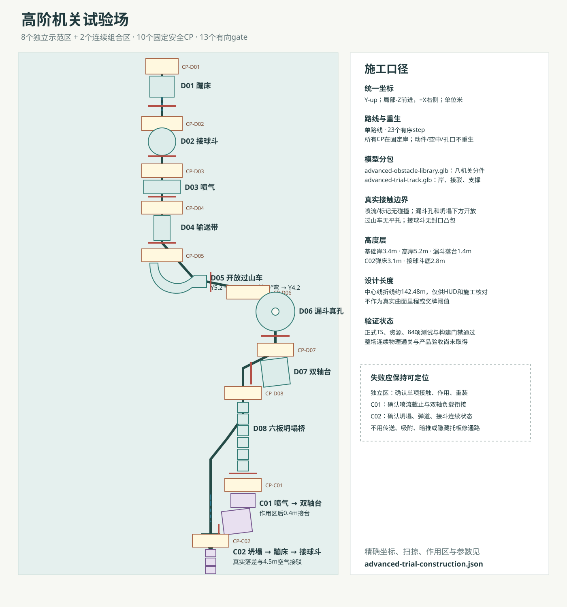

# 高阶机关试验场 · 施工与验证设计

2026-09-14。第一阶段提交 `e5d9025859e918f1f6c98209d5464605c53e377d` 已推送且关联 Actions 全部通过，依据[两阶段执行单](../product/two-stage-release.md)正式启动第二阶段。本关独立 id=`advanced-trial`，标题“高阶机关试验场”，目录编号“试验”，首版规则`standard`，不设置未校准奖牌时间。旧五关与全部历史成绩保留。

精确事实源为[施工JSON](advanced-trial-construction.json)，运行字段遵循[高级八机关协议](../integration/advanced-obstacles-contract.md)。CODE确认运行时实现已通过构建和高级纯函数测试后，LEVEL已交正式[`advanced-trial.ts`](../../src/levels/advanced-trial.ts)：包含测试场固定几何、13个实例、10个安全CP、13个有向gate和单路线。ART已交付并由LEVEL核对`advanced-trial-track.glb`与高级共享库哈希，配置已恢复静态模型引用；运行装配和全路线物理仍以CODE证据为准。

## 难度节奏

前半是八个可单独复现问题的示范区，每区都从固定岸CP开始，出口有有向gate：

1. D01蓄能蹦床：高岸真实下落踩床，飞到固定落台。先验证上表面新接触、冲量去重、边缘衰减和离面重装。
2. D02巡航接球斗：从高岸落入运动凹斗，等待真实dock后离开。先验证落空、留斗、制动与停靠。
3. D03脉冲喷气阵：宽道受横向有限体积力，出口立即收窄。先验证边界力、预告节拍与离区惯性。
4. D04反转输送带桥：6米真实接触带面。先验证正反保持、减速、零速和玩家对抗牵引。
5. D05重力过山车：由Y5.2开放下降至Y3.4，经过R4、32度倾斜90度弯，再升至Y4.2。没有完整环、磁吸、隐藏托底或全局速度例外。
6. D06回旋漏斗：切向进入外圈，真实回旋后从半径.65米开放孔落到Y1.4固定接台，再爬坡离开。
7. D07双轴天平台：入口低边上盘，通过负载改变两轴姿态，从相邻边离开；底座不能变成盘下隐藏承托。
8. D08连锁坍塌桥：六块板承重后依次真实解锁下落，失败回入口固定CP并按协议整组重装。

后半只安排两组连续复测，避免把所有新行为无缓冲堆叠：

- C01“侧风压盘”：喷气作用区结束后仅0.4米固定短舌接双轴台。目标是把横向余速带入双轴负载，定位力区截止、接岸和两轴响应问题。
- C02“塌桥弹接”：坍塌桥出口以可见落差接蹦床，蹦床中心到接球斗目标4.5米，斗dock后再进终点。目标是连续验证承重时序、真实下落、弹道和运动接台；组合入口有独立安全CP。

## 安全路线与冒险近道

本关用于真实物理验收，因此没有绕过机关的捷径。安全路线是每个固定CP后的标准入口；玩家可以在高岸、喷气预告区、输送带岸和坍塌入口观察节拍。风险来自踩蹦床边缘、抢接球斗相位、逆带强冲、过山车外轨高速、漏斗孔口横速过大、双轴盘偏角和坍塌桥停顿。

开放结构允许玩家用更高速度缩短等待或更早切入，但所有近道仍必须穿过该实例出口gate。gate不重生、不重置机关，也不能代替真实接触；组合中的蹦床飞行gate位于空中，后续接球斗dock gate仍是完成组合的最终证明。

## 检查点与重生

10个CP全部位于固定台面：D01-D08各一个，C01/C02各一个。球不会在弹床、斗、带面、曲轨、漏斗孔、双轴盘或坍塌板上重生。普通机关按全局玩法时钟继续，坍塌桥按协议在安全重生或重开时重装；暂停冻结本地机关计划，不补算后台时间。

路线严格按`CP → 本区实例gate`推进，连续组合只有入口CP，内部用多个gate保持顺序。终点要求23个step全部完成。中心线折线参考长度约142.48米，仅用于HUD投影和施工核对，不等同于真实曲面滚动距离或奖牌标定。

## 装配与支撑

所有机关统一局部`-Z`前进、`+X`右侧、Y-up、米制完整尺寸。共享库只放八个机关根与分件，测试场静态GLB只放固定岸、接驳、坡、护轨和落地支撑；水、CP环、作用区与动态件不烘入静态轨道。

施工JSON逐项给出root、入口出口、参数、静动分件、扫掠/作用区和支撑禁区。过山车使用按弧长细分的真实静态代理；漏斗用32方位×3径向带，中央孔保持开放；接球斗用分段凹面，不能用凸包封口。喷流只按球心进入显式体积施力，任何作用区可视标识都没有碰撞。

输送带`tractionForce`原设计没有候选值，LEVEL暂定10N供首轮试玩校准；它低于默认玩家满输入12N量级，但真实滚动、接触与不同灵敏度仍需CODE验证。双轴台合同只有一个`outerFrame`碰撞primitive，施工数据将它定义为真实X轴梁；完整四边外框由GLB显示，不能用大碰撞盒填平内盘。

## 技术门禁与待验收

ART已交付`advanced-obstacle-library.glb`、manifest和`advanced-trial-track.glb`，静态引用已恢复。CODE最终门禁中`npm test` 84/84通过、`npm run build`通过（仅既有大chunk提示），高级关配置与资源哈希和交付记录一致。

自动化技术门禁证明类型、配置结构、资源契约和既有回归检查通过；它没有证明玩家已连续完成整场真实物理路线。八项逐个真实接触/受力、暂停、重开、坍塌安全重生、快速碰撞、全路线以及桌面与小屏操作仍需完整试玩证据，因此当前不能写成产品验收通过。
