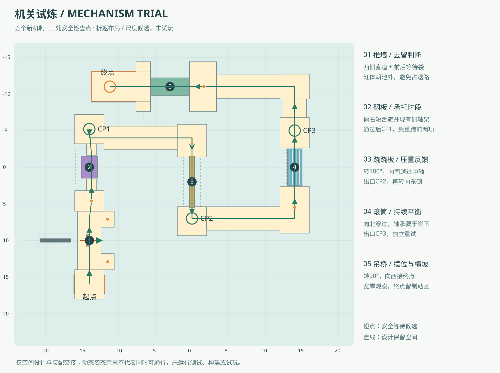

# 机关试炼 · 第三关设计交接

2026-09-14。稳定id `mechanism-trial`，当前已启用 `intense-v2` 分组，保留 `standard/challenge/intense` 历史成绩。本轮杆身碰撞、翻板短停留、7米长窄跷跷板与45°吊桥均已配套，最终状态见文末“intense-v2最终交付”。按[第三关产品任务](../product/level-03.md)，五项全部使用：**推墙→翻板→跷跷板→滚筒→吊桥**。本关采用西、中、东三条纵向路线折返，末段沿北侧横向过桥，不把五项排成直线。

CODE已通知五类行为实际落盘，已按[接入协议](../integration/level-03-contract.md)写入[正式配置](../../src/levels/mechanism-trial.ts)，并引用ART配套静态模型。CODE已在 `src/game/levels.ts` 注册“03 机关试炼”，五项图鉴已关联该关；代码就绪不代表真实动力、通关或难度验证通过。用户要求不自动检查，本轮不test/build/试玩、不Git写、不备份、不改前两关与玩家手感。

## 首张空间俯视

[统一布局JSON](mechanism-trial-layout.json)当前包含21块静态台面、5条起终点短栏、33个静态支撑建议点、5个库实例、3CP、等待点与环境图元。米制Y-up，尺寸完整；共享库五根全scale1，固定岸顶Y3.4，根Y=0。设计图中的动态件是一个参考姿态，不表示所有机关能同时直冲。

## 路线与恢复节奏

1. **推墙**：起点[-14,3.95,16]朝−Z进入西侧通道。推墙根[-14,0,10]，yaw0；缸体向−X伸到池外，头向+X推出。通道宽3.2、Z6→14，前后袋中心[-11.5,3.22,12.9]/[-11.5,3.22,7.1]，各1.8×2.2。危险带Z9.2～10.8的右侧不接连续绕行板。等待袋是真实静态线路，不能误以为共享GLB里已有。
2. **翻板**：推墙后先到[-14,3.4,4.6]固定观察岛，独立重新择时；翻板根[-14,0,0]、yaw0。两舌中心[-13.7,3.22,±2.41]，尺寸[1.4,.36,1.58]，沿−Z通过。通过后到CP1[-14,3.95,-5.2]完整岛，不再重跑推墙/翻板。
3. **跷跷板**：CP1向+X经过10米连接，到[0,−5.2]固定转向区，然后朝+Z。跷跷根[0,0,2]、yaw180，入口岸边Z−1.39、出口岸边Z5.39。入口固定岛长4.46米，可等初始入口端降低；出口CP2[0,3.95,7]，这一项失败只从CP1重试。
4. **滚筒**：CP2向+X经10米连接，到[14,7]固定转向岛，再朝−Z上滚筒。根[14,0,0]、yaw0；筒身沿Z、冠部Y3.4，入口/出口口沿Z±2.62。前岛有足够长度先居中，滚筒后CP3[14,3.95,−5]位于完整4米宽台面。
5. **吊桥**：CP3继续向−Z到[14,−11]固定角台，再向−X经过北侧连接和入口岛。吊桥根[-3,0,−11]、yaw90，入口口沿X−.35、出口口沿X−5.65；转过根后，库局部Z轴成为世界X轴。最后进入8×4米终点岛，终点[-11.2,3.95,−11]，侧栏/端栏只在后段，保留登岸与制动空间。

各新机制之间均有固定恢复区，不把翻板与跷跷、滚筒与吊桥直接首尾相接。首次练习可慢下、重新观察；没有必须靠跳跃或两个机关同时卡相位才能通过的设计意图。实际可通性未验证，以上是正式配置中的设计路线，不表示已通关。

## 库实例与候选动力

实例TRS以JSON `instances` 为准，库内零姿态、主体尺寸、轴与质心偏移读取 `public/models/obstacle-library.json`；正式配置不重复填写一套主体尺寸。五项当前intense-v2值如下（旧阶段参数见文末历史对照）：

- `piston-01` / `piston-wall`：行程3.7，阶段[.9,.45,.22,.65,.25]秒；Rod以缸口局部[-2.5,3.95,0]为原点、参考长.3。预告不能按球位置偷偷延长。
- `trapdoor-01` / `timed-trapdoor`：侧轴绕局部Z从0到−90°，阶段[1.5,.20,.45,.22]秒，预告.45含在闭合1.5中。水平区域露空时没有静态承托。
- `seesaw-01` / `weight-seesaw`：mass.65、restAngle25°、limitAngle25°、spring4、damping3；板长7米/宽.7米、轴高约4.743218。根yaw180后，正局部X倾角仍表示当地入口端低；动态板受球重，不改成定时摆动。
- `roller-01` / `axial-roller`：角速度−4.5rad/s，负局部Z转动使冠部朝世界+X，玩家可向−X纠偏。圆柱必须有实际转动接触，不加暗推力。
- `cradle-01` / `sway-cradle-bridge`：amplitude45°、period3秒，桥面中心与倾角由上轴同源变换。yaw90后局部横向X对应世界−Z，纠偏沿世界Z，不与行驶−X混淆。

时间相位均先0，跷跷不使用时间相位。场内同一时钟可推进全部机关，但关卡不依赖跨机关固定同步过法；各观察岛可等下一轮。球.85、控制力度/刹车/限速/摩擦/重力/镜头均保持，手机只有摇杆和刹车。

## 真实装配与支撑边界

**翻板接岸作了针对当前库的避让。** 当前库的轴架/驱动器不只占3米板长：Static局部Z约−2.51～2.22、侧部X到−.8、Y到3.7。若原样接3.6米宽岸台会让侧驱动器进入台面。现在两短舌在局部X=[−.4,1.0]、|Z|=[1.62,3.2]，宽固定岛从|Z|3.2外开始；让行驶线偏右但仍落在2.2米板面内。不是改库铰点，也不将两端错位用于制造难度。

**滚筒岸下留出轴承。** 筒body长5，实际轴/轴座到局部|Z|3.125，轴承座顶2.71；岸顶3.4/碰撞底3.04。静态轨道底层在局部|Z|2.475～3.125且|X|≤.6范围不低于2.83，不再放重叠撑脚或斜撑，给库轴承留竖向空间。端缝.12仍只是候选，不宣称无需试玩即可过缝。

**吊桥保留整架空间。** 板面宽2.4，实际静架宽5.7、高6.4、Z到−3.54。世界摆放预留以库完整架体为依据，不能只拿板宽计算邻道距离。入口/出口岛内缘离板端.15，底层不能向缺口外扩填桥；门架在两岸外侧，无跨台面低横梁。

JSON的 `designReservedBoundsWorld` 是设计保留空间，不是已运行扫掠验证。库低位轴座与岸台的投影可以重叠，但需有真实竖向净隙。31个 `supportPoints` 给第三关静态支撑位置/上限，均不新增玩法碰撞；ART若因具体库网格冲突可在同一固定台面内移动支撑，不移动路面、根TRS或CP。库脚底Y0与池底−.4之间，可在真实固定脚掌下补小基座，不做整个机关下的大托盘。

水面仅由六个无碰撞Pool图元提供，延续第一关风格；不烘焙进GLB、不加浮力。第三关静态资源仅线路/岸岛/袋区/短栏/支撑，根`TrackStatic`世界原点identity；五机关用原共享GLB实例，既不烘进静态模型也不重新分别导出。

## 可触结构代理与坐标空间

根据库制作脚本的具体杆/座/驱动器尺寸，JSON已列每实例 `staticColliders`：只给可触固定结构的盒或圆柱，不把Static整组AABB变成碰撞，不把空区填上。跷跷轴座/柱、滚筒轴承、推墙缸筒/立柱、翻板侧齿轮/马达和支柱、吊桥门架/上轴分别提供。轴承套的小孔小于球，候选用外圆柱简化；并未执行碰撞或动力验证。

`staticColliders`坐标相对库根，实例yaw由CODE统一变换；不能先转一次世界坐标后再重复转。吊桥另有 `frameColliders`，只用于实际可触的四根侧吊臂、下夹头与两条板下横梁，坐标相对上轴Pivot；不加一个覆盖整架的大盒。主板主体由库清单创建，不在这些数组重复补板。低位连接件可能改变落水前接触，是模型真实结构的表现，不作为隐藏近道托板。

正式字段以[代码类型](../../src/game/library-types.ts)为准：`mechanisms[].id/kind/position/yaw/phaseSeconds/visual/staticColliders`与各类参数。设计JSON的 `candidateParameters/bodySize/pivot`只用于交接说明，实际TS按已支持字段映射；旧platform等不需要填假对象。共享库原清单的未实现状态保留为制作时记录，实际能力另由代码就绪通知说明。

## CP、等待、成绩与未验证项

三个CP均在完整固定岛上，水平触发半径1.35/高度容差1.2，圆环半径.8/中心Y3.46；起点和终点也有各自固定承托。推墙前后袋、翻板前岛、跷跷前岛、滚筒前岛、吊桥前岛提供独立等待位置，具体点见JSON。CP后不重置机关为自动放行姿态；跷跷普通掉落也不应瞬间复位。

新成绩按 `mechanism-trial + intense-v2`独立保存，已有第三关standard/challenge/intense成绩及旧两关成绩保留，不清空设置或记录。奖牌暂不设置金银铜秒数，代码允许省略目录medals；新机关未试玩，不从旧关用时套阈值。进度按四阶段z/z/z/x粗估，转弯与等待不等于累计实际路程。

本次未运行测试、构建、几何检查、浏览器或试玩。待后续实际体验才能判断：推墙窗口、翻板开合接触、跷跷铰链与低端接岸、筒面横向带动、吊桥倾摆承托及手机微调。用户当前要求不以这些检查作为开发落盘前置；也不能把“已写配置/已建模型”表述成通关或平衡通过。

## 文件与交接

- LEVEL：本说明、`mechanism-trial-layout.json`、`mechanism-trial-top-view.svg`与已完成的`src/levels/mechanism-trial.ts`。
- ART：按布局制作唯一`art/mechanism-trial.blend`与`public/models/mechanism-trial-track.glb`；其余库与旧关文件由各自任务维护。
- CODE：五种真实行为、图鉴13项、第三关注册/入口/存档/模型生命周期；不由LEVEL改运行时或页面。

首份尺寸已经发ART/CODE，不等待长报告才开工。共享工程中首页、水面、图鉴及旧蛇形的并行修改保留，本对话只写第三关职责文件。

## 静态资源已配套

ART已按几何源JSON `88e82fc3fce516f53c6b7716d4b7c9edecc955b5dac6b53eb417dca4ccbad0fa` 完成第三关静态，19台面/5栏/31支撑/12个独立库脚垫，库五机关与池水/圆环未烘焙。此处为第三关初版静态历史交付，本轮intense新资源见文末。

- `art/mechanism-trial.blend`：`ea0b0dc7dc67bf5a12e4199e05278f6ff4ea82f0baddbc122599f393b7505e85`。
- `public/models/mechanism-trial-track.glb`：`b115eb499234546aa92c8b1a18c7c04957a802e0ed5e7d9b86821b3166fabda3`，TrackStatic/Y-up/世界原点，40384三角面、5材质、750280字节。
- 预览见 [第三关场景](../art/mechanism-trial-preview.png) 与 [模型俯视](../art/mechanism-trial-top.png)。本轮无几何验收/测试/试玩，模型交付不能当玩法通过。

## 正式配置交接

五类行为收到CODE明确就绪通知后，正式TS已按现有类型落盘。配置SHA256为 `58da1b2af8ef976eb03d71ac650d294c0f78180baaab8c0f175e6e3975055c6e`；JSON状态元数据更新后的SHA256为 `3fc0af707fcf77bd1634f16ab5465c1ffb927abcec7166607f251e6095e09586`。当前intense制作几何源为ea6685ae，早期88e82fc3仅作历史；后续仅状态元数据变化不要求重导。

当前配置包含32个staticObjects（6个无碰撞Pool显示，21台面+5栏真实静态碰撞）、5个新机关实例、3CP与终点，以及具体可触支架代理。`visuals`只指定`mechanism-trial-track.glb`，五机关由共享库加载；没有填旧platform占位，也没有将设计JSON中的重复主体尺寸/轴心塞进新实例字段。正式机制参数保持本设计候选，未因代码接入改变玩家手感。

已将正式文件交CODE注册第三关并衔接首页/继续挑战/成绩保存，CODE已回传注册完成，五项图鉴已关联第三关；登记完成不表示实际通关。按用户要求未运行类型检查、测试、构建、浏览器或试玩；这里仅说明配置与模型接入开发交付，不称已平衡或通过验证。

## 第三关调难 · 2026-09-14

用户反馈初版“完全没有任何难度”。按 [本轮产品任务](../product/level-03-difficulty.md)，本次直接修改当前第三关参数并切换challenge；没有移动路线/CP、修改主体或代理尺寸、改变玩家参数或重导美术。编辑前正式TS与本对话初版交付哈希`9cc37be109d846a81410ce91ac15d105af176a122c4d0eef4b291342681f60bb`一致，设计JSON也与上次交付一致；本次只定向替换指定字段。

### 最终实际参数与意图

- **推墙**：`stages=[.9,.45,.45,.65,.65]`，从8秒缩到3.1秒一轮。完全收回保持+.45预告合计1.35秒，原先4秒；推出从1.6缩到.45秒，行程仍3.7。smoothstep峰速约12.33m/s，这只是运动公式推导，不保证快推无穿透或球必然被推出；未按球接近延长窗口。
- **翻板**：`stages=[1.5,.35,1.5,.6]`，周期3.95秒；`warningSeconds=.45`包含在闭合1.5秒内。稳定闭合未预告段剩1.05秒，迫使玩家在岸上提前组织通过时机；下翻.35秒、回位.6秒，仍保留完整闭合窗口和打开1.5秒。开角仍−90°，真空区不补板。回位接触/弹起是否过强尚未实测。
- **跷跷板**：`spring=10`（原25）、`damping=15`（原55）。减少强恢复和黏滞阻尼，让负载更容易改变板角、连续纠偏更有影响；不保证失误率一定上升。mass4、restAngle8°、limitAngle8°及实际铰轴高度不变，避免用更大限角破坏接岸。
- **滚筒**：`angularSpeed=-1.8rad/s`（原−.45），绝对转速4倍，半径1米对应冠部切向速度1.8m/s；转向与纠偏方向保持。是否产生足够横向带动依赖真实接触，未给球直接侧推。
- **吊桥**：`amplitude=10°`（原9°）、`period=3.6s`（原10s），主要提高频率。桥心中位峰值横向速度由约.276提高到.853m/s；这是桥面运动量，不是玩家速度或通关证明。

### 吊桥为何没有直接采用14–16°

保留现有3.6米岸口，半宽1.8。桥面半宽1.2、半厚.12、上轴到板心2.8米，正摆角A时板体最外侧局部X投影为 `1.2cos(A)+2.92sin(A)`：10°约1.688822，岸口单侧余量约.111178；14°约1.870767、16°约1.958375，分别超出岸口约.071/.158米。因此本次取10°，为原岸口保留投影余量，主要靠周期缩短增加连续纠偏要求，不以伸出岸口代替难度。

该约束是设计选择，不表示14°必然发生实体穿模，也不表示10°已完成全扫掠验证。库静态塔柱的局部|Z|最近约2.74，动夹头到|Z|2.33、主板端2.5；固定塔与动架在Z上分离，不能只比较X向总AABB就断言相撞。上轴/轴套保留原有装配，完整动架和接岸效果本轮未做几何验收或试玩。静态模型不含动桥，所以这次时间参数与限幅修改无需ART重导。

### CODE同步与未经实测边界

CODE回传源码追踪：运动学实体TRS经RigidBody._updateKinematic、AmmoPhysicsBody.setKinematicTarget进入nativeWorld.stepSimulation，包括旋转；未发现中心不动就跳过转动、或每帧teleport清除角差的明确缺陷。吊桥框架与板同枢轴；动态跷跷板读取native角度并仅施加板轴恢复扭矩，hinge限角、motor关闭，未见每帧写角覆盖。**本轮没有据此修物理代码，也不把源码路径存在当作实际带球已验证。**

发现并修复的是图鉴预览仍用默认参数：CODE已让previewLibraryConfig读取当前正式第三关实例，归零展示位置/朝向，保留独立演示时钟；跷跷板预览仍只是姿态示意。目录/存档同步由CODE负责，本对话不改运行时或图鉴。

未运行自动测试、类型检查、构建、几何检查或试玩，没有Git写入/部署。当前结果是“实际参数已提高，图鉴已按CODE回传跟随配置”；手机纠偏、快速推墙接触、翻板返程、跷跷回位和完整路线难度仍未经本轮实测，不宣称已平衡。

## 再次加强 · intense（2026-09-14）

用户再次反馈五项不够刺激，本轮按 [快动作与真实失衡](../product/level-03-intense.md) 执行，覆盖上轮“只改参数、不改模型”的限制。CODE已支持intense与「极限挑战」标签；旧standard/challenge桶和所有设置保留，不增加第四关。图鉴继续读正式配置，不将模型制作清单的历史implemented状态当开关。

**快动作已落盘：** 推墙阶段[.9,.45,.22,.65,.25]，实际推出.22秒/回收.25秒；翻板阶段[1.5,.20,1.5,.22]，下翻.20秒、回位到闭合.22秒、闭合停留仍1.5秒、预告.45包含其中；滚筒−4.5rad/s，是上一轮−1.8的2.5倍。推出/回位没有误改成停留时间。

CODE指出运动学目标按渲染帧更新，不能用内部1/120物理子步假称目标已逐子步细分。.22秒推出smoothstep峰速约25.23m/s，30Hz目标差约.841米、20Hz约1.261米，而头厚.35+球径.85合计1.20米；还要考虑球的相向运动。采用候选范围上沿.22比.18稍留余量，但不保证低帧下不漏扫。未改世界步进、球CCD、摩擦或直接加推球力。

### 已与ART冻结的跷跷板结构

- 主体从[2.2,.30,5]变为 **[1,.30,5]**，所有板层同步收窄，板心=Pivot，局部X轴不变；根仍[0,0,2]/yaw180，不用偏心轴。
- restAngle/limitAngle均 **25°**，mass **1.2**、spring **4**、damping **3**。仅缩宽不降低绕X轴惯量，所以同时减质量。均匀盒模型Ixx由约8.363降至2.509kg·m²；球质量1、g16，板端准静态力矩约36.25N·m，双极最大扭簧恢复约3.49N·m。此为设计推导，未模拟负载或通关。
- 枢轴 `h=3.4+2.5sin25°−.15cos25°=4.320599486296251`。两端低位顶Y3.4、高端顶约5.513091；板底扫掠最低约3.128108。中位抬高并不表示必须跳上板，入口须等+25°低端，越过中心后用负载压低出口。
- 低位端顶投影|Z|=2.329162，岸内沿设|Z|=2.48，名义缝.150838。实例yaw180后入口岛南边Z−.65→−.48、出口CP2岛北边4.65→4.48；其他外边与CP中心[0,3.95,7]不动。近中位板投影略超过岸边，但板在上方；不是加隐藏水平板或把低端埋入岸面，实际接触仍未验证。
- 轴柱X±.9、宽.2，轴承r.20/长.18，簧壳X±1.08/r.24/长.14，转轴长2.28；指针同步换25°刻度。脚印中心X±.9，尺寸.64×1米，库脚底Y0，第三关垫座只在新脚掌下承接−.4→0。
- 旧±.84位置的8°止挡/支架撤下。四个新橡胶止挡尺寸[.10,.10,.16]，X±.32，中心Y=3.8646360587574664、Z±.5045764092256826，rotationX随Z符号为±25°；顶接触面与极值板底同角。止挡承载梁顶≤h−.70，不能用旧限位卡住新板。

### 已冻结的25°吊桥与接岸

- amplitude **25°**、period **3秒**；主板[2.4,.24,5]、Pivot[0,6.08,0]、板心偏移[0,−2.8,0]和动U架保持。根仍[-3,0,−11]/yaw90，全部动架按同一枢轴变换，不暗加摇晃力。
- 门架塔柱局部X从±2.45移到 **±3.8**、宽.24，顶部portal宽 **7.84**，两端Z±2.86、高度保持；角撑、门架脚和第三关12个库脚垫中对应4脚一起移位。根名和可寻址路径保持。
- 25°时板外侧投影约2.321615米；入口岸宽 **6米**，半宽3给出约.678米投影余量，不再被旧3.6米口限回10°。动架保守横向投影约3.2574，设计预留±3.35，塔柱内沿±3.68再留.33米预算；这不是已完成的网格扫掠验收。
- 入口`cradle-entry-island`尺寸由[3.7,.36,3.6]改[3.7,.36,6]。出口在原finish岛前端补两块2×1米翼：世界X=[−7.65,−5.65]、Z=[−14,−13]及[−9,−8]，均顶3.4。原终点与CP不动，翼与旧台面共边，不另铺桥下托面。
- 新翼支撑点[-6.6,−13.55]、[-6.6,−8.45]，原31点不变，总33点。宽岸仅给择时登离的空间，倾斜时的岸高差真实保留，玩家仍要判断中位；不承诺25°任意时刻都能下桥。

### 配套阶段与文件责任

完整制作JSON冻结SHA为 `ea6685ae3accc0aa364eb6b56fad657208388e917f5c5062cf5ec7c634089969`，含`intenseAssetRequirements`、新staticColliders、两岸和两翼。ART已接受.30厚方案并负责当前共享库/manifest和第三关同名静态GLB定向更新；旧两关与其余三个库模型保留。21台面/5栏/33支撑、三CP，整体路线不变。

收到ART新manifest/共享GLB及第三关静态交付后，正式TS现已同步全部25°参数、代理、岸口，并恢复精细静态引用；此阶段为开发配套完成，未验证玩法。按用户要求不test/build/typecheck/试玩，不Git/部署；后续状态只说明开发交付，未宣称难度平衡或通关。

## intense最终交付

本批开发与模型配套完成，最终正式TS SHA256 `58da1b2af8ef976eb03d71ac650d294c0f78180baaab8c0f175e6e3975055c6e`；当前JSON SHA256 `3fc0af707fcf77bd1634f16ab5465c1ffb927abcec7166607f251e6095e09586`。五项快动作/25°参数和新代理/岸口全部已映射，21台面+5栏、33支撑与三个原CP，根位置/yaw及玩家参数保持。

- 共享库源：`375e74335958a9b8b49057b1d6cb3ed23df2f663f337106ea6454196359370ea`。
- 共享GLB：`3d7bcd0b04d907e409354b440bdbf543fe3b8356157b9eb7d9cdf1921437c40a`，31860三角面、6材质、618608字节。manifest中的跷跷轴高约4.320599556是glTF浮点表示；模型协议仍板心=轴心、offset0、轴X。
- 第三关源：`946c3b3762e99aa86e369c21d6d4ca567acb2ec0ba29115ce5f02155a604ed9e`。
- 第三关静态GLB：`77a2fdfad5f1e1e82d5cdf02fb0fedaa6a33232d0b2f6a28f12aa9598c2f641c`，42792三角面、5材质、795296字节；已在正式配置恢复引用。

ART制作依据保留ea6685ae，后续JSON仅状态、现模型包围盒快照与哈希同步，不需因其新摘要重导。库其余三个模型、旧两关未因本轮被LEVEL修改。CODE已支持intense存储标签、预览读正式配置，更新两项缩略图及基础回退对明确代理的读取。

无自动测试、构建、类型检查、浏览器或试玩，无Git/部署。快推与快合板低帧漏扫/回弹、跷跷真实负载与两岸接驳、吊橋倾摆的手机体验均未验；没有明确证据要求修改世界步进或玩家CCD，本次未用暗推/强绑制造难度。

## 杆身碰撞、长窄板与45°吊桥（2026-09-14）

本节依据 [四项细化要求](../product/level-03-refinements.md)，覆盖前文intense阶段的对应值。规则intense-v2已获CODE支持并落盘；翻板第三阶段打开停留已从1.5改.45，完整阶段为[1.5,.20,.45,.22]，预告.45仍含闭合1.5。推墙阶段[.9,.45,.22,.65,.25]与滚筒−4.5保持；本轮没有再改快动作或玩家参数。

### 长窄跷跷板已冻结

主体 **[.7,.30,7]**，比上一版长2米、窄.3米，板心=Pivot、局部X轴与±25°保持。新轴高 `3.4+3.5sin25°−.15cos25°=4.743217748036951`，低端顶Y3.4，端顶投影|Z|3.23546999388938。岸内沿|Z| **3.39**，名义缝 **.154530**；root仍[0,0,2]/yaw180，实际入口岛Z=[−5.85,−1.39]、出口岛Z=[5.39,9.35]，三个CP位置不动。低端在极值接岸，中位板抬高，需等低端进入，不增加隐形桥或跳跃按钮。

仅加长会让质量1.2下的X惯量由2.509增至4.909kg·m²。采用CODE推导的 **mass=.65**，Ixx≈2.659，接近原响应量级；spring4/damping3/rest25/limit25保持。球端准静态负载矩约50.75N·m，但真实球负载同时改变有效惯量，不能据公式承诺响应速度或通关。

轴柱X±.75/宽.20，轴承r.20/长.18，簧壳X±.93/r.24/长.14，spindle长1.98、指针X±.53。脚印.54×1米中心X±.75；carrier宽1.25、顶≤新h−.70。止挡四块X±.22、Y4.287254320498167、Z±.5045764092256826、Rx随Z±25°、尺寸[.10,.10,.16]；全部收在.7米板投影内，不能留下旧宽轴架/止挡撑出假宽板。

### 45°吊桥与邻道避让已冻结

摆幅 **45°**、周期仍3秒，原根/Pivot/板心偏移/板体/U架保持。根据原完整动组包络，45°处横向保守投影 `(2.06+3.29)/sqrt(2)≈3.783021`，不只看2.4米主板。静塔X由±3.8移 **±4.35**，塔内沿±4.23，portal宽 **8.94**、角撑和脚同移；动组横向预算±3.9。完整Y保留预算约2.2～7.8米，未执行网格扫掠验证。

板体45°的横向投影约2.91328；岸口扩大到 **6.8米**，半宽3.4。入口岛仍原中心[1.5,3.22,−11]；出口两翼同X=[−7.65,−5.65]，Z扩到[−14.4,−13]/[−9,−7.6]，旧翼支撑仍在新翼内，未新增检查点。

门架变宽后，南侧塔会靠近原CP1→跷跷连接道，因此只把`trapdoor-to-seesaw-link`中心Z从−5.2移到 **−4**，该段两个撑点一同移动。CP1仍[−14,3.95,−5.2]，在完整岛内先向Z−4调整再向+X；它与新跷跷入口保持可连接。新塔柱最近面与这段3.2米宽路的北缘留约.93米设计间隔，不以穿模凑45°。

### 杆身碰撞与阶段边界

CODE负责读取manifest的缸口、referenceLength、extensionAxis与collisionRadius=.08，给真实露杆建立随长度变化的碰撞；不得把一根全行程静态长杆留在回收后的空区，也不能仅缩放Render。碰撞原点/半径由CODE与ART合同维护，本关不另写硬编码杆代理。

冻结制作JSON SHA为 `3e3e7b8681b2ee066c42d76bd2454a4fee03010bb34904d1e0909e8e7256c44a`，21面/5栏/33支撑，包含新岸/轴架/止挡/门架代理与绘图路径。ART已完成当前共享库/manifest及第三关同名静态；新轴高、45°参数、具体代理和接岸均已同步正式TS，精细轨道引用已恢复。此为开发配套完成，不是运行验证通过。旧两关、玩家参数和三CP保留。

本轮未test/build/typecheck/试玩、未Git/部署。候选装配、负载/完整动力和实际接岸效果仍未经运行验证。

## intense-v2最终交付

最终正式TS SHA256 `4e2f616d2c3ad2497c8a8e4eb227ad2ca931de92b093a6a9182a2fa4a16d2c3d`；当前JSON SHA256 `ef42244e2ca0569873a6e72b4b9efebc201fb136e1ac90860ff7715309d6fded`。模型制作几何源保留 `3e3e7b8681b2ee066c42d76bd2454a4fee03010bb34904d1e0909e8e7256c44a`，后续仅状态/现模型bounds/哈希元数据变化，不要求重导。

- 新库源：`43c336afd41f47bceaa1046d68e73fd335afe932d48e069b9b6a0eac8a40fd91`。
- 新共享GLB：`8281551e662b13d240a1f5ffa64bcfb43d3687cc37ddd0ae605e28f8575f4b68`，31860面、6材质、619092字节；当前manifest提供7×.7×.3板、4.743217748轴高、Rod collisionRadius=.08。
- 新第三关源：`02c615c12777f8c9ab3cd629db1b4a6888d3df9eb151df15854799bf3d94a3b0`。
- 新第三关静态GLB：`5d56e7739479d8ba62b89e0c926421ff368ed53976ad3938c92b68946e4f8a5f`，42792面、5材质、794956字节，TrackStatic世界原点；已恢复正式track引用。

CODE已回传杆身真实伸缩碰撞实现完成：复用一个运动学圆柱与原生shape，setLocalScaling沿轴改变.3→4→.3米露杆长度，中心取缸口与Head后缘中点，半径读Rod.collisionRadius=.08；world.updateSingleAabb同步更新推出与回收，模型失败仍保留基础杆和碰撞，不逐帧重建collision.height或遗留静态长柱。生命周期/端点回归用例已写但未运行；动态变形接触和低帧扫掠仍未实测。两项图鉴缩略图已跟新模型更新。LEVEL只映射现有字段，没有另加一根覆盖全行程的静态杆。

本批四项开发完成，21台面/5栏/33支撑/三CP保持数量，局部两岸、门架和连接道已配套。用户推墙节奏、滚筒转速、小球手感和旧两关保留。无自动检查、类型构建、测试、试玩、Git或部署；杆碰撞实际接触、长板负载响应、45°接岸及整关可玩性仍未运行验证，不能把开发交付写成验收通过。
