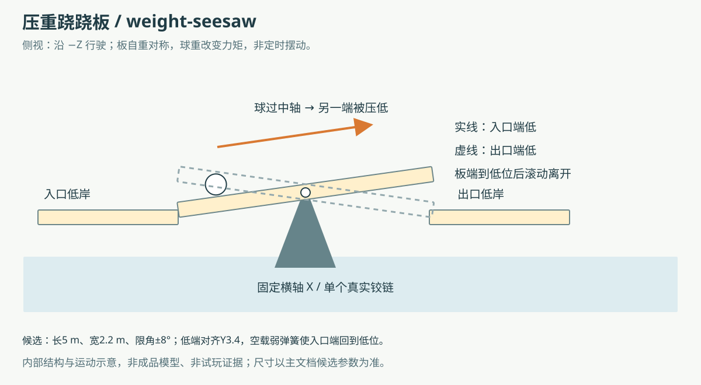
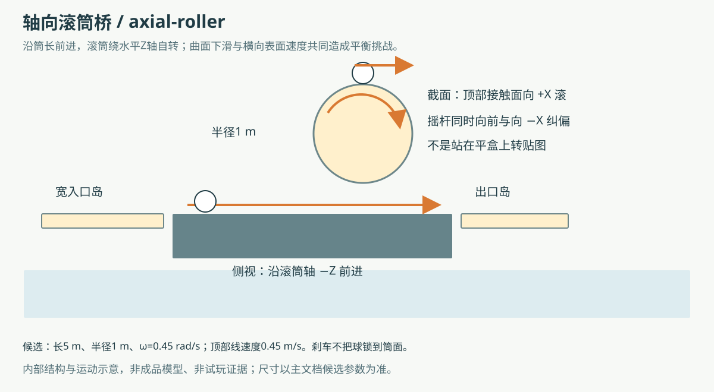
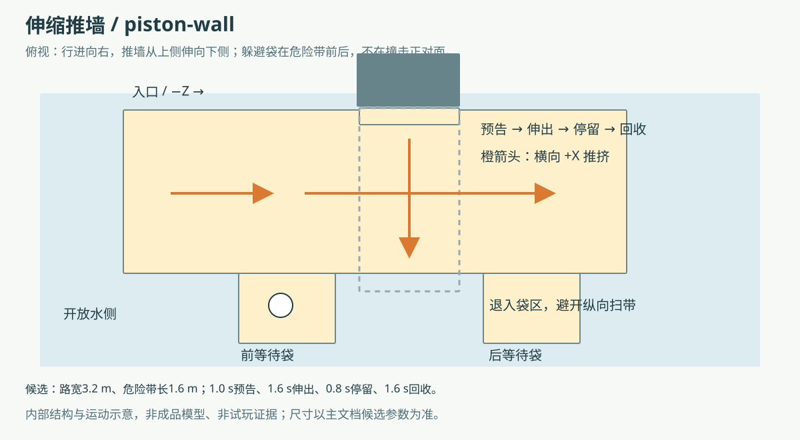
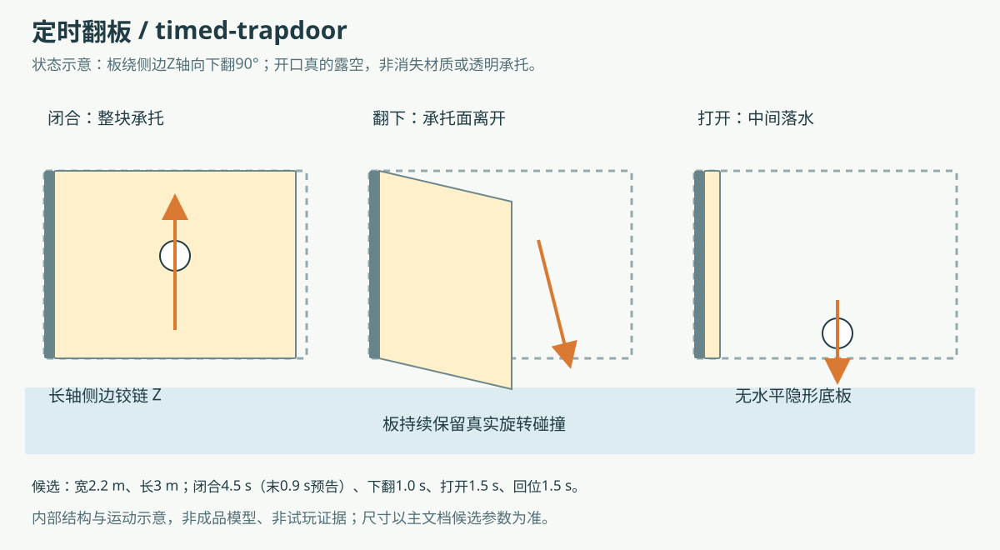
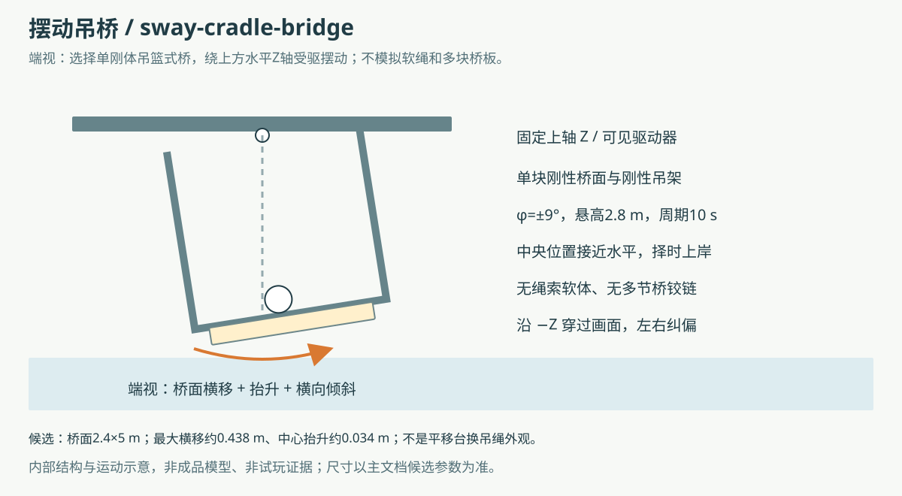

# 新机关设计 · 内部方案

日期：2026-09-14。任务来源：[产品任务](../product/new-obstacle-designs.md)。本次交付五个设计与五张结构示意，**推荐先做伸缩推墙、定时翻板**；其余按重量反馈、滚动曲面与吊挂倾摆三个方向补充玩法。

五项玩法均未实现、未试玩；用户随后已授权五项统一建模，制作范围见 [共享模型库任务](../product/obstacle-library.md)。ART负责一个 `art/obstacle-library.blend` 和一个 `public/models/obstacle-library.glb`，CODE先交命名/取用协议，本对话只补设计装配说明。下列数值仍是候选，不是已支持的玩法配置、已平衡参数或可通关保证；本对话不改现有关卡、运行时、Vue、图鉴、存储或模型，不test/build/试玩，不进行Git写、外网取材或服务器操作。

## 现有八类与本次设计差异

本次已读取README、协作约定、产品任务、`src/game/obstacles.ts`、`src/game/level-types.ts`及运行时的碰撞/输入实现。现有八类是：

- `pendulum` 单摆锤：按时间扫过路线，击球出界。
- `hammers` 三锤阵：多个固定杆长圆弧锤，连续错相择时。
- `platform` 横移平台：平面承托沿水平轴往复，登离接驳。
- `cross` 十字旋转台：水平十字绕Y轴旋转，四角真实露空。
- `lifts` 交替升降板：平面承托上下移动，等待同高。
- `beam` 独木桥：静态细梁，控制落点。
- `serpentine` 蛇形回头弯：静态曲线，转向与保速。
- `ramp` 惯性坡：静态坡面，消耗入坡余速。

新五项分别改变**受力反馈、支撑曲率、避让空间、承托存在时段、桥面倾角与摆位耦合**。推墙虽也横向运动，但承担持续侧推与退入袋区的空间决策；吊桥虽也位移，但同步改变坡向和重力沿面分量。它们不能通过旧机关改名、提速或增加装饰获得。

## 共同尺度、输入与能力边界

坐标统一米制Y-up，局部行进方向默认−Z，X为左右；尺寸为完整 `[X宽,Y厚,Z长]`。除特别注明，固定岸顶面Y=3.4，球直径.85、半径.425；重生球心候选Y=3.95。示意为结构草图，不是精确施工图或新美术主题；继续沿用象牙台面、橙色识别件、深色底座和机械支撑。

当前球质量1、重力16、默认输入力12×灵敏度、水平限速7，球体/接触与镜头手感均保持。运行时刹车衰减球的世界X/Z速度；**不锁相对平台位置、不消除Y速度、不冻结机关**。移动表面上的长按刹车可能被平台带走，也可能被刹车抵消带动而相对滑动，须如实描述，不能承诺“按住就站稳”。手机仅用摇杆与刹车两指；无跳跃、抓取、交互键或精确点按机关。

当前已具备盒/球/圆柱等基础代理、静态旋转图元、专用运动学机关、暂停时间控制、基础显示回退、GLB实例生命周期及固定检查点。**尚未暴露通用动态机关质量/铰链、任意枢轴驱动、分段运动周期、接触负载响应或这五种新配置类型。** 引擎能构造某形状不等于当前关卡已支持该机制；不得直接往LevelConfig填本方案参数或借用旧字段制造假功能。

所有新机关的真实可触表面都需要对应碰撞：台面/筒面/推墙/翻板/可触支架不能只有Render。螺栓、吊杆或驱动器若只显示，必须退到球可达包络之外；装饰不能形成视觉上能挡球的假护栏。固定岸与动件接缝先取.12–.15米、同高对接；小缝只是尺寸候选，不是无跳跃可跨越的证明。

每项先作为独立短段布置：完整固定岛→新机关→完整固定岛。等待球心离动态扫掠边界至少1.2米；CP只放固定岛，在“扫掠边界+触发半径”之外，避免站在机关上提前触发安全点。默认固定岛至少3.6×3.6米，出口恢复段至少3米；不在首次教学就把两个动态缺口首尾无缓冲连起来。

预告以实物刻度/指针和低频颜色变化辅助，不能只靠声音、闪烁或细小文字。暂停/失焦冻结时间与约束模拟；继续时不补算暂停间隔。普通掉落仍按原计时与CP重生，不临时传送到出口或因球接近而偷偷停止机关。

## 1. 压重跷跷板 · `weight-seesaw`

**一句话玩法：** 球滚过中央支点，用自身重量把出口端压低，再趁对岸接平离开。新技能是“位置改变支撑姿态”，不是按时间等另一块升降板。

### 通行、失误与手机操作

入口端初始落低，与入口岸同高；远端抬起。玩家从岸上观察支点和倾角，沿板中线缓推，越过支点后出口端开始降低。到后半段用小幅摇杆控制位置，等出口接近平齐后滚上固定岸。熟练路线可利用自身滚动和板的转动连续出板，但不设计必须被弹射到对岸。

过早冲向还没降下的出口会撞接缝、回滚或飞出；在入口半段长时间刹停会持续压住入口，板不会自动按倒计时反向。横向偏离仍会落水。掉落回入口固定岛，板继续按真实弹簧/阻尼回位，玩家等待入口端重新落低再进；不因重生瞬间重置一块正在运动的板。

手机用向前小幅推进与短刹，操作决定前后重心，不增加第三个按钮；键盘点按完成同样动作。板中心附近可以减速观察，但不是检查点或绝对静止点。若后续发现必须以极小指尖范围才能压出稳定姿态，先调整机关质量/阻尼/长度，不改球重、玩家控制或触控死区。

### 候选参数与接驳

- 单板 `[2.2,.30,5.0]`，绕中央世界X横轴转动；限角±8°，不自由翻转。板质量候选4（后续调3–6），质量分布关于轴对称。
- 两岸顶面均Y3.4。枢轴高度按 `3.4 + 2.5×sin8° − .15×cos8° ≈ 3.5994` 放置：低端顶面可对齐岸面；高端顶面约4.096米，中位顶面约3.749米。**不能把枢轴随手放在3.4而让低端永远低于岸面。**
- 正X转角+8°时入口（+Z端）低、出口（−Z端）高；−8°时反过来。低位端沿Z投影距轴约2.50米；接岸边建议从轴距约2.65米起，实际以旋转盒角点确定.12–.15米最小缝，不放固定水平托板跨过摆幅。
- 可见回位扭簧以+8°为无负载平衡角，刚度初选25 N·m/rad、轴阻尼55 N·m·s/rad；候选范围20–40 / 40–70。限位块对应±8°，杆/止挡不得伸进可走台面。
- **无固定周期。** 回位与翻转时间由球位置、接触、板惯量与扭簧决定；设计希望转端是可观察的约秒级变化，实际响应未验证，不写成“2秒必落平”。

### 实际动力、渲染与缺失能力

选择**真实动态板+一个受限铰链**，由球与板接触传递负载，板自重/球重、惯量、扭簧和阻尼共同驱动；不使用检测到球就播放一段倾倒动画，不把球坐标直接映射到板角度。回位扭矩只施加到板轴，公式候选 `−k(θ−θrest)−cω`，物理来源是可见扭簧/阻尼器。若使用求解器约束电机模拟该元件，要保持有限力矩，不能刚性追角压过球重。

板面是一个动态盒；底座固定，中央轴约束限制其余自由度。满载侧碰、睡眠唤醒、角限位与暂停必须由代码明确处理。当前通用primitive把dynamic质量固定为1且未暴露关卡动态板配置，不能把新板参数误写成已支持；需新增独立板质量/惯量、铰链创建销毁、有限弹簧阻尼、初始化姿态与模型跟随，不能改通用默认质量影响球。只调此机关，不建设软体系统。

美术以后需交可分离板面/轴套、静态底座、限位块、扭簧与阻尼器；板模型原点用板体质心，另记录相对铰点，不能把固定底座烘焙到动板。所有角度的低端接岸与底座净隙需在另行实施时解决。

**能力状态：** 基础盒/动态刚体底层可复用；负载驱动与铰链配置需要新增。**代价：复杂**，主要难点是受限关节、接触稳定和两岸接平。

**等待/CP与组合：** CP在入口岸，远离板端全摆幅；出口固定岛才设后续CP。候选短段“单锤→4米固定恢复岛→跷跷板→出口岛”：先择时，再用位置压板；不得将锤扫掠区压到跷跷板上。合理停靠与连续压板出端形成稳妥/冒险两种走法。

## 2. 轴向滚筒桥 · `axial-roller`

**一句话玩法：** 沿滚筒长度前进，同时抵消筒顶横向滚动，尽量停留在冠部。新技能是“曲面上的横向平衡”，不是绕Y轴乘转盘。

### 通行、失误与手机操作

入口为宽固定岛，筒顶中心线与入口同高。玩家看筒面粗条纹判断转向，对准冠部缓入，摇杆向前同时向滚动反方向略推；出口仍是固定宽岛。首版一个筒固定转向，不在玩家上筒后突然反转。

球被筒面摩擦带向侧面后，曲面的重力下滑分量会增大；纠偏太晚会顺侧面滚落。猛打反向也可能越过冠部从另一侧落水。筒上不设“安全停住”的提示，长按刹车不保证相对筒面静止；可在两岸等候、重新对准。失败从入口岸CP重试，不把球直接复活到筒面。

手机斜向摇杆能同时前进与侧向纠偏，短刹只用于抑制过快横漂；不要求交替点两个方向键或按节拍点击屏幕。键盘允许W/A等组合。第一摆放不接现有.5米梁，否则两种极窄容错连续叠加，无法辨别失误原因。

### 候选参数与真实接触

- 一个圆柱，半径1米、长5米，局部尺寸 `[2,2,5]`；长轴为水平Z，中心 `[0,2.4,0]`，冠部Y3.4。沿−Z走，不沿筒周方向走。
- 首版恒定角速度−.45 rad/s，候选大小.30–.60；一圈约13.96秒。正Z旋转时顶面切向速度朝−X，负向则相反；本方案与示意统一采用负Z角速度，筒顶朝+X滚，玩家向−X纠偏，不仅写“顺时针”。
- 顶部表面线速度大小 `R×|ω|=.45m/s`。用于选量级，不代表球横漂速度也是.45；实际相对滑动/摩擦与曲面接触决定球运动。
- 前后岸各至少3.6×3.6米，中心同X=0、顶Y3.4；筒端至岸边初选.12米。入筒处做视觉倒角但不能铺入一段隐藏水平底板；端部轴承退到球不可触的下方/侧外。
- 不额外调高筒面或球的摩擦，不添加随机侧推；固定中心、持续转动，首版不增加不规则凸刺或两个反转筒。

圆柱是有真实角速度的运动学碰撞体，球从其接触面获得切向作用。**完美圆柱的碰撞外形转前转后相同，仅setEulerAngles或旋转条纹未必让接触求解器获得角速度。** 代码需明确运动学角速度/接触点速度的传递路径；如果仅能看到条纹转而球不受转动影响，该功能未完成，不能靠给球暗加侧向力补齐。

当前Z轴圆柱形状、分离GLB与时间驱动可复用；当前十字只支持盒组绕Y轴，未提供轴向转筒协议。需要新增圆柱运动配置、轴/角速度和接触传递、暂停恢复、实例销毁及对应圆柱基础回退。物理参数变更只允许新增机关独有值且另行确认，玩家原值保持。

美术以后需独立筒体、两端轴/轴承座和可读纵向粗条纹；筒体原点为轴心，条纹不能凸成实际齿或用外露装饰形成假护栏。进入端切口/倒角应与圆柱碰撞的冠部接驳一致。

**能力状态：** Z轴圆柱代理与模型加载已支持部分；持续轴转且实际传递接触需要新增。**代价：中等**，技术不确定性集中在对称圆柱的接触速度。

**等待/CP与组合：** 入口CP→滚筒→4米固定岛→横移平台；先持续平衡，再停稳择时。安全走法为低中速纠偏，冒险走法缩短筒上暴露时间；不设置必须全速通过的隐形限制。

## 3. 伸缩推墙 · `piston-wall` ★ 首选

**一句话玩法：** 看到活塞预告后选择穿过或退进等待袋，避免被持续伸出的墙面推落水。新技能是“识别危险带、利用退路”，区别于摆锤的一次撞击和横移平台的乘坐。

### 结构、进入与失误

固定通道沿−Z，宽3.2米、长8米，X=[−1.6,1.6]。一面推墙从−X侧伸向+X侧，危险带是Z=[−.8,.8]，危险侧对面开放落水，**不设硬对墙制造夹杀**。玩家先在危险带前的侧袋观察，选择在墙收回时过带；来不及时退回前袋，已经越过则停入后袋。前后侧袋沿+X拓宽路面，但不延伸到危险带里，不能变成能绕墙的连续旁路。

预告开始仍在带内犹豫、沿侧面蹭着挤过或在伸出过程中长按刹车，均可能被墙持续推向水侧。球撞上墙只通过真实接触受力，不按“触碰就判死”处理。后退路线保持完整承托，不在前袋之后紧贴第二把摆锤。

手机只需向前/后退与刹停两种明确动作，不要求亚秒级滑入小洞；袋宽能容纳转向纠正。键盘同理。提示包括可见活塞预压动作、粗刻度移动及低频橙色预告，不单靠音效或颜色。

### 候选几何与周期

- 推墙尺寸 `[.35,1.1,1.6]`，底Y3.4、中心Y3.95，沿X平移；头部前缘初始X=−1.85，完全退出路边，最远到X=+1.85，行程3.70米。中心X=前缘−.175。
- 初始前缘与路边间.25米；最远越过右路边.25米。固定缸体/导轨位于−X侧外，不占候车点；模型推墙正面是真实盒面，不用有碰撞的隐形“风场”。
- 前袋候选X=[1.6,3.4]、Z=[1.8,4.0]；后袋X同上、Z=[−4.0,−1.8]。它们分别接前/后段宽路，袋区与危险带边界相隔1米；等待球心推荐Z≥2.2或Z≤−2.2，不能仅以球心没进Z=.8线就说安全。
- 一周期8.0秒：**收回保持3.0 → 预告1.0 → 伸出1.6 → 伸出保持.8 → 回收1.6**。完整畅通可用时段为收回保持与预告，玩家初次推荐在3秒保持段开头过带。
- 伸出/回收使用连续速度的平滑曲线，两端速度归零，不在帧边界瞬移；候选平均伸出速度约2.31m/s，平滑曲线峰值会更高，未验证碰撞稳定或玩家反应余量。第一次不把行程继续加快。

### 碰撞、渲染分件与能力

固定地面和侧袋提供真实静态碰撞；推墙使用一块运动学盒，真实正面与侧面持续推动球。模型缸筒静止、活塞杆沿轴伸缩、推头整体移动；装饰杆不得成为侧袋内的可见隐形障碍。

代码可以复用运动学平移、时间暂停、静态地面与模型实例；但现有横移平台是固定正弦往复，没有预告/保持阶段与推墙配置。需要新增最小分段周期及相位、多实例调度、动件位姿/速度同步、模型分件挂载和固定扫带数据。预告从同一机关时钟派生，不用UI独立计时器。帧卡顿时需处理快推头的扫掠/穿透问题；不改球体步长/手感来掩盖，不以视觉位置先到为碰撞已到。

用户没有免撞键，推头回收时侧面仍可碰球；不能只给正面碰撞却在侧边穿模。全程不按球是否在带内自动延长安全期，除非以后另行批准明确的自适应玩法。

美术以后交固定缸座、伸缩杆、推头三件；推头原点为刚体中心，杆的伸长来自推头与缸座的实际关系。等待袋/粗预告刻度属于静态线路显示，指针随同一周期动作。不导出脚本或可承托的无碰撞“救援栏”。

**能力状态：** 固定路线、运动学平移与分件外观可复用；带预告的行程状态机/推墙实例需要新增。**代价：中等**，相对五项中最低，不存在真实铰链求解前置。

**等待/CP与组合：** CP在前固定岛，球心位于危险带前至少3米；前后袋是等待位而非CP。短组合“宽蛇形两转→3.6米恢复岛→推墙→出口岛”，练提前减速与去留判断；熟练路线赶畅通段，稳妥路线等下一轮。以后两面镜像错相推墙之间必须有完整中间岛，首版仅一面。

## 4. 定时翻板 · `timed-trapdoor` ★ 次选

**一句话玩法：** 看准整块板的闭合时段通过；板向下翻开后通路真实消失。新技能是“预估能否在承托撤走前离开”，不是升降板间等同高。

### 通行与候选状态

固定岸之间放一块侧铰板。闭合时板顶与岸同高，玩家在入口观察标记位置，选择新一轮闭合后进入并滚到出口。预告晚期尚未上板就留岸等待；已经在板上则根据距出口的距离持续前推或退回近岸，不能指望刹车阻止板翻开。

- 板尺寸 `[2.2,.24,3.0]`，闭合顶Y3.4、体中心Y3.28；长轴Z、沿−Z通行。铰轴沿Z，放左上边线X=−1.1、Y3.4，板体质心相对铰点偏移 `[1.1,−.12,0]`。
- 从0°绕Z向下转到−90°，板收至左侧立面；铰点不是板中心。两岸边Z=±1.62米，闭合板端Z=±1.5，名义接缝.12米。前后岛至少3.6×3.6米，左铰链不延出高栏挡视线。
- 一周期8.5秒：**闭合4.5（最后.9为预告）→下翻1.0→打开1.5→回位1.5**。闭合阶段细分为3.6秒稳定通行+.9秒预告，二者相加不能被误算成5.4秒。
- 下翻/回位两端采用零角速度的平滑曲线；打开角−90°才形成清楚开口。开口下方不放地面、水平板或圆柱承托，水面仍无碰撞。

错过窗口可能在斜面滑落，也可能被转板带离固定岸；不能将所有触碰预告阶段的球直接判死。回位会向上推到接触的球，不用自动瞬移清场：建议回位比下翻慢，后续实际研究是否出现不受控弹起。若出现可重复“搭回位板起飞”，先调此机关时序/角速度和出口恢复区，不改球体重力或用后台扣分。

手机在固定岛松杆、刹停观察，再稳定向前；无需多指按机关。预告期不以小于.2秒的极窄操作窗作为首版要求，也不将板上长按刹车标成安全。键盘使用相同通行策略。

### 真空角、分件与缺失能力

选择**受驱运动学铰转板**，不做承重触发，不需要真实动态关节。可见侧边减速电机给出驱动力来源，盒体按枢轴变换整体旋转，同时计算质心平移；球通过真实接触离开板。板打开时其原水平区域必须无承托，既不关掉Render保留水平Body，也不临时关闭/开启碰撞把球吞进板内。

侧边竖立的.24米厚板和铰轴只允许存在于对应真实轮廓，不能在开口中保留覆盖整个宽度的代理。接触可达的轴套/支座如会阻挡需有匹配代理，否则退到不可达处。不得用隐藏平面改善首次通行。

当前静态Euler旋转和专用十字运动可复用思路；现有类型没有偏心枢轴翻转、多阶段停留或该机关实例。代码新增枢轴→质心位姿关系、角速度/碰撞传递、阶段时钟/预告、加载回退、暂停/重开释放。可复用推墙的少量阶段计算，但首批不用为两个机关搭通用可视化时间轴编辑器。

美术以后需独立单板、固定侧轴架、驱动器与清楚的闭合刻度；动板原点选择铰轴，并交付质心偏移，与推墙的中心原点语义分开。板下层也跟板旋转，不留装饰底座补洞；安全岛属于固定线路。

**能力状态：** 盒体和旋转数学可复用；偏心驱动翻转及分段周期需要新增。**代价：中等**，主要是正确枢轴、全开真空和回位接触，而非复杂关节。

**等待/CP与组合：** 入口CP在板边前至少3米固定台；出口台留3–4米再接后续机关。候选短段“单翻板→4米固定恢复岛→低位升降组”，先判断通路存在时段，再判断高度；不能把翻板出口直接接正在远离的升降板。首版不连排三块让全部失败原因混在一起。

## 5. 摆动吊桥 · `sway-cradle-bridge`

**一句话玩法：** 在横摆又倾斜的吊挂桥面上纠偏，趁桥面接近中位时离岸。新技能是“位置与坡向同时变化”，不是平直横移台加两根假绳子。

### 明确结构取舍

首版选择**单块刚性吊篮桥**：固定上方纵轴Z、一个刚性U形吊架及桥面，整体绕上轴受驱左右摆动。用可见减速电机/偏心连杆驱动，模型吊架与桥面保持固定相对关系。它不模拟绳索拉伸、布料、软体或十几块多铰链桥板；以后若用户要真实绳桥，需单独讨论多体约束与移动端成本，不能用这一版假称已实现。

桥面不是保持水平的平行四杆。随着摆角，它同时横移、少量升高并产生横坡，球受重力沿面分量与表面接触共同影响。若最后只做水平往复而桥面倾角不变，就退化为现有横移平台，不符合本方案。

### 几何、运动与通行

- 桥板 `[2.4,.24,5.0]`；中位中心 `[0,3.28,0]`、顶Y3.4；纵向上铰轴位于 `[0,6.08,0]`，与桥体中心相距L=2.8米。
- 摆角 `φ=9°×sin(2πt/10)`，候选幅度±6°～±10°、周期8–12秒，首值±9°/10秒。桥面中心 `x=Lsinφ`、`y=6.08−Lcosφ`、Z不变，并绕Z转同一个φ。
- 首值最大中心横移约±.438米，中心抬升约.034米；横坡边缘还随桥宽产生约±.188米高度变化。不能只拿中心抬升.034就宣称两岸一直同高。
- 两岸口宽3.6米、顶3.4，沿Z与桥端名义缝.15米；入口出口均固定。动板完整X扫掠约±1.64米（含厚度），岸口用于中位对接，不把岸延长到桥下作为静态宽底托。
- 观察中位φ≈0时进入，板上持续微调，在出口侧接近中位再离开；侧面轴臂放到行走宽度外，避免变成假护栏。候选接近水平观察带|φ|≤3°，每次约1.08秒，只是时序量，不是隐藏通行判断或已验证窗口。

玩家在板偏斜时过度向低侧推、长按刹车忽略桥位，或朝错开的岸角离板，都可能落水；回入口岸CP重试。上桥不要求主动跳跃，离板也不靠给球额外向上速度。

手机摇杆向前与横向合成输入，短刹控制球相对画面漂移；不能承诺按刹车会随桥停住。首次用较长周期和完整宽岛让玩家看懂方向，退出前可以在板中央减速观察，但板上无绝对安全等待点。键盘按相同方向补偿，不能给手机版本偷偷缩小摆幅或更改球摩擦。

### 真实碰撞与缺失能力

采用一个受驱运动学桥面盒及刚性吊架外观；不是软体，也不是负载驱动。绕上轴运动时必须同时更新桥体质心位置、角度和接触点速度，避免绕板中心转动导致视觉杆长与位移不一致。原重力、原接触参数决定球在横坡的滚动，禁止对球暗加“摇晃力”或把球设成桥的子实体跟随。

当前圆弧锤已有固定杆长运动思路，但只针对锤头，且球不站在锤上；不能直接复制锤头参数声称稳定承托已支持。需要新增偏置上轴驱动的可承托桥、模型同动、完整扫掠约定与接岸形状，复用翻板的枢轴位姿计算即可，不引入重型物理包。摆角/杆长成为此机关参数，不扩散为玩家或相机设置。

美术以后交桥板+刚性U架作为动组、固定上轴和桥头门架为静组；动组原点上铰轴，记录板质心相对偏移[0,−2.8,0]。横杆不能在球通路低空横穿；吊架侧臂建议在板局部X±1.95米附近，具体以球可达包络安排，对可碰结构交匹配代理。上部结构不得挡住入口或球，不以改镜头解决过密门架。

**能力状态：** 圆弧位姿和运动学盒可复用思路；承托桥的平移/倾转耦合与分件需要新增。**代价：中等**；接岸/倾转承托比推墙更难，若改为多板多铰链则升为复杂，本版不选。

**等待/CP与组合：** CP在入口固定岛，避开全部门架和扫掠；出口岸至少4米缓冲。候选“短宽折返→入口岛→摆动吊桥→终点岛”，用静态转向衔接动态横坡，不直接接惯性坡要求满速。熟练走法在一次摆动中连贯登离；稳妥走法在宽板中央纠偏后等下一次中位。

## 推荐顺序与下一步选择

**第一项：伸缩推墙。** 它给现有以移动承托为主的关卡增加“前进/撤退/躲避袋”的空间决策；预告与退路可以直接看懂，适合手机摇杆和刹车。实现以已有平移盒为起点，新增小规模阶段时钟与分件，不依赖动态关节或对称筒体的切向传递。仍须承认推头高速碰撞与扫带设计的后续不确定性。

**第二项：定时翻板。** 它让台面从“可走”变为真实开口，轮廓和失败原因直观，与推墙的侧推明确不同；能共享暂停/阶段时间的基础处理，但需要单独正确处理偏心枢轴与恢复接触。先单板配完整两岸，避免一开始追求连排跳板。

其后三项建议顺序：滚筒桥→摆动吊桥→压重跷跷板。滚筒平衡新鲜但先要解决接触角速度；吊桥需要处理倾坡与岸口；跷跷板的真实负载反馈最独特，同时是五项中唯一需要新的动态约束求解与负载调节的方案，因此后置而非用定时摇板冒充它。

候选只改变机关，均不授权改现有手感。当前图鉴仍只有八类，前台只显示名字和模型；这些内部玩法说明、参数、状态与组合不应恢复到前台详情。后续若选定某项，顺序是“代码明确最小行为/字段与碰撞协议→关卡给精确静态布局和候选值→美术按分件建模→按用户当时指令安排验证”。五项模型制作现已获单独授权，由ART按共享库任务执行；以上推荐顺序仅针对未来玩法实施，不限制本轮五项全做模型。当前不增加图鉴卡片、注册新关卡或分派动力开发。

## 本次交付文件

- 本说明：`docs/levels/new-obstacles.md`。
- 侧视/端视/状态草图：`docs/levels/new-obstacles/weight-seesaw.svg`、`axial-roller.svg`、`piston-wall.svg`、`timed-trapdoor.svg`、`sway-cradle-bridge.svg`。

未运行测试、构建、浏览器、物理试玩或模型制作。既有本地首页、水面和图鉴改动属于其他任务，本次不修改、不暂停、不回退。

## 共享模型库 · 装配澄清（2026-09-14追加）

本节只固定设计尺寸、基准姿态和装配语义。正式根/子节点名、清单字段及库内寻址以CODE已交付的 [共享库协议](../integration/obstacle-library-contract.md) 为准。已统一五根 `WeightSeesaw` / `AxialRoller` / `PistonWall` / `TimedTrapdoor` / `SwayCradleBridge`，根TRS为identity、各关键动组导出scale=1；固定岸顶仍Y3.4，未改为岸顶0。未来接到岸高H时只将整个实例根Y移到H−3.4，不单独移动板/轴/支座。以下坐标仍是本说明的**单机关装配坐标**：岸顶Y3.4、行进−Z、地面参考Y0，与Blender陈列区位置无关。

五个根内部各自完整装配，动组与静组分离；展示排开的位置只服务编辑，不作为游戏实例的局部坐标。各动组导出中性姿态，模型尺寸不随选择状态变动，动作姿态另作示意，不在主GLB烘焙强制循环动作来表示动力已完成。候选碰撞主体与完整外观包围盒分别报告，不能将轴座/门架/杆长计入板厚或圆柱半径。

### 固定岸与显示边界

按CODE正式协议，固定岸岛、推墙通道地面和前后袋区只作为不导出的制作参照，**不进入五个GLB根或运行清单的模型子树**。以下岸边线仍是未来关卡接驳依据，不表示本次已铺设线路。根内部同样不导出水面、共用展台、标牌、灯光、相机或CP圆环。该明确决定替代早期“可拆Context可入库”的建议。

- 跷跷板、吊桥：入口岛Z=[2.65,6.25]，出口岛Z=[−6.25,−2.65]；宽3.6、厚.36，顶Y3.4。桥板本体仍长5，不将岛宽计入桥面宽。
- 滚筒：两端岛Z=[2.62,6.22]及[−6.22,−2.62]，宽3.6、厚.36、顶3.4；筒端Z=±2.5，冠部对接名义缝.12。轴承座须位于冠部通行区域下方或侧外，不能把轴穿过球通道。
- 翻板：两岛Z=[1.62,5.22]及[−5.22,−1.62]，宽3.6、厚.36、顶3.4；板端Z=±1.5。左侧铰架不将整个缺口连接为另一条可走桥。
- 推墙：通道尺寸[3.2,.36,8]、中心[0,3.22,0]；前后袋各[1.8,.36,2.2]、中心[2.5,3.22,±2.9]。袋与通道X=1.6共边，危险带Z=[−.8,.8]对面的水侧不放连通底板。推墙底面与路顶同Y3.4，不用底脚扩大其碰撞宽度。

### 跷跷板：零姿态、铰点与初始姿态分开

- 板体 `[2.2,.30,5]`，动板原点=质心=中央铰点。装配坐标铰点 `[0,h,0]`，`h=3.4+2.5sin8°−.15cos8°`；美术按表达式取精确值，不仅用四位小数反算岸高。
- 导出0°水平板，中性板顶Y=h+.15；不能为让中性展示更平整而将板压低到3.4。可给+8°入口低、0°、−8°出口低三张姿态示意；这不表示板按固定周期运动。
- 固定轴座、弹簧壳、限位块留静组；板、内轴和随板运动的连接臂留动组。阻尼器若表现为伸缩件，其两安装点需可区分，不将跨动静两组的一根刚性杆焊死。
- 支点轴承的设计接合不等于其他固定底座可以穿入动板。板长端下方不布高撑柱；候选质心/质量与扭簧值只记内部元数据，本轮不生成刚体或约束。

### 滚筒：轴向、冠部与贴花

- 轴心 `[0,2.4,0]`，筒体以轴心为动组原点，局部Z为5米筒长，半径1；零姿态角为0。候选负Z角速度对应筒顶向+X，示意箭头与此一致。
- 厚壳、内轴和筒端封盖可与筒体同动；固定轴承与外座保持静止。筒体圆柱面不能用贴花凸条撑出另一条平面通路，粗条纹用同面材质分区或内嵌浅槽。
- Z轴圆柱size[2,2,5]是主体尺寸，端轴可超出Z=±2.5但在冠部通路以下；超出的轴/轴座记入完整外观包络，不把它们当可走筒面或延长碰撞长度。

### 推墙：推头中心与杆端关系

- 伸出量u∈[0,1]仅作装配姿态参数。推头前缘X=−1.85+3.70u，中心X=−2.025+3.70u，后缘X=−2.20+3.70u；Y中心3.95、Z中心0，推头厚.35、高1.1、Z宽1.6。
- 缸口轴心候选 `A=[−2.50,3.95,0]`，杆末端接推头后面 `B=[−2.20+3.70u,3.95,0]`。露杆长度.30+3.70u、中心 `[−2.35+1.85u,3.95,0]`，从.30变化到4.00米。**不能把3.70行程当成全伸露杆长度，也不能把杆末端接到推头中心穿过正面。**
- 已统一合同的缸口端原点方案：`PistonWall_Rod` 与Head为兄弟，原点固定A，`RodShaft`网格局部X从0到参考长.30米，Y/Z围绕轴心，导出scale=1。未来只缩放RodShaft的X为 `(.30+3.70u)/.30`，Rod本身不随头平移；端盖/套环不焊入可伸长杆。前述露杆中心用于理解实际几何，**不是节点原点**；不采用1米归一或中心节点方案。
- 缸筒候选轴向X=[−6.7,−2.5]、轴心Y3.95/Z0；杆半径.08、筒内半径.10、筒外半径.16。该4.2米壳体为收杆保留空间，不能只做一只短盒却声称容纳4米刚杆；内部不可见全杆无需重复网格。
- 导出姿态u=0：推头中心−2.025，露杆几何中心−2.35、长.30，Rod位于−2.5且scale=1。全伸姿态u=1的头中心1.675，露杆几何中心−.5、长4.0；未来RodShaft的X倍率约13.3333。合同允许ART按结构调整缸口，本次统一outletX=−2.5/referenceLength=.30，替代合同初稿的可选−3.5/1.3，清单必须据此填写，不混用两组。

### 翻板：上边铰轴与质心偏移

- 铰点 `P=[−1.1,3.4,0]`，动组零姿态与装配坐标轴平行；板心相对动组 `[1.1,−.12,0]`，板尺寸[2.2,.24,3]。动组原点是左上边轴，不是板中心也不是左侧厚度中线。
- 旋转规则 `center=P+Rz(θ)×[1.1,−.12,0]`，θ从0到−90°。全开时板心 `[−1.22,2.3,0]`，主体X=[−1.34,−1.1]、Y=[1.2,3.4]、Z=[−1.5,1.5]；因此向下翻后板位于铰点左侧，不是右侧。留出该竖板容积，不能在左下方放固定实心箱堵住。
- 轴套的固定外壳和动板内轴分组；动板下面的夹层/底边随同转动。固定装饰不得横跨原板面X=[−1.1,1.1]形成隐蔽支撑。候选开合姿态只是模型装配，不构成碰撞协议已实现。

### 吊桥：上铰点、刚性吊架与可走板面

- 动组原点为上轴 `P=[0,6.08,0]`，桥板质心偏移 `[0,−2.8,0]`，板面尺寸[2.4,.24,5]。导出φ=0，桥板局部顶部Y=−2.68，装配顶部回到3.4。
- 整个刚性动组仅绕其Z轴转φ；板心平移由父轴旋转偏移自然产生，不额外再手加 `Lsinφ` 导致重复平移。公式中的L=2.8是枢轴到桥心距离，不是每根斜撑或U架侧臂都长2.8。
- U架侧臂候选局部X±1.95，桥板边缘±1.2；用板下横向连接架接到桥板，不能在台面高度放一条从板边伸到吊杆的宽法兰形成可走翼。板下横向连接件上表面建议≤桥体中心局部Y−.30，即上轴局部Y≤−3.10，未来须按真实可触范围决定代理或继续后退。
- 长轴上轴与固定门架跨在桥头/桥尾的高处，不在桥面进出口高度横拦球。动架/轴臂整体扫掠比桥板约±1.64的包络更宽，完整库模型报告要包括它们，不能把板面扫掠当整架包围盒。
- 只用单刚性吊篮与固定外架；模型上的刚性吊臂不能画成会自然弯曲的软绳，也不做几十节独立桥板暗示已有软体。

本次支持澄清没有修改五项玩法方向或现有关卡。候选机械尺寸已足以开始可编辑装配；动力稳定、真实摩擦带动、回位接触与接岸体验均未验证，本轮不安排新测试/试玩。
