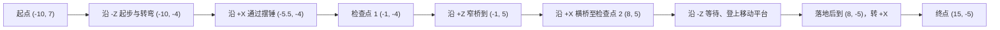

# LEVEL-01 · 第一轮关卡静态分析与最小优化提案

日期：2026-09-11。状态：已补充 CODE-01 阶段回传、九张游戏截图及运行记录；等待正式技术基线与统筹验收。本次仅为首轮方案证据补充，不是实施授权，也不表示全部技术验收完成。

补充证据后的推荐收窄为：只保留平台入口固定岸的两条无碰撞观察提示线作为待验证候选，暂缓摆锤双线；不改变路线、机关参数、检查点或奖牌阈值。现有关卡已在 CODE-01 一次键盘驱动的真实物理测试中通过，平台没有形成该次通关的阻塞。当前没有依据判定“太单调”，也不据此增加分岔、收集物或机关。

本轮首次新增、此次只补充本文档。保留现有控制力度、摩擦、刹车、速度上限、镜头、质量、重力和物理步长；未修改配置、Vue、运行时、资源引用、模型、用户设置或成绩。

## 1. 依据和证据边界

已重新阅读 `README.md`、`AGENTS.md`、`docs/COLLABORATION.md` 和 `docs/product/round-01.md`。当前目录无 Git 仓库，不能据此证明其他文件是干净版本。首次交付时目标文档不存在；此次补充已读取最新全文并保存临时内容基线，写入前核对并发修改。

静态依据如下，行号对应本次读取版本：

- [关卡配置](/Users/zhongjijie/study/球球大作战/marble-lab/src/levels/initial-gravity.ts:8)：轨道、护栏及标记；第 79–100 行为起终点、检查点、机关和进度。
- [配置类型](/Users/zhongjijie/study/球球大作战/marble-lab/src/game/level-types.ts:5)：支持基础几何体、材质、位置、尺寸和可选碰撞；奖牌阈值不在 `LevelConfig` 中。
- [运行时](/Users/zhongjijie/study/球球大作战/marble-lab/src/game/runtime.ts:88)：弹珠直径 0.85 米；第 110–115 行为重生及重开，第 141–166 行为机关、计时、检查点与进度判定。仅阅读以核对配置语义。
- [成绩与奖牌](/Users/zhongjijie/study/球球大作战/marble-lab/src/state.ts:23)：按用时保留最快 20 条，奖牌为 35 / 55 / 90 秒；[首页](/Users/zhongjijie/study/球球大作战/marble-lab/src/components/Lobby.vue:19)另有相同阈值显示。
- [模型加载器](/Users/zhongjijie/study/球球大作战/marble-lab/src/game/track-visuals.ts:1)：精细模型成功时隐藏被标记的基础外观，失败时回退。

关卡配置 SHA-256：`fde23231e32481972724bd174a8880f76003d33e0353f018f54b0597cb5341b7`。
运行时 SHA-256：`a29647a37fba42f250cc61be00553a8475128304139111488c6004b48f5b1333`。

本次没有亲自操作浏览器；已查看 CODE-01 的九张 1280×720 游戏截图，并读取运行记录及测试/构建日志。下文把直接可见的画面、状态样本、代码侧方法回传与体验假设分开。候选提示线尚未实施，其可见性、刹停距离与改善效果仍未验证。

### CODE-01 阶段证据与限制

- **方法与检查**：统筹阶段回传说明，代码侧通过键盘驱动既有输入完成真实物理通关，未瞬移或改状态/物理。运行记录包含 `repeat-keypress` 与 `keyboard-events-held` 两种输入过程；后段有明确按键和持续时间。本文引用该方法说明，未独立重演全程，也不以离散日志证明每一帧的行为。[测试日志](/Users/zhongjijie/study/球球大作战/marble-lab/docs/integration/round-01-evidence/npm-test.log)为 6/6 通过、0 失败；[构建日志](/Users/zhongjijie/study/球球大作战/marble-lab/docs/integration/round-01-evidence/npm-build.log)显示构建成功，仍有大包提示。均为 CODE-01 结果，不是 LEVEL-01 重新执行。
- **起步、摆锤与窄桥画面**：[08-start-route.png](/Users/zhongjijie/study/球球大作战/marble-lab/docs/integration/round-01-evidence/08-start-route.png)实际是第一次掉落后、34.67 秒的再次接近画面，不是零秒开局；可辨认摆锤球、支架、护栏和下一检查点。[09-pendulum-through.png](/Users/zhongjijie/study/球球大作战/marble-lab/docs/integration/round-01-evidence/09-pendulum-through.png)显示通过摆锤后检查点 1/2；[10-narrow-bridge.png](/Users/zhongjijie/study/球球大作战/marble-lab/docs/integration/round-01-evidence/10-narrow-bridge.png)显示弹珠在窄桥、掉落仍为 1。不能从这些通过后的画面推断首次识别速度或摆锤撞击的精确时刻。
- **第一次掉落与起点重生**：[运行记录](/Users/zhongjijie/study/球球大作战/marble-lab/docs/integration/round-01-evidence/runtime-trace.json)的 `pendulum-pass-attempt-before-brake` 在 28.8475 秒记录球心约 `[-5.213, 1.244, 1.291]`，已离开正常路面；`pendulum-pass-attempt` 在 31.3627 秒为 `checkpoint=0、falls=1`，球心回到约 `[-10, 3.825, 7]`。支持摆锤尝试期间发生掉落、回起点且计时未归零；缺少连续碰撞记录，不能断言具体由哪次撞击或提示不足造成。前段使用重复按键方式，不能将整段尝试时长当作普通玩家学习耗时。
- **第二次掉落与检查点 1 重生**：`checkpoint-one-fall` 对应明确的 A 键 700ms 定向输入；42.2896 秒球心约 `[-3.141, 3.478, 0.493]` 离开窄桥，43.1192 秒回到约 `[-0.993, 3.824, -4.005]`，`falls: 1 → 2`，检查点保持 1，计时继续。[11-checkpoint-respawn.png](/Users/zhongjijie/study/球球大作战/marble-lab/docs/integration/round-01-evidence/11-checkpoint-respawn.png)显示球在检查点 1、掉落 2 次。此项作为定向掉落/重生验证样本，不计作窄桥自然失误率；球心高度是落稳后的高度，不要求等于重生瞬间的 3.95 米。
- **实际平台通行**：[14-platform-near-bank.png](/Users/zhongjijie/study/球球大作战/marble-lab/docs/integration/round-01-evidence/14-platform-near-bank.png)、[15-on-platform.png](/Users/zhongjijie/study/球球大作战/marble-lab/docs/integration/round-01-evidence/15-on-platform.png)、[16-platform-exit.png](/Users/zhongjijie/study/球球大作战/marble-lab/docs/integration/round-01-evidence/16-platform-exit.png)依次显示固定岸接近、球在蓝色活动台面、到达出口岸范围。对应 `platform-near-bank`（50.0715 秒，球 Z≈2.337）、`on-moving-platform`（51.8046 秒，球 Z≈0.101，平台中心 Z≈0.823）、`platform-far-bank`（54.0943 秒，球 Z≈-2.722）；球 Y 均约 3.825，检查点为 2、掉落保持 2。随后 `finish-corner` 的球 Z≈-4.200，已超过平台最远外缘 Z=-3.05，支持到达固定出口道路。证明本次输入/相位组合可以登板、通过并离板，不能证明松开方向键即可稳定被动搭乘整周期、任意相位均可通行或跨设备一致。平台段没有新增掉落，因此本批没有平台掉落后回检查点 2 的实测证据。
- **完赛与记录**：[17-finish-approach.png](/Users/zhongjijie/study/球球大作战/marble-lab/docs/integration/round-01-evidence/17-finish-approach.png)显示终点前固定道路与门框/棋盘目标；[18-finish-result.png](/Users/zhongjijie/study/球球大作战/marble-lab/docs/integration/round-01-evidence/18-finish-result.png)显示 57.24 秒、掉落 2 次、铜牌。`first-full-route-finish` 为 `phase=finished、checkpoint=2、falls=2、progress=1`，实际存储时间 57.2464 秒；顺序样本已有检查点 0 → 1 → 2。截图计时截取至百分秒，并且常比同名状态采样晚约 0.26 秒，不能逐帧硬对齐。
- **阶段边界**：补读记录时已出现 `records-after-reload`，其中仍有该条 57.2464 秒/2 次掉落的成绩；可记录为刷新后状态样本佐证，不能扩成全部存储场景通过。统筹本消息仍为阶段回传，首次检查时正式 `round-01-baseline.md` 尚未落盘；即使公共 README 已先更新，也不据此宣称全部技术验收完成。刷新与其他技术验证的最终结论仍由 CODE-01 正式交付确认。

## 2. 当前路线、任务与失败代价

以下为路线顺序草图，不是等比例平面图。坐标使用世界 `(x, z)`；路面高度统一为 `y = 3.4` 米。

1. **起步与首次转弯**：起点平台为 4 × 4 米，直道宽 3 米，主要沿 `-Z` 行驶，至 `z ≈ -4` 转向 `+X`。直道两侧有局部护栏，起点附近有四条蓝色地面横线。玩家任务是学会加速、提前刹车和转向。检查点 1 之前掉落都回起点；护栏不等于不会被撞出或冲出。
2. **摆锤与检查点 1**：横道宽 3 米，摆锤中心 `x = -5.5`，沿 Z 摆动，半径 0.725 米，周期约 `2π / 1.8 = 3.49` 秒。玩家需要观察空隙再穿过摆动区域。检查点 1 在摆锤之后 `[-1, 3.95, -4]`，成功后不会因窄桥失败重跑摆锤。若在摆锤前后、检查点触发前掉落，仍回起点。
3. **窄桥与横桥**：窄桥宽 2.1 米、长 9 米，相比前段宽度缩小 30%；两侧橙线没有碰撞护栏。玩家从检查点 1 转向 `+Z`，保持居中，到 `z ≈ 5` 再转 `+X` 走宽 3 米的横桥。失败回检查点 1；横桥末端通过检查点 2 `[8, 3.95, 5]`。这里从躲避机关转为持续控线，再给一段较宽路面恢复节奏。
4. **移动平台**：从检查点 2 转向 `-Z`，入口固定路面边缘在 `z = 1.4`，出口边缘在 `z = -2`，静态缺口长 3.4 米。平台长 2.9 米，中心 Z 范围 `[-1.6, 0.9]`，周期约 `2π / 1.25 = 5.03` 秒。平台不能同时覆盖两个固定边缘；在两个极端位置分别与入口、出口有约 0.95 / 1.05 米的几何重叠。任务是观察、登板、在平台运动时推进至出口再离开；CODE-01 本次已实际通过，详见第 1 节。被动搭乘稳定性和不同相位成功率仍待验证。按配置规则失败应回检查点 2，无需重跑窄桥；本批未实际测试该段掉落。
5. **终点段**：落地后沿 `-Z` 到 `(8, -5)`，再转 `+X` 至 `(15, -5)`；终点平台 4 × 4 米。玩家完成最后一次转弯并进入终点范围。仅在两个检查点按顺序通过后结算；此段掉落仍回检查点 2，需要重过平台。

所有掉落都在球心低于 `fallY = -0.5` 后触发，速度归零，掉落次数增加，计时继续。掉落不重置机关相位；整局重开才同时清零计时、检查点与机关时间。故同一检查点的重试不是固定机关开局，平台等待不能简单写成每次固定增加 5 秒。

## 3. 最多三个优先问题

### P1-1 · 平台固定岸的观察提示是否必要（保留候选，效果待验证）

**配置事实**：显式 `Approach marking` 全在起点；窄桥有边线，平台有装饰导轨与自身条纹，但没有单独的入口等待横线。摆锤也没有独立的前置观察线。本次画面已可辨认摆锤球和支架、平台蓝色台面及其浅色横条，不能说游戏中没有提示。固定岸路面与背景色接近，平台活动边缘和两岸关系在不同相位截图中可见，但首次玩家能否及时理解仍待验证。

**待验证假设**：初见玩家可能临近缺口才开始判断登板时机。此次平台成功且没有新增掉落，没有证据称其提示已经造成失败。摆锤双线即使只解释为“观察提示”，也可能被误读成停在此处就安全；当前画面与一次失败不足以证明新增的收益大于歧义，暂不推荐摆锤地面线。

**验证重点**：让未接触配置的试玩者说明哪块台面会移动、准备在哪里观察和何时登板；再决定是否需要固定岸提示。已有实测在固定岸球 Z≈2.337 处减速成功，但不证明候选 Z=2.6/3.0 双线有效。推荐最小方案只保留此项候选，不把“能通关”写成“不需要提示”，也不把可见的低对比度直接写成玩家误读。

### P1-2 · 首次摆锤失败的重跑成本可能压过学习收益

**配置事实**：沿中心折线路径，起点到摆锤中心约 `11 + 4.5 = 15.5` 米，途中无检查点；这是路线长度估算，不是强制行驶距离或耗时。窄桥掉落从检查点 1 重试，平台掉落从检查点 2 重试，后两段已具备分段练习条件。

**待验证假设**：若首次摆锤连续失败，玩家可能觉得反复跑起步直道；尚无自然试玩的失败率、连续重试分布或玩家反馈证明需要新增检查点。窄桥收窄也可能形成难度跳变，但已有前置检查点承接，不能只按宽度判断过难。

**阶段证据与处置**：已观察到摆锤尝试期间一次掉落回起点，31.3627 秒的起点样本到 38.1751 秒检查点 1 样本相差约 6.81 游戏秒，包含再接近、转弯和通过，是一次样本区间，不是单纯重跑惩罚或典型重试耗时。第二次为窄桥定向掉落测试，检查点 1 承接重试已得到证据。保留检查点位置和失败代价，继续等待自然试玩数据；不据“掉落 2 次”认定两个路段都过难。

### P2-3 · 横向推进与进度条不一致，冲线前会过早接近满格

**配置和公式可证明的事实**：`progress` 只使用 Z。第一段在 `z = -4` 已到 32%，沿 X 经过摆锤不继续增长；第二段在窄桥末 `z = 5` 已到 65%，沿横桥至检查点 2 的过程中也不增长；第三段到 `(8, -5)` 为 98%，沿 X 到终点仍为 98%，完赛才为 100%。实际检查点会在半径内提前触发，所以切段位置不等于精确中心。

**阶段证据与待验证假设**：本次实际在 Z≈-4.2 转向终点，`finish-corner` 到 `first-full-route-finish-before-brake` 的 X 约由 7.94 增至 13.48，进度只由 95.8796% 变为 95.9444%，随后完赛变为 100%；与仅沿 Z 计算的限制一致，不能把理论 Z=-5 时的 98%冒充此次实测。画面中门框和棋盘可辨认、HUD 无百分比数字，玩家是否误以为已到终点仍无反馈证据。

**本轮处置**：保留现有 `progress`；调整 `divisor` 或 `max` 不能补出 X 方向的信息，不用数值微调假装解决。若统筹认定必须修复，交代码对话评估能表达横向路段的进度能力；本方案不依赖该扩展。

## 4. 推荐的最小方案：仅保留平台固定岸观察提示候选

**摆锤双线暂缓**。本次画面能辨认摆锤球和支架，尚无“看不见机关/不知何处观察”的玩家反馈。一次失败还混有前段重复按键方式的影响，无法归因为提示缺失；仅靠文档声明“只提示观察”不能阻止双线被读成安全停车线。接受 ART-01 关于安全区暗示的顾虑，本轮推荐不包含摆锤地面线。以后若自然试玩反复出现同一识别问题，先确认误解原因再评估提示，不沿用静态球体余量来承诺刹停安全。

**平台只保留两条固定岸提示作为最小配置候选，尚未证明必须新增**。向 `src/levels/initial-gravity.ts` 的 `staticObjects` 追加以下两项，每项均为 `type: 'box'`、`material: 'orange'`，省略 `body` 和 `refinedVisual`；只显示地面横线，不创建碰撞，也不在 GLB 加载成功后隐藏：

- `Platform approach marking 1`：`position: [8, 3.43, 3.0]`，`size: [2.4, 0.025, 0.10]`。
- `Platform approach marking 2`：`position: [8, 3.43, 2.6]`，`size: [2.4, 0.025, 0.10]`。

两线横跨 X，与 `-Z` 来向垂直。候选作用是让玩家在固定路面上意识到“前方需要观察平台”，不是必须停车、可立即登板或新的检查点。固定岸提示必要性的验收是初见玩家能否据此更早理解接驳方式；不能用现有通关样本替代新增提示的验证。

**固定岸与活动端部各自回答不同问题**：

- 固定岸提示回答“在哪里开始观察”：位置不随机关移动，服务接近中的玩家；它不表达当前相位，不是跳跃起点、停车保证线或精确缺口边界。本方案只在入口岸内放两线，不延伸至空隙或出口岸。
- ART-01 的活动平台端部提示回答“当前哪条边属于活动台面”：随平台移动，帮助识别可登/离板的真实端部及它与岸的相对位置；不能解释为瞬时通行许可。保持在平台轮廓内，不画跨空隙连续路线。
- 两者功能可以互补，但必要性尚未共同验证；不默认同时制作。若统筹决定先采用活动端部提示，需验证它是否已足以说明接驳，再决定是否保留固定岸两线。活动端部标记的模型制作归 ART，本文不将它加入关卡配置、不代改模型；固定岸两线仍为本文唯一配置候选。

**位置依据与限制**：

- 以球心 `z ≥ 2.6、x ≈ 8` 作为固定岸观察位置候选。距入口缺口边缘 Z=1.4 为 1.2 米，扣除弹珠半径 0.425 后约余 0.775 米；横线位于固定路面内。CODE-01 在更靠前的 Z≈2.337 有减速后样本，说明一次特定输入可以在那里停留，不证明任意速度在双线处开始刹车都能停住。
- 标线中心高度 3.43 米、厚 0.025 米，底面 3.4175 米，高于基础路面。新增线尚未渲染，不能用现有截图确认其遮挡、浮起或闪烁。未来获准实施后可在 `position[1] = 3.42–3.46` 米内复核；仍不匹配则反馈 ART/统筹，不自行改 GLB。
- 保留原路线、两个检查点、机关参数与奖牌。稳妥玩法仍是提前减速、观察再登板；熟练玩法可通过同一路线判断相位、减少停车。本次通关证据没有证明跳缺口或擦边近道，不把它们作为交付路线，也不修改已认可的控制手感。

若初见玩家凭现有蓝色台面和活动端部就能正确理解接驳，本方案可以不实施；此处是有具体配置的待验证候选，不是必须新增两条线的结论。

## 5. 计时、奖牌与重复挑战

当前“连续计时 → 检查点重试 → 完赛奖牌 → 最快 20 次纪录 → 再来一局”在功能上已构成单关重复挑战循环。掉落会自然增加耗时，掉落次数另行展示；奖牌只看时间，不以零掉落为额外门槛。现阶段没有证据要求增加分岔、收集物、分段计时或新奖励系统。

35 / 55 / 90 秒仍保留。此次 57.2464 秒（显示 57.24 秒）落在银牌 55 秒以上、铜牌 90 秒以内，截图与判定一致；这只验证该样本得到铜牌，不说明阈值合理或金牌不可达。测试包含前段输入方式调试、暂停观察以及一次定向掉落验证，不是自然首玩或竞速基准。不能扣掉两次估算的“掉落罚时”来反推银牌/金牌，也不据距 55 秒仅约 2.25 秒来放宽阈值。后续建议保留同一试玩者的首次完赛记录，再做至少 5 次熟悉后完整挑战，记录总用时、掉落路段与次数、两机关的停等时间、失败后重新接近机关的时间及继续重试意愿；同时注明设置与设备。样本只作方向判断，不冒充普遍玩家分布。

本方案暂保留全部阈值。若后续需要修改，统筹交代码对话处理 `src/state.ts` 的判定与首页显示的一致性，并明确旧成绩如何解释；关卡对话不能通过现有 `LevelConfig` 修改奖牌。不得清空旧纪录，也不在本轮顺带新增奖牌字段。

## 6. 影响、依赖与复验方法

**成绩比较**：两条固定岸纯显示标线不改碰撞、距离、机关周期、重生点或奖牌比较规则，原始计时成绩仍可比较；视觉提示可能帮助玩家跑得更快，不能因此宣称体验没有变化。若实施范围转为宽度、机关参数、检查点或其他规则改动，必须先回统筹处理成绩兼容，保留旧成绩。

**进度**：本方案无路段或检查点变更，仍为两个顺序检查点和三项 `progress`；不解决横向路段进度停滞问题。

**模型与碰撞**：不需要重做静态 GLB 或平台 GLB，不改 `visuals`；这是现有布局上新增装饰，不属于轨道布局变更。标线不写 `refinedVisual: true`，让精细模型和基础回退两种显示都保留它们。与 ART-01 对齐危险提示的颜色和双线含义；若美术方案也覆盖相同位置，统筹选择唯一表现，避免叠两套标记。

已核对 [ART-01 提案](/Users/zhongjijie/study/球球大作战/marble-lab/docs/art/round-01-proposal.md)关于摆锤安全区暗示的顾虑，此次关卡方案已暂缓摆锤线。平台固定岸与活动端部的语义、归属和是否需要同时存在见第 4 节；统筹只需选择最小组合，不将两份提案自动合并执行。

**实施后的复验清单（本轮未执行）**：

1. 由统筹正式发实施任务后，核对配置只增加两条固定岸装饰横线；轨道碰撞、两个检查点、终点、机关和控制参数逐项保持原值。执行统一 `npm test`、`npm run build`，代码对话负责集成验证。
2. 复用来自本项目的本地服务，在隔离测试浏览器验证精细模型成功与基础外观回退时都能看到入口岸两条标线；近处、来向视角和窄屏下检查遮挡、闪烁与“看起来像凸起障碍”的误解，不清除用户数据。
3. 实走原路线至少一次，验证检查点 1 → 检查点 2 → 终点结算和成绩保存；在摆锤、窄桥、平台各主动掉落一次，核对重生位置、计时连续和机关相位继续。
4. 在平台入口固定路面候选观察位置停稳，观察平台至少两个周期，验证标记确实处于可观察、可继续通行的位置；再用常规来向速度试验能否提前看见并减速。不能用静态间距替代这一步。
5. 记录新增标线前后的首次平台接驳决策：是否识别危险、在哪里开始刹车、是否因提示误导而停车或掉落。出现“到线才刹已来不及”时记录来向速度与位置，再决定是否前移标线；不调整刹车或镜头补偿。

LEVEL-01 未运行 `npm test`、`npm run build` 或浏览器试玩；首次交付的只读脚本已复算轨道边缘、平台极值与重叠、机关周期和进度公式。此次只查看 CODE-01 的九张游戏截图、运行记录及测试/构建日志，更新既有方案的证据分层，并核对关卡与运行时 SHA-256 未变。测试 6/6、构建成功、一次平台通行及完赛均归属 CODE-01 阶段证据；新增标线、跨设备表现与全部技术验收不能记为通过。

## 7. 回传统筹

- **任务 ID**：LEVEL-01。
- **交付**：`/Users/zhongjijie/study/球球大作战/marble-lab/docs/levels/round-01-proposal.md`。
- **已完成**：保留五段路线和三个优先问题，补充九张截图、平台实际通行、两次掉落及检查点 1 重生、57.24 秒铜牌和进度反馈的证据边界；暂缓摆锤线，将推荐收窄为两条平台固定岸提示候选，并区分活动平台端部提示的作用。
- **未完成/依赖**：CODE-01 正式技术结论仍待统筹确认；本批未验证平台掉落后回检查点 2、全周期被动搭乘、自然玩家失误率和奖牌分布，也未验证新增线的可见性及改善效果。现有关卡一次可通关已获阶段证据，不再列为缺失；不把阶段补充提升为全部技术验收完成。
- **需要统筹决定**：是否采纳暂缓摆锤地面线、平台固定岸两线仅作待验证候选的收窄；平台活动端部提示是否优先且足以替代固定岸提示；横向进度反馈是否另列代码任务。检查点和 35/55/90 秒奖牌阈值保留，等待自然试玩数据，不提前实施。
- **冲突**：当前未发现目标文件被其他对话占用；没有编辑公共规则或 `docs/product/`。若后续出现重叠标记、美术布局或新进度字段需求，由统筹分派对应角色。

本次已完成 CODE-01 阶段证据补充。后续仅按统筹回传补充正式验证结论；布局、能力扩展、标线接入与模型重做仍需后续实施任务。
