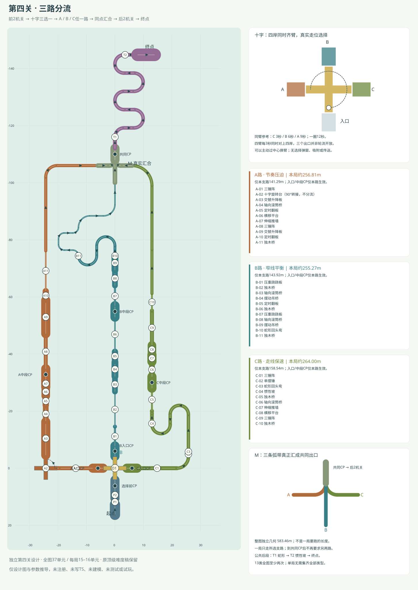

# 第四关 · 三路分流

2026-09-14，依据[第四关设计任务](../product/level-04-design.md)。本稿是独立第四关的**design-only**方案：`intendedLevelNumber: 4`、设计id=`three-route`，不是已注册的游戏id。原“顶级难度关卡”三份387.253米单路线设计保留，本轮未写入或恢复它们。

**唯一当前拓扑：起点 → 单摆锤 → 推墙 → 十字三选一 → A/B/C任一路 → 几何汇合 → 蛇形 → 惯性坡 → 终点。** 公共前段严格2个机关，公共尾段严格2个机关；分流十字另计，汇合只是静态线路节点。三锤阵按目录的一项计算，其内部3锤不冒充3次覆盖；四升降也按一组计算。

## 先看选择与长度

- **A 节奏压迫**：三锤、内部转向十字、升降、滚筒、翻板、横移与推墙连着处理；所选支路参考141.290米，含公共部分的单次参考 **256.81米**，经过16个机关单元。
- **B 窄线平衡**：负载板、窄梁、反转滚筒与45°吊桥，最后双回头接一条曲窄梁；支路 **143.917米**，单次 **255.27米**，经过16个单元。
- **C 走线保速**：三锤转弯、单锤接回头蛇形、惯性坡上高层，再滚筒→推墙→横移→三锤；支路 **158.537米**，单次 **264.00米**，经过15个单元。

三种单次参考长度相差约 **3.4%**。C独立支路稍长，同臂选择它所走的转台弧较短；不是靠加总三路冒充一局长线。三路均有连续压力，不宣称相同用时或已平衡；C可奖励更好的保速，但没有宽直绕关通道。

整图独立几何中心线为 **583.460米**，含所有支路、两个十字实体的四臂骨架与各独立接缝；一局无需走完583米，更无需收齐13类。单次路线采用“分流时同臂到所选岸”的参考走法，主动换臂可改变实际里程与等待。

## 十字如何真正三选一

D-01中心[0,3.15,0]、顶面Y3.4、跨度8、臂宽1.4、厚.5。四岸名义口沿：**入口南岸[0,3.4,4.18]，A左/西岸[−4.18,3.4,0]，B前/北岸[0,3.4,−4.18]，C右/东岸[4.18,3.4,0]**。入口与三个出口同高，正对时端缝均.18米。岸口宽1.6，后方观察岛宽3.2；臂端角半径4.060788，小于岸距4.18，显示外缘限制4.11，底座不得向扫掠区额外外扩。

绕世界+Y以π/6rad/s转动，完整一圈12秒。沿同一根最初朝南的臂，位置顺序为 **南→东→北→西**：参考在t0登上南臂，t3到C，t6到B，t9到A。以半径3.2随转，并加进出各.98米（含.18缝），参考转乘长C6.987、B12.013、A17.040米。

**这不是三个出口轮流出现。** t=0、3、6、9……时，四条臂同时分别对齐四岸，三个出口都存在且可用；只是“当前这根臂”到达的岸不同。玩家可以随当前臂等待目标岸，也可以主动经过中心、换到另一条臂，朝目标出口滚动离台。没有弹窗、自动分配、吸附或传送；中心走法不会被隐藏等待时间禁止。

按球半径.425、臂上半径3.5、横向留边.275估算，投影角带约±4.506°、时间约±.150秒。它只是对齐几何条件，不保证任意球速/横漂都能跨缝；要在离台前瞄准目标岸。选择在越过目标岸外向标记并到达该路入口CP时提交，在转台上尚未下岸前仍可改变主意。

公共选择CP在[0, 3.95, 6.18]。分流前落水回这里；提交选路后落水回所选支路CP，不再被送往别路。若已提交仍想改选，可用既有“重开本局”重新选择；本稿不新增选路弹窗或物理挡墙。

## 公共前段：恰好两个机关

- **P-01 单摆锤**：根[0, 0, 11.83]、yaw0°，入口[0, 3.4, 12.73]→出口[0, 3.4, 10.93]。道长1.8m、宽1.3；侧偏1.65、周期2.4s，峰值t0.45，phase=0.393rad；抬升系数.16。
- **P-02 伸缩推墙**：根[0, 0, 9.38]、yaw0°，入口[0, 3.4, 10.58]→出口[0, 3.4, 8.18]。道长2.4m、宽3.2，行程3.7，阶段[.83,.45,.22,.65,.25]s；全收回含预告从t0.4起1.28s，phaseSeconds=2；杆r.08/露长.3–4。

起点3.6米准备台、锤后.35米总接驳和推墙后的4米选择观察区是线路，不额外计机关。P-01→P-02无完整中间休整台，推墙节奏与单锤一起观察；全部接头条件见后文清单。

## A路 · 节奏压迫

**A-01→A-02→A-03→A-04→A-05→A-06→A-07；中段CP后A-08→A-09→A-10→A-11。**

内部A-02不是新的岔路：只连接东侧入口与北侧出口，其余两臂仍是真实死端，不接新岸。第一组最后升降板直接送到滚筒，再赶闭合翻板、平台与推墙；第二组三锤/升降重新指定相位。

从[-4.18, 3.4, 0]到[-6, 3.4, -106]；支路参考141.290米。入口CP负责保留所选分支，中段CP只在组合边界，组合内部没有固定休整岛。

- **A-01 三锤阵**：入口[-7.78, 3.4, 0]→出口[-19.78, 3.4, 0]；根[-13.78, 0, 0]、yaw90°。三锤作为1单元，道长12m、宽1.4；门心[1.4, 6, 10.6]m，周期[4, 3, 2.4]s，峰值参考t=[0.33, 1.4, 2.47]；相位=[1.0524, 1.7802, 1.3875]rad。
- **A-02 十字旋转台**：入口[-20.28, 3.4, 0]→出口[-24.28, 3.4, -4]；根[-24.28, 0, 0]、yaw90°。跨度8/臂宽1.4、T12，phase=4.712rad；从东侧入口向北侧出口转90°，同臂参考t3登/t6离，不是第二个三路分流。
- **A-03 交替升降板**：入口[-24.28, 3.4, -4.58]→出口[-24.28, 3.4, -16.23]；根[-24.28, 0, -10.405]、yaw0°。四板3.2×.32×2.8，节距2.95，A0.6、T4；零位t6.2+2n，各phase=[2.8274, 5.969, 2.8274, 5.969]rad。
- **A-04 轴向滚筒桥**：入口[-24.28, 3.4, -16.53]→出口[-24.28, 3.4, -21.53]；根[-24.28, 0, -19.03]、yaw0°。圆柱直径2、长5，纵轴角速-4.5rad/s；冠部与名义岸同高，必须有真实切向接触。
- **A-05 定时翻板**：入口[-24.28, 3.4, -22.03]→出口[-24.28, 3.4, -25.03]；根[-24.28, 0, -23.53]、yaw0°。板2.2×.24×3，侧轴0→−90°；阶段[1.5,.20,.48,.22]s，预告.40含闭合；闭合t15.55–17.05，phaseSeconds=1.25。
- **A-06 横移平台**：入口[-24.28, 3.4, -25.33]→出口[-24.28, 3.4, -28.23]；根[-24.28, 0, -26.78]、yaw0°。板3×.36×2.9，横移A3.6/T4.8，中位t16.5、再过2.4s离开；phaseSeconds=-16.5。
- **A-07 伸缩推墙**：入口[-24.28, 3.4, -28.43]→出口[-24.28, 3.4, -30.83]；根[-24.28, 0, -29.63]、yaw0°。道长2.4m、宽3.2，行程3.7，阶段[.83,.45,.22,.65,.25]s；全收回含预告从t18.9起1.28s，phaseSeconds=0.3；杆r.08/露长.3–4。
- **A-08 三锤阵**：入口[-24.28, 3.4, -34.83]→出口[-24.28, 3.4, -46.83]；根[-24.28, 0, -40.83]、yaw0°。三锤作为1单元，道长12m、宽1.4；门心[1.4, 6, 10.6]m，周期[3, 2.4, 4]s，峰值参考t=[0.33, 1.4, 2.47]；相位=[0.8796, 1.0472, 3.9741]rad。
- **A-09 交替升降板**：入口[-24.28, 3.4, -47.13]→出口[-24.28, 3.4, -58.78]；根[-24.28, 0, -52.955]、yaw0°。四板3.2×.32×2.8，节距2.95，A0.65、T4；零位t2.9+2n，各phase=[1.7279, 4.8695, 1.7279, 4.8695]rad。
- **A-10 定时翻板**：入口[-24.28, 3.4, -58.98]→出口[-24.28, 3.4, -61.98]；根[-24.28, 0, -60.48]、yaw0°。板2.2×.24×3，侧轴0→−90°；阶段[1.5,.20,.48,.22]s，预告.40含闭合；闭合t10.9–12.4，phaseSeconds=1.1。
- **A-11 独木桥**：入口[-24.28, 3.4, -62.13]→出口[-24.28, 3.4, -76.13]；根[-24.28, 0, -69.13]、yaw0°。宽0.5m、参考长14.000m、无护栏。

## B路 · 窄线平衡

**B-01→B-02→B-03→B-04→B-05→B-06；中段CP后B-07→B-08→B-09→B-10→B-11。**

两块跷跷板都为真实负载驱动，不能把出端排成固定倒计时。B-11是一条全程.5米宽的曲窄梁：向西做R2绕行，再从双回头以北用R4折返归中；不横穿蛇形内空区，也没有把多个动态机关藏进这条梁。

从[0, 3.4, -4.18]到[0, 3.4, -100]；支路参考143.917米。入口CP负责保留所选分支，中段CP只在组合边界，组合内部没有固定休整岛。

- **B-01 压重跷跷板**：入口[0, 3.4, -7.78]→出口[0, 3.4, -14.56]；根[0, 0, -11.17]、yaw0°。板.7×.30×7，m.65/k4/c3，初始+25°/限±25°；轴高=岸高+1.343218，岸缘距轴3.39，低端缝.15453；真实负载，无固定周期。
- **B-02 独木桥**：入口[0, 3.4, -14.56]→出口[0, 3.4, -26.56]；根[0, 0, -20.56]、yaw0°。宽0.45m、参考长12.000m、无护栏。
- **B-03 轴向滚筒桥**：入口[0, 3.4, -26.86]→出口[0, 3.4, -31.86]；根[0, 0, -29.36]、yaw0°。圆柱直径2、长5，纵轴角速4.5rad/s；冠部与名义岸同高，必须有真实切向接触。
- **B-04 摆动吊桥**：入口[0, 3.4, -32.16]→出口[0, 3.4, -37.16]；根[0, 0, -34.66]、yaw0°。板2.4×.24×5，45°/T4.8，中位t0+nT/2；上轴距板心2.8，完整动架预留半宽3.9，固定架半宽4.85。
- **B-05 定时翻板**：入口[0, 3.4, -37.76]→出口[0, 3.4, -40.76]；根[0, 0, -39.26]、yaw0°。板2.2×.24×3，侧轴0→−90°；阶段[1.5,.20,.48,.22]s，预告.40含闭合；闭合t2.45–3.95，phaseSeconds=2.35。
- **B-06 独木桥**：入口[0, 3.4, -40.91]→出口[0, 3.4, -52.91]；根[0, 0, -46.91]、yaw0°。宽0.5m、参考长12.000m、无护栏。
- **B-07 压重跷跷板**：入口[0, 3.4, -56.91]→出口[0, 3.4, -63.69]；根[0, 0, -60.3]、yaw0°。板.7×.30×7，m.65/k4/c3，初始+25°/限±25°；轴高=岸高+1.343218，岸缘距轴3.39，低端缝.15453；真实负载，无固定周期。
- **B-08 轴向滚筒桥**：入口[0, 3.4, -63.99]→出口[0, 3.4, -68.99]；根[0, 0, -66.49]、yaw0°。圆柱直径2、长5，纵轴角速-5rad/s；冠部与名义岸同高，必须有真实切向接触。
- **B-09 摆动吊桥**：入口[0, 3.4, -69.39]→出口[0, 3.4, -74.39]；根[0, 0, -71.89]、yaw0°。板2.4×.24×5，45°/T3.6，中位t0+nT/2；上轴距板心2.8，完整动架预留半宽3.9，固定架半宽4.85。
- **B-10 蛇形回头弯**：入口[0, 3.4, -74.39]→出口[-12.8, 3.4, -74.39]；根[0, 0, -74.39]、yaw0°。R3.2、宽1.0，入口额外90°=False；直臂长度[3.5, 3.5]m，回头角[-180, 180]°，弯心留空。
- **B-11 独木桥**：入口[-12.8, 3.4, -74.39]→出口[0, 3.4, -100]；根[-12.8, 0, -74.39]、yaw0°。宽0.5m、参考长45.543m、无护栏。包含连续R2/R4弯和直段，仍是一条固定窄梁，不藏其他机关。

## C路 · 走线保速

**C-01三锤接R4窄转弯；C-02→C-03→C-04→C-05；中段CP后C-06→C-07→C-08→C-09→C-10。**

C-03的两次回头之后仅.35米接惯性坡，绝无末弯后长直道重新加满。上层基准Y6.674；C-07反向穿越、缸壳朝外侧，避免杆座伸向B路。末端通过1.1米宽的12°下降引道回Y3.4，再向共同汇合收线；下降引道不冒充另一项“惯性上坡”来凑覆盖。

从[4.18, 3.4, 0]到[6, 3.4, -106]；支路参考158.537米。入口CP负责保留所选分支，中段CP只在组合边界，组合内部没有固定休整岛。

- **C-01 三锤阵**：入口[7.78, 3.4, 0]→出口[21.78, 3.4, 0]；根[14.78, 0, 0]、yaw270°。三锤作为1单元，道长14m、宽1.4；门心[1.4, 7, 12.6]m，周期[2.4, 4, 3]s，峰值参考t=[0.31, 1.56, 2.8]；相位=[0.7592, 2.2619, 1.9897]rad。
- **C-02 单摆锤**：入口[25.78, 3.4, -4]→出口[25.78, 3.4, -5.8]；根[25.78, 0, -4.9]、yaw0°。道长1.8m、宽1.3；侧偏1.65、周期2.4s，峰值t4.7，phase=1.833rad；抬升系数.16。
- **C-03 蛇形回头弯**：入口[25.78, 3.4, -5.8]→出口[12.98, 3.4, -15.3]；根[25.78, 0, -5.8]、yaw0°。R3.2、宽1.2，入口额外90°=False；直臂长度[13, 3.5]m，回头角[-180, 180]°，弯心留空。
- **C-04 惯性坡**：入口[12.98, 3.4, -15.65]→出口[12.98, 6.674, -20.03]；根[12.98, 0, -15.65]、yaw0°。坡角[20, 46, 20]°、斜长[1, 3.6, 1]m、宽1.3；目标入坡余速4.5–6.2，非硬编码通行门槛。
- **C-05 独木桥**：入口[12.98, 6.674, -20.03]→出口[12.98, 6.674, -28.03]；根[12.98, 3.274, -24.03]、yaw0°。宽0.65m、参考长8.000m、无护栏。
- **C-06 轴向滚筒桥**：入口[12.98, 6.674, -32.03]→出口[12.98, 6.674, -37.03]；根[12.98, 3.274, -34.53]、yaw0°。圆柱直径2、长5，纵轴角速-5rad/s；冠部与名义岸同高，必须有真实切向接触。
- **C-07 伸缩推墙**：入口[12.98, 6.674, -37.33]→出口[12.98, 6.674, -39.73]；根[12.98, 3.274, -38.53]、yaw180°。道长2.4m、宽3.2，行程3.7，阶段[.83,.45,.22,.65,.25]s；全收回含预告从t1.25起1.28s，phaseSeconds=1.15；杆r.08/露长.3–4。本实例反向穿越局部+Z，缸壳朝世界+X外侧。
- **C-08 横移平台**：入口[12.98, 6.674, -40.13]→出口[12.98, 6.674, -43.03]；根[12.98, 3.274, -41.58]、yaw0°。板3×.36×2.9，横移A3.6/T4.8，中位t2.05、再过2.4s离开；phaseSeconds=-2.05。
- **C-09 三锤阵**：入口[12.98, 6.674, -43.18]→出口[12.98, 6.674, -55.18]；根[12.98, 3.274, -49.18]、yaw0°。三锤作为1单元，道长12m、宽1.4；门心[1.2, 6, 10.8]m，周期[3, 2.4, 4]s，峰值参考t=[4.75, 5.82, 6.89]；相位=[4.1888, 2.042, 3.3144]rad。
- **C-10 独木桥**：入口[12.98, 6.674, -55.18]→出口[12.98, 6.674, -61.18]；根[12.98, 3.274, -58.18]、yaw0°。宽0.6m、参考长6.000m、无护栏。

## 汇合是可走的Y形带，不是传送点

三条实际入口位于 **A[−6,3.4,−106]、B[0,3.4,−100]、C[6,3.4,−106]**，汇合后出口[0,3.4,−112]。所有接驳顶面Y3.4，C路先下降再进汇合，不把高路直接接低路造台阶。

- A向东走4米到[−2,3.4,−106]，沿R2的90°圆弯向北到[0,3.4,−108]。
- C向西走4米到[2,3.4,−106]，对称R2圆弯向北到同一点。
- B从[0,3.4,−100]直走8米到该公共点；没有必须急转进入另一条支路的要求。
- 公共点之后向北4米到出口，宽度从三条1.6米引道展开到3.2米供共同CP，**不填成12×12米大平台**。弧带与直带按真实并集接合，内部重叠只消除接缝，不存在隐藏平面。

A/C经过汇合分别为4+π+4=11.142米，B为12米；整处独立几何为两条4米侧引道、两段R2圆弧、B的8米直段及公共4米，共26.283米。三路只在这处有意汇到一起；不会在旁边贴一块宽板直接连通未完成的支路。

选中支路需先通过自己的有向组末标记与对应汇合入口；再向北越过Z=−108.5的公共确认线，才激活共同CP。标记只是进度信息，不是额外机关、隐形墙或速度门。误入另一路、从汇合反向走回支路不能替代原选支路的完成条件。

## 公共尾段：恰好两个机关

- **T-01 蛇形回头弯**：入口[0, 3.4, -116]→出口[3.2, 3.4, -144.8]；R3.2、宽1.25，入口额外90°=True；直臂长度[3.5, 3.5, 3.5, 3.5]m，回头角[-180, 180, -180, 180]°，弯心留空。
- **T-02 惯性坡**：入口[3.55, 3.4, -144.8]→出口[7.93, 6.674, -144.8]；坡角[20, 46, 20]°、斜长[1, 3.6, 1]m、宽1.25；目标入坡余速4.5–6.2，非硬编码通行门槛。

共同CP后4米蓄速段→T-01→.35米切向→T-02→6米终点制动台。除蛇形和惯性坡外没有再加第三个窄梁/摆锤挑战；终点球心[10.93, 7.224, -144.8]。T-01含入口90°和四个反向180°回头，长59.239米；坡角20/46/20°、斜长1/3.6/1米，顶面从3.4升至6.674。

## 所有紧接接口与窗口

坐标和相位完整值在[设计JSON](three-route-layout.json)。下列名义高差均0；动态板只在对应相位或负载低端附近同高。短接头不等于两体重叠；“0”表示共边或跷跷板已含低端缝，不重复计。

时钟t来自统一游戏时间，不在进入支路/组合时自动归零。可在分支入口或中段CP前选择一个24n或12n的参考起跑时机；B路跷跷到达由真实负载决定，不假设重复周期。列出的速度和时刻是设计条件，未进行物理试玩。

- **P-J01 P-01→P-02**：[0, 3.4, 10.93]→[0, 3.4, 10.58]；总距0.35m，窄舌0.15m、实际缝0.1/0.1m，无独立休整岛。前速3.5–4.5，读锤后立即穿推头；杆和头均真实有碰撞。单锤T2.4、峰值t.45，投影让空约±.32s；参考t.23过锤心，t.54进推墙，推墙全收回含预告t.40–1.68。
- **A-J01 A-01→A-02**：[-19.78, 3.4, 0]→[-20.28, 3.4, 0]；总距0.5m，窄舌0.2m、实际缝0.15/0.15m，无独立休整岛。末锤过后前速约4.3–5，直接上臂；短舌不能作为新的固定休整岛。三锤参考峰值t.33/1.40/2.47；12.5m/4.3≈2.907到十字入口，对齐t3±.150s。
- **A-J02 A-02→A-03**：[-24.28, 3.4, -4]→[-24.28, 3.4, -4.58]；总距0.58m，窄舌0.25m、实际缝0.18/0.15m，无独立休整岛。内部十字从东入口转到北出口，只取四分之一圈；出臂先收侧速。同臂出口t6±.150；.58m/4≈.145，第一板零位t6.20，高差<=.10约t6.093–6.307，参考到达6.145。
- **A-J03 A-03→A-04**：[-24.28, 3.4, -16.23]→[-24.28, 3.4, -16.53]；总距0.3m，窄舌0m、实际缝0.3m，无独立休整岛。从最后升降板直接上滚筒，零位时离板并准备反向纠偏。第一组接板参考6.2/8.2/10.2/12.2，最后板离岸14.2；.3缝按4m/s约.075，滚筒冠部常在，前速4–5。
- **A-J04 A-04→A-05**：[-24.28, 3.4, -21.53]→[-24.28, 3.4, -22.03]；总距0.5m，窄舌0.3m、实际缝0.1/0.1m，无独立休整岛。出筒横偏<=.12、横速<=.4，赶上闭合板；条纹转动不等于接触已验。参考入筒14.275、出15.525，.5m/4=.125到板15.650；闭合窗15.55–17.05，计划16.40离板。
- **A-J05 A-05→A-06**：[-24.28, 3.4, -25.03]→[-24.28, 3.4, -25.33]；总距0.3m，窄舌0m、实际缝0.3m，无独立休整岛。板后直接上侧移平台，不等它从远端回来。翻板出16.40，.3m/4=.075，平台中位16.50，参考入16.475；目标横偏<=.12，横速<=.6。
- **A-J06 A-06→A-07**：[-24.28, 3.4, -28.23]→[-24.28, 3.4, -28.43]；总距0.2m，窄舌0m、实际缝0.2m，无独立休整岛。跟平台到下一中心，离台即穿推头危险带。平台再到中位18.90；.2m/4=.05到推墙18.95；推头全收回18.90–20.18，预计中心带19.25。
- **A-J07 A-08→A-09**：[-24.28, 3.4, -46.83]→[-24.28, 3.4, -47.13]；总距0.3m，窄舌0m、实际缝0.3m，无独立休整岛。第二组三锤直接接交替板，宽安全岛已在这一组合之前。锤峰t.33/1.40/2.47；12.3m/4.3≈2.860到板，零位2.90，高差<=.10约±.098s（A=.65）。
- **A-J08 A-09→A-10**：[-24.28, 3.4, -58.78]→[-24.28, 3.4, -58.98]；总距0.2m，窄舌0m、实际缝0.2m，无独立休整岛。最后升降接闭合翻板，要求同时看高度与开合。第二组零位2.9/4.9/6.9/8.9、出端10.9；.2缝/4=.05到翻板10.95，闭合10.9–12.4。
- **A-J09 A-10→A-11**：[-24.28, 3.4, -61.98]→[-24.28, 3.4, -62.13]；总距0.15m，窄舌0m、实际缝0.15m，无独立休整岛。翻板未开前对准.5米梁，沿梁连续控线；梁之后才进入汇合引道。参考出板11.70、入梁11.738；梁无相位，不能靠下层轴套绕过翻板。
- **B-J01 B-01→B-02**：[0, 3.4, -14.56]→[0, 3.4, -14.56]；总距0m，窄舌0m、实际缝0m，无独立休整岛。板低端接平时直接上.45米梁；看角度/角速度，不使用固定通过时间。负载事件：出口约-25至-23°、下岸余速2–3.5。板单元已含两端.15453米缝，附加接头0不表示板端埋入梁。
- **B-J02 B-02→B-03**：[0, 3.4, -26.56]→[0, 3.4, -26.86]；总距0.3m，窄舌0m、实际缝0.3m，无独立休整岛。窄梁先对准冠部，滚筒正转要求与A路相反的侧向补偿。滚筒+4.5rad/s恒转，入口无需特定转角；.3m接缝以3.5–4.5m/s连续过，横偏<=.10。
- **B-J03 B-03→B-04**：[0, 3.4, -31.86]→[0, 3.4, -32.16]；总距0.3m，窄舌0m、实际缝0.3m，无独立休整岛。滚筒末端择时上45°吊桥，筒上等候也要持续纠偏，无固定平台。B04周期4.8，|摆角|<=3°的中位带约±.051s；.3m/4=.075，因此出筒需在目标中位前约.075s。此条件可观察，未证明真实接触通过。
- **B-J04 B-04→B-05**：[0, 3.4, -37.16]→[0, 3.4, -37.76]；总距0.6m，窄舌0.3m、实际缝0.15/0.15m，无独立休整岛。桥出口先收与岸的相对横速<=.6，再过窄舌进翻板。桥中位参考0/2.4；2.4离桥+.6m/4=.15到板2.55，闭合窗2.45–3.95，计划3.30出板。
- **B-J05 B-05→B-06**：[0, 3.4, -40.76]→[0, 3.4, -40.91]；总距0.15m，窄舌0m、实际缝0.15m，无独立休整岛。板后是12米.5宽梁，提前收侧速不在缝边停车。参考3.30出板+.15/4=.0375入梁3.338；闭合到3.95，梁恒在，偏线落水回该路CP。
- **B-J06 B-07→B-08**：[0, 3.4, -63.69]→[0, 3.4, -63.99]；总距0.3m，窄舌0m、实际缝0.3m，无独立休整岛。第二块负载板直接接反转滚筒，尽量在板落低且角速减小时进冠部。出口由球重控制，不给跷跷板phase；滚筒-5rad/s恒转，目标前速3–4、横偏<=.10。
- **B-J07 B-08→B-09**：[0, 3.4, -68.99]→[0, 3.4, -69.39]；总距0.4m，窄舌0.1m、实际缝0.15/0.15m，无独立休整岛。出滚筒后没有完整岸岛，直接追更快吊桥的中位。B09周期3.6，|摆角|<=3°约±.038s；.4m/4=.10，需要约中位前.10s离筒，并提前抵消横带速。
- **B-J08 B-09→B-10**：[0, 3.4, -74.39]→[0, 3.4, -74.39]；总距0m，窄舌0m、实际缝0m，无独立休整岛。吊桥中位直接进入静态双回头，出桥后马上转向。名义顶同高、共边0；中位附近高差小，离桥时横速<=.6。不是任何摆角都能走下去。
- **B-J09 B-10→B-11**：[-12.8, 3.4, -74.39]→[-12.8, 3.4, -74.39]；总距0m，窄舌0m、实际缝0m，无独立休整岛。蛇形出口接同高连续曲窄梁，梁的西侧绕行与北侧归中为同一固定窄结构。静态接头0；这段45.543米全程.5米宽，曲线半径2/4米，允许减速但无宽休整台。
- **C-J01 C-02→C-03**：[25.78, 3.4, -5.8]→[25.78, 3.4, -5.8]；总距0m，窄舌0m、实际缝0m，无独立休整岛。单锤后直接进紧回头，不先给宽直道重整。C01至C02之间R4窄转弯长6.283；以约4.5m/s参考单锤心t4.70。通过锤后蛇形没有时钟，保持走线。
- **C-J02 C-03→C-04**：[12.98, 3.4, -15.3]→[12.98, 3.4, -15.65]；总距0.35m，窄舌0.35m、实际缝0/0m，无独立休整岛。最后回头只隔.35米就上坡，目标出弯余速4.5–6.2。纯静态无停等；三段20/46/20°、斜长1/3.6/1米，是否能靠余速登顶未试玩，不设硬编码门槛。
- **C-J03 C-04→C-05**：[12.98, 6.674, -20.03]→[12.98, 6.674, -20.03]；总距0m，窄舌0m、实际缝0m，无独立休整岛。坡顶立即收成.65米梁，出坡后刹车定线。坡末与梁顶同高6.673664、同切线、接缝0；不加隐藏坡顶宽台。
- **C-J04 C-06→C-07**：[12.98, 6.674, -37.03]→[12.98, 6.674, -37.33]；总距0.3m，窄舌0m、实际缝0.3m，无独立休整岛。出筒穿反向摆放的推墙，缸壳朝外侧，头推向另一侧；沿局部+Z反向通过。中段起跑参考t0：5m筒/4=1.25，加.3/4=.075，到推墙1.325；全收回1.25–2.53，门带中心约1.625。
- **C-J05 C-07→C-08**：[12.98, 6.674, -39.73]→[12.98, 6.674, -40.13]；总距0.4m，窄舌0.1m、实际缝0.15/0.15m，无独立休整岛。穿墙后追平台中位，保持前速约4、横速<=.6。推墙出端约1.925；.4/4=.10到平台2.025，对齐中心2.05，下次中心4.45。
- **C-J06 C-08→C-09**：[12.98, 6.674, -43.03]→[12.98, 6.674, -43.18]；总距0.15m，窄舌0m、实际缝0.15m，无独立休整岛。平台离开即三锤，来不及在岸上重新读节奏。平台4.45出端+.15/4=.0375进锤道；三个锤峰4.75/5.82/6.89，对应门心1.2/6/10.8m。
- **C-J07 C-09→C-10**：[12.98, 6.674, -55.18]→[12.98, 6.674, -55.18]；总距0m，窄舌0m、实际缝0m，无独立休整岛。锤后直入.6宽梁，再走窄的下降汇合引道，避免一路不刹冲进共同尾段。同高共边0；梁6米，之后12°下降恢复Y3.4，下降不计惯性坡覆盖次数。
- **T-J01 T-01→T-02**：[3.2, 3.4, -144.8]→[3.55, 3.4, -144.8]；总距0.35m，窄舌0.35m、实际缝0/0m，无独立休整岛。两侧支路都完成汇合后才进入公共蛇形；蛇形后无休整直接冲坡。共同尾段严格只有T01蛇形与T02惯性坡；中间.35米切向段，目标余速4.5–6.2，失败从共同汇合CP重试。

**窗口的限制。** 第一组升降A=.6、T4：岸高差≤.10的零位半窗约.107秒，但相邻反相板的高差半窗仅约.053秒，必须在当前移动板上组织下一次跨板，不是固定休息。45°吊桥T4.8时|角度|≤3°的中位半窗约.051秒，T3.6时约.038秒。转动平台出口还要先收横速，.6米接头按4m/s仅.15秒，仍有3m/s横漂会偏出.45米。零位、横偏、横速和真实接触要共同成立，不能仅凭两个动画都在动就说组合可通关。

负载板出口不写phase：看到出口约−25至−23°且角速足够可控，再滚到后续梁/筒。滚筒上等吊桥也必须持续反向纠偏，长按刹车不是锁定平台。两个坡都在静态蛇形之后，避免“先停等再高速冲坡”；粗略入坡目标4.5–6.2m/s，不是实际已验证下限。

## 检查点、重生、完成和重选

全图8个物理CP候选，但**每次路线只访问4个**：公共选择CP→所选支路入口CP→所选支路中段CP→共同汇合CP。未选两路CP不需要碰、不进入待完成计数。CP只落在固定观察区，圆环半径.8、触发半径1.2；禁止放到动板、筒面或短接头。

- `CP-SELECT`：球心[0, 3.95, 6.18]；公共节点，按前置条件生效。
- `CP-A-ENTRY`：球心[-5.98, 3.95, 0]；仅选择A路时生效。
- `CP-A-MID`：球心[-24.28, 3.95, -32.83]；仅选择A路时生效。
- `CP-B-ENTRY`：球心[0, 3.95, -5.98]；仅选择B路时生效。
- `CP-B-MID`：球心[0, 3.95, -54.91]；仅选择B路时生效。
- `CP-C-ENTRY`：球心[5.98, 3.95, 0]；仅选择C路时生效。
- `CP-C-MID`：球心[12.98, 7.224, -30.03]；仅选择C路时生效。
- `CP-MERGED`：球心[0, 3.95, -110]；公共节点，按前置条件生效。

提交支路后，掉落保留 `selectedBranch` 与已通过的本路组末标记，重生回这一路最近CP；不会送到另一支路或要求重新走公共两机关。到共同CP后失败只重试公共蛇形/坡，仍保留原分支完成记录。终点要求公共前两项、一次合法分流、所选支路的有序组末/汇合标记，以及共同后两项完成；不检查另两路。

在十字上、尚未外向越过岸上选路标记前可以自由改走位；进入支路入口CP后本局选路锁定。物理上不放透明门禁止返回，但返回/误入别路不会重写已选进度；要主动改选可重开本局。该规则需要未来显式实现，目前的线性CP数组和单轴progress不能承担，不能把本稿当现有功能。

进度设计为有向图：公共开场与分流→selectedBranch局部距离/组末标记→公共尾段。显示分母按所选路线，不能用583米全图长度让任选一条的玩家到终点还剩一半。若以后保存成绩，建议保留路由标签A/B/C以便比较；本稿不修改存档或设置奖牌阈值。

## 全图覆盖与长度账本

公共前2、分流十字1、A路11、B路11、C路10、公共后2，总计37个机关单元。三锤内部有3把、升降组内部有4板，不拆开刷覆盖。

- **单摆锤 2次**：P-01、C-02。
- **三锤阵 4次**：A-01、A-08、C-01、C-09。
- **十字旋转台 2次**：D-01、A-02。
- **交替升降板 2次**：A-03、A-09。
- **横移平台 2次**：A-06、C-08。
- **独木桥 6次**：A-11、B-02、B-06、B-11、C-05、C-10。
- **蛇形回头弯 3次**：B-10、C-03、T-01。
- **惯性坡 2次**：C-04、T-02。
- **压重跷跷板 2次**：B-01、B-07。
- **轴向滚筒桥 4次**：A-04、B-03、B-08、C-06。
- **伸缩推墙 3次**：P-02、A-07、C-07。
- **定时翻板 3次**：A-05、A-10、B-05。
- **摆动吊桥 2次**：B-04、B-09。

**整图独立几何中心线：** 公共开场12.150 + 分流十字16.720 + A独立几何150.663 + B143.917 + C158.537 + 汇合26.283 + 公共尾段75.189 = **583.460米**。每条独立几何边计一次，共享部分不重复三次。

**每局参考：**

- A：开场12.150 + 所选同臂弧17.040 + 本支路141.290 + 本次汇合11.142 + 公共尾段75.189 = **256.810米**。
- B：开场12.150 + 所选同臂弧12.013 + 本支路143.917 + 本次汇合12.000 + 公共尾段75.189 = **255.269米**。
- C：开场12.150 + 所选同臂弧6.987 + 本支路158.537 + 本次汇合11.142 + 公共尾段75.189 = **264.005米**。

两种账本不能混用：分流十字实体有四条4米骨架和四条.18缝，几何16.72米；乘同一臂去A/B/C的时间轨迹分别17.040/12.013/6.987米。A路内部十字同样有16米实体骨架，但90°参考乘行只6.627米。跷跷按7米材料中心线+两端.15453米缝计7.309米，实际世界轨迹还随负载变化；蛇形按圆弧+直臂，坡按斜长，C下降引道计实际斜长。主动换臂、额外转圈、等待、退回纠偏和失败重跑均不在参考长度里，因此这些数字不是游戏实测总路程或完成时间。

## 防近道、空间风险和后续缺口

A在西侧外廊，B的曲窄梁向西绕开自身回头区、再从其北面归中，C在东侧并让推墙缸壳朝外。三路之间不做固定桥；C下降到Y3.4才汇入共同尾段。B最西侧曲窄梁与A引道仍留水隙，不跨自己蛇形的内空区。普通滚动无法从旁边直线抄到汇合；特殊撞击抛射能否跨路，仍需以后授权的真实运动检查，有向合法路径信息不能被用来掩盖实际错误搭台。

三条汇合引道均为窄的有形台面/圆弧，既不传送，也不靠全包围盒补洞。共享库端轴、门架和高层支脚有实际延伸；直接串接时需另做详细支架/碰撞包络，不能把本图中心线间距当作现有GLB已无穿模。碰撞主体、模型和实际接触仍要在未来实施阶段对应。

只记录后续CODE/ART需求，不派活：旧单字段机关的多实例/朝向/相位；分流四端口的物理对接和选路标记；分支条件CP、合流状态与终点判定；反向穿过C推墙时的杆碰撞/坐标；曲梁/蛇形/坡与窄引道精确网格；高层支持与掉落归属；多分支资源可见性和成绩路由。第四关意图已明确，但未写TS、注册入口、模型或玩法代码。

本次仅新增three-route三份设计文件。原顶级难度关卡稿、当前机关试炼、旧两关与独立皮肤任务均保持。没有test/build/typecheck/浏览器试玩、Git或部署；局部设计图制作不构成通关或平衡验收。
