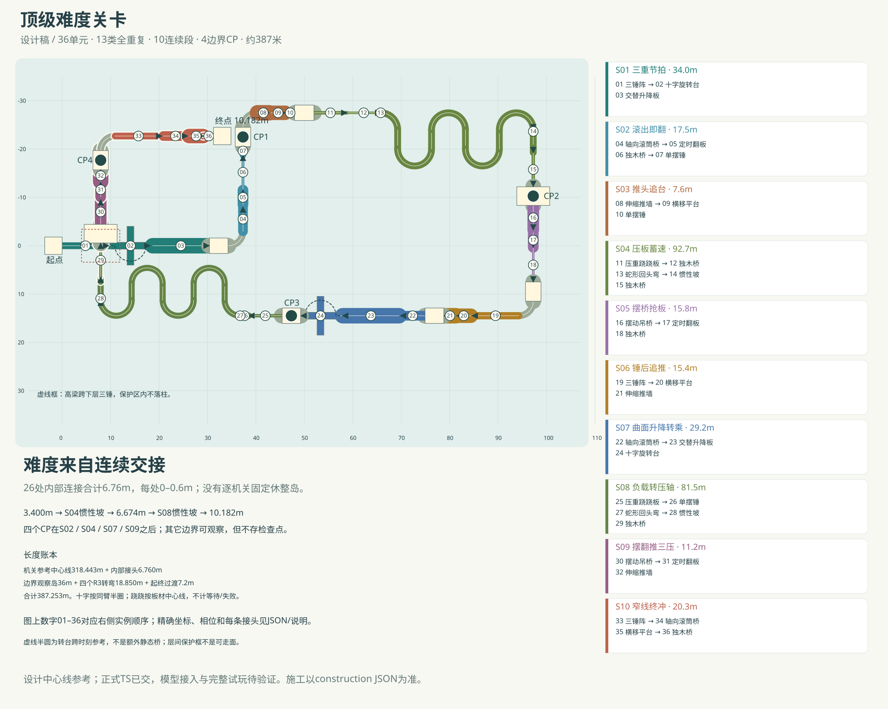

# 顶级难度关卡 · 可讨论设计稿

2026-09-14，依据[设计任务](../product/top-difficulty-design.md)。**约387.25米、10个连续挑战段、36个机关单元、13类全部至少两次、4个边界CP。** 重点是过A马上处理C；不是把现有“机关试炼”放大后换名字。

本稿只交 `top-difficulty.md`、`top-difficulty-layout.json`、`top-difficulty-top-view.svg`。JSON的 `status=design-only`；`top-difficulty`仅设计标识，是否替换现有关卡或新增入口尚未决定。没有运行配置、模型、注册、实施派单、测试、构建、试玩或Git操作。当前三关不改。

## 总体路线

从低层东向三锤起步，经北折返进入推墙与负载板；第一段蛇形向东反复掉头后南转上坡，到中层摆桥链。再向西连过锤/横移/推墙及滚筒/升降/十字；第二段蛇形向西反复掉头后北转升至高层，最后吊桥三连、锤筒台梁冲线。

三层基准顶高为 **3.4 → 6.674 → 10.182米**，升降/跷跷/吊桥还各自改变瞬时高度。S08高梁跨过S01下层三锤一处；下层门架最高约8.02，高梁厚.36对应底约9.822，约1.802米竖向设计余量。上层支撑必须跨出X=[4,11.9]、Z=[−3.4,3.4]、Y≤8.15的下层保护体；不得穿锤道落柱。该净空与镜头遮挡尚未做模型或运行验收，图不是无交叠证明。

起点/终点各3.6米，9个组合边界各4米中心线观察区，4个90°边界弯半径3米、宽1.4米。长距离主要在机关内部：两条蛇形共124.72米、八次180°回头；不是靠长宽走廊补长度。

## 覆盖统计与计数口径

每组三锤按 **1个单元** 计数，每组四升降也按1个单元计数。实际小锤/升降板数量不能替代目录类型的重复次数。

- **单摆锤**：3次；pendulum-01（S02）、pendulum-02（S03）、pendulum-03（S08）。
- **三锤阵**：3次；hammers-01（S01）、hammers-02（S06）、hammers-03（S10）。
- **十字旋转台**：2次；cross-01（S01）、cross-02（S07）。
- **交替升降板**：2次；lifts-01（S01）、lifts-02（S07）。
- **横移平台**：3次；platform-01（S03）、platform-02（S06）、platform-03（S10）。
- **独木桥**：6次；beam-01（S02）、beam-02（S04）、beam-03（S04）、beam-04（S05）、beam-05（S08）、beam-06（S10）。
- **蛇形回头弯**：2次；serpentine-01（S04）、serpentine-02（S08）。
- **惯性坡**：2次；ramp-01（S04）、ramp-02（S08）。
- **压重跷跷板**：2次；weight-seesaw-01（S04）、weight-seesaw-02（S08）。
- **轴向滚筒桥**：3次；axial-roller-01（S02）、axial-roller-02（S07）、axial-roller-03（S10）。
- **伸缩推墙**：3次；piston-wall-01（S03）、piston-wall-02（S06）、piston-wall-03（S09）。
- **定时翻板**：3次；timed-trapdoor-01（S02）、timed-trapdoor-02（S05）、timed-trapdoor-03（S09）。
- **摆动吊桥**：2次；sway-cradle-bridge-01（S05）、sway-cradle-bridge-02（S09）。

全稿有 **26条组合内部连接、22类不同有向二连**；10段均有三项以上，共包含三锤→十字→升降、滚筒→翻板→细梁、推墙→横移→单锤、吊桥→翻板→推墙等不同三连。内部连接总长仅 **6.76米**，每处0–.6米；无独立休整岛，不代表碰撞体互相重叠，也不承诺任何窄接头绝对无法刹停。

## 几何和时钟口径

世界坐标为[x,y,z]、米制Y-up；`headingDegreesXZ`的0为+X、90为+Z，库默认−Z沿 `placement.yawDegrees` 转到行进方向。所有位置和接头端点的完整精度见[JSON](top-difficulty-layout.json)，文档仅显示三位小数。

每实例给定root position/yaw、入口出口、当前岸高和候选参数；共享库根Y=当前岸高−3.4。蛇形/坡以起点为静态制作锚，旧单锤/十字/横移所需广义实例根尚不是运行时现有API。高层库脚、岸下支撑必须真正接到外侧基础或梁柱，不能悬空，也不能造整块隐形底板。

接头“总距.6”可由.15缝+.30窄舌+.15缝组成，**不是一块.6米长的安全岛**。短舌仅宽1.4，桥后落脚口可局部展开以接模型，但不向前延长成休息台。跨缝名义顶高差为0；动件只在列明相位/负载姿态附近接平。窗口中动板高差初按≤.10m，侧位和侧速还需同时满足；球半径.425必须纳入接触时刻，不能只检查点中心。

所有t是**全局游戏时钟的参考秒数**，不是进入段落就重置的局部计时。比如S01可选择t≈24n进入，按实例phase观察同一组相对时序；S05重复参考7.2秒，S06为24秒而非4.8。玩家可在段前岛准备入段速度；表述的到达t只是所选速度下的一条时序草案，未证明真实滚动能复现。暂停不补时，失败不偷偷把下一门放开。

允许在移动平台或升降板上择时，但必须持续控制；不等同每个机关后都有固定安全岛。跷跷板只看真实负载、角度与角速度，没有固定周期；绝不为它套正弦运动。所有速度阈值都是设计需要观察的量，不是未来运行时暗门槛、传送或自动补推。

## 逐段配置和全部组合接头

### S01 三重节拍 · 33.98米

**01 三锤阵 → 02 十字旋转台 → 03 交替升降板**

先把三锤间的通过节拍带到十字，再在离臂窗口直接踩上升降板。第一次先在起点看完三锤和十字的相对节奏。H1末锤不是休息终点；离臂前收横速、同高时上第一板，之后在移动板上纠偏等下一次同高。三锤/十字/第一升降各有相位约束；后续升降板可等待，但没有固定岸恢复。

入口[0, 3.4, 0]朝+X，出口[30.33, 3.4, 0]；失败回START。组合的时序重复参考为24秒。

- **01 三锤阵 / `hammers-01`**：根[4.8, 0, 0]、yaw270°；入口[0, 3.4, 0]→出口[9.6, 3.4, 0]。三把中心站距[1.2, 4.8, 8.4]m；路宽1.4m；周期[4, 3, 2.4]s、角频率[1.5708, 2.0944, 2.618]rad/s；相位[1.0996, 2.1991, 2.3562]rad，目标峰值t=[0.3, 1.2, 2.1]。杆3.6m、侧偏1.65m。参考长度9.600米。
- **02 十字旋转台 / `cross-01`**：根[14.1, 0, 0]、yaw270°；入口[10.1, 3.4, 0]→出口[18.1, 3.4, 0]。跨度8m、臂宽1.4m、角速π/4；入口对齐t2.55、同臂出口t6.55，phase=4.28rad。参考随转半径3.2m，四角露空。参考长度11.653米。
- **03 交替升降板 / `lifts-01`**：根[24.505, 0, 0]、yaw270°；入口[18.68, 3.4, 0]→出口[30.33, 3.4, 0]。4块3.2×.32×2.8m板，节距2.95m；A=0.6m、T4s；各phase=[1.9635, 5.1051, 1.9635, 5.1051]rad；零位参考[6.75, 8.75, 10.75, 12.75, 14.75]s，板间.15m。参考长度11.650米。

本段接头（坐标为名义/接平姿态）：

- **S01-J01：01→02**，[9.6, 3.4, 0]→[10.1, 3.4, 0]，朝+X；总距0.5米、窄舌0.2米、实际缝0.15/0.15米，接平高差0。余速3.5–5，最后一锤避开后立即登臂；不可在短舌上等半圈。H1三锤峰值t=.30/1.20/2.10；十字入口对齐t2.55±.10，末锤后约.45秒到臂端。失误落入该接缝/动件侧下方，回START，不设接头复活。
- **S01-J02：02→03**，[18.1, 3.4, 0]→[18.68, 3.4, 0]，朝+X；总距0.58米、窄舌0.25米、实际缝0.18/0.15米，接平高差0。离臂前抵消侧向带速，|v侧|≤.6，跨缝速度约4。十字出口t6.55±.10，.58m约.145s；第一升降顶高差≤.10窗口t6.643–6.857，可相交在t6.70附近。失误落入该接缝/动件侧下方，回START，不设接头复活。

### S02 滚出即翻 · 17.50米

**04 轴向滚筒桥 → 05 定时翻板 → 06 独木桥 → 07 单摆锤**

曲面纠偏未结束就要进入闭合翻板，随后立刻收成窄梁并过单锤。入筒以4–5m/s推进，提前抵消滚筒侧带；翻板闭合期间通过，梁上调整前速到约3–3.5m/s，把到锤心时刻送入让空带。不是复刻S01择时：这里主要检验运动表面出口的横速是否收得住。

入口[37.33, 3.4, -3]朝−Z，出口[37.33, 3.4, -20.5]；失败回START。组合的时序重复参考为2.4秒。

- **04 轴向滚筒桥 / `axial-roller-01`**：根[37.33, 0, -5.5]、yaw0°；入口[37.33, 3.4, -3]→出口[37.33, 3.4, -8]。圆筒直径2m、长5m，绕纵向Z以-4.5rad/s转；冠部同岸高，出端需要反向补偿横速，不能拿转贴图当带动。参考长度5.000米。
- **05 定时翻板 / `timed-trapdoor-01`**：根[37.33, 0, -10]、yaw0°；入口[37.33, 3.4, -8.5]→出口[37.33, 3.4, -11.5]。板2.2×.24×3m、侧铰0→−90°；阶段[1.5,.20,.48,.22]s、T2.4s，预告.40含闭合；phaseSeconds=1.2，参考闭合[1.2, 2.7]。参考长度3.000米。
- **06 独木桥 / `beam-01`**：根[37.33, 0, -15.2]、yaw0°；入口[37.33, 3.4, -11.7]→出口[37.33, 3.4, -18.7]。宽0.55m、长7m，无护栏；球径.85不变，允许部分悬出。参考长度7.000米。
- **07 单摆锤 / `pendulum-01`**：根[37.33, 0, -19.6]、yaw0°；入口[37.33, 3.4, -18.7]→出口[37.33, 3.4, -20.5]。活动道长1.8m、宽1.3m；头.9×.9×1.36m、侧偏1.65m、T2.4s；phase=2.749rad、原abs(offset)×.16抬升。提前读让空后连续过。参考长度1.800米。

本段接头（坐标为名义/接平姿态）：

- **S02-J01：04→05**，[37.33, 3.4, -8]→[37.33, 3.4, -8.5]，朝−Z；总距0.5米、窄舌0.3米、实际缝0.1/0.1米，接平高差0。滚筒出口|横速|≤.4、中心偏差≤.12、前速4–5；否则会从板侧漏出。按前速4.5，5m滚筒约1.11s，.50接头约.11s；翻板闭合t1.20–2.70，计划入板1.25、离板1.92。失误落入该接缝/动件侧下方，回START，不设接头复活。
- **S02-J02：05→06**，[37.33, 3.4, -11.5]→[37.33, 3.4, -11.7]，朝−Z；总距0.2米、窄舌0米、实际缝0.2米，接平高差0。前速3–4.5；在下翻前把球中心移到窄梁轴线，不能把打开的轴套当边路。S02翻板闭合至2.70；入梁参考1.97。S05闭合至3.75；入梁参考3.18。独木桥本身无相位。失误落入该接缝/动件侧下方，回START，不设接头复活。
- **S02-J03：06→07**，[37.33, 3.4, -18.7]→[37.33, 3.4, -18.7]，朝−Z；总距0米、窄舌0米、实际缝0/0米，接平高差0。保持线位，看到锤让空再跨其中心；无桥后完整观察岛。S02梁7m前速约3，单锤中心参考t4.35；T2.4、峰值4.35附近按|offset|>1.105推导让空约±.32s。失误落入该接缝/动件侧下方，回START，不设接头复活。

### S03 推头追台 · 7.65米

**08 伸缩推墙 → 09 横移平台 → 10 单摆锤**

通过推头后直接追横移台，下一次对齐就要离台过锤。在段前等推头收回；推墙后的.4米总接头没有独立等待岛。登台后随板移动，回中心时向前出，头部让空恰好落在随后约.3秒。平台中途留台属于持续动态控制，不是过一项到固定安全岛重开下一项。

入口[40.33, 3.4, -27.5]朝+X，出口[47.98, 3.4, -27.5]；失败回CP1。组合的时序重复参考为4.8秒。

- **08 伸缩推墙 / `piston-wall-01`**：根[41.53, 0, -27.5]、yaw270°；入口[40.33, 3.4, -27.5]→出口[42.73, 3.4, -27.5]。活动道2.4m、宽3.2m；行程3.7m、阶段[.83,.45,.22,.65,.25]s、T2.4s；phaseSeconds=0，全收回参考从t0起持续1.28s（含预告），杆.08m半径真实随伸缩碰撞。参考长度2.400米。
- **09 横移平台 / `platform-01`**：根[44.58, 0, -27.5]、yaw270°；入口[43.13, 3.4, -27.5]→出口[46.03, 3.4, -27.5]。主体3×.36×2.9m、侧向A3.6m、T4.8s；phase=5.367rad，中位登/离t0.7/3.0999999999999996。参考长度2.900米。
- **10 单摆锤 / `pendulum-02`**：根[47.08, 0, -27.5]、yaw270°；入口[46.18, 3.4, -27.5]→出口[47.98, 3.4, -27.5]。活动道长1.8m、宽1.3m；头.9×.9×1.36m、侧偏1.65m、T2.4s；phase=5.236rad、原abs(offset)×.16抬升。提前读让空后连续过。参考长度1.800米。

本段接头（坐标为名义/接平姿态）：

- **S03-J01：08→09**，[42.73, 3.4, -27.5]→[43.13, 3.4, -27.5]，朝+X；总距0.4米、窄舌0.1米、实际缝0.15/0.15米，接平高差0。不能站在危险带末端等待；推头收回时通过，前速3.5–5，对准横移中心。S03推墙全收回含预告t0–1.28；门带中点t.30、末端t.60，.4接头约.10s，平台中心t.70。失误落入该接缝/动件侧下方，回CP1，不设接头复活。
- **S03-J02：09→10**，[46.03, 3.4, -27.5]→[46.18, 3.4, -27.5]，朝+X；总距0.15米、窄舌0米、实际缝0.15米，接平高差0。平台上跟随再向前离开，出端前|横速|≤.6；锤前不能刹成停点。平台入口中心t.70，下一中心t3.10离开；.15缝+.9到锤心按3.5m/s约.30s，单锤峰值t3.40。失误落入该接缝/动件侧下方，回CP1，不设接头复活。

### S04 压板蓄速 · 92.74米

**11 压重跷跷板 → 12 独木桥 → 13 蛇形回头弯 → 14 惯性坡 → 15 独木桥**

用负载压板接窄梁，长蛇形中重新组织速度，再冲坡和短窄出口。跷跷出口低到接岸高度时上梁，梁与蛇形直接相接；四次回头之后只留.35米切向，带4.5–6.2m/s目标余速上坡，坡顶马上收成.7米梁。负载出板时刻没有时钟保证；其后到坡前全部静态，不会停等机关又被要求满速。

入口[51.98, 3.4, -27.5]朝+X，出口[97.26, 6.674, -12.27]；失败回CP1。含负载驱动，不设固定重复通过时刻。

- **11 压重跷跷板 / `weight-seesaw-01`**：根[55.37, 0, -27.5]、yaw270°；入口[51.98, 3.4, -27.5]→出口[58.76, 3.4, -27.5]。板.7×.30×7m，低端岸缘±3.39m；m.65/k4/c3、初始入口低+25°、限角±25°。轴高=岸高+1.343218m；无固定周期，出端靠负载压到−25°附近。参考长度7.309米。
- **12 独木桥 / `beam-02`**：根[62.26, 0, -27.5]、yaw270°；入口[58.76, 3.4, -27.5]→出口[65.76, 3.4, -27.5]。宽0.5m、长7m，无护栏；球径.85不变，允许部分悬出。参考长度7.000米。
- **13 蛇形回头弯 / `serpentine-01`**：根[65.76, 0, -27.5]、yaw270°；入口[65.76, 3.4, -27.5]→出口[97.26, 3.4, -24]。R3.5、宽1.4m；入口90°+四次交替180°，四条4m直臂，按5°盒段未来实现；禁止填弯心。参考长度65.480米。
- **14 惯性坡 / `ramp-01`**：根[97.26, 0, -23.65]、yaw180°；入口[97.26, 3.4, -23.65]→出口[97.26, 6.674, -19.27]。坡角[20, 46, 20]°、斜长[1, 3.6, 1]m、宽1.4m；入口目标4.5–6.2m/s，非隐藏速度判定。参考长度5.600米。
- **15 独木桥 / `beam-03`**：根[97.26, 3.274, -15.77]、yaw180°；入口[97.26, 6.674, -19.27]→出口[97.26, 6.674, -12.27]。宽0.7m、长7m，无护栏；球径.85不变，允许部分悬出。参考长度7.000米。

本段接头（坐标为名义/接平姿态）：

- **S04-J01：11→12**，[58.76, 3.4, -27.5]→[58.76, 3.4, -27.5]，朝+X；总距0米、窄舌0米、实际缝0/0米，接平高差0。负载把出口压到−25°附近后才离板；前速约2.5–4，横偏≤.10，窄梁接板端本身无定时窗。无固定相位。低端顶H且到名义岸沿余缝.15453已计入跷跷单元，下一梁从该岸沿开始，不另插等待台。失误落入该接缝/动件侧下方，回CP1，不设接头复活。
- **S04-J02：12→13**，[65.76, 3.4, -27.5]→[65.76, 3.4, -27.5]，朝+X；总距0米、窄舌0米、实际缝0/0米，接平高差0。从窄梁到连续弯，前速4–5.5，提前转向；宽度变化同高直接相接。静态接头无时钟，后面的每个回头都需控线；不存在等待后自动补速。失误落入该接缝/动件侧下方，回CP1，不设接头复活。
- **S04-J03：13→14**，[97.26, 3.4, -24]→[97.26, 3.4, -23.65]，朝+Z；总距0.35米、窄舌0.35米、实际缝0/0米，接平高差0。目标出弯4.5–6.2；过度刹车无法靠.35m重获全部动量，切向接坡不转直角。纯静态连续面，无相位等待；主坡46/48°按连锁余速选，不搬用旧单项通关证明。失误落入该接缝/动件侧下方，回CP1，不设接头复活。
- **S04-J04：14→15**，[97.26, 6.674, -19.27]→[97.26, 6.674, -19.27]，朝+Z；总距0米、窄舌0米、实际缝0/0米，接平高差0。坡顶马上收窄到.7/.6m梁，出坡后短刹定线；不在顶部放宽平台。三段坡末端顶面与梁同高、同切线，间隙0。低速失败可回滚，失控越过边缘即落水。失误落入该接缝/动件侧下方，回CP1，不设接头复活。

### S05 摆桥抢板 · 15.75米

**16 摆动吊桥 → 17 定时翻板 → 18 独木桥**

45°吊桥尚在摆动，出口就接翻板，翻板后是.5米梁。桥上主动补偿倾摆；最后半秒减小相对岸的横速，在中位离桥，跨.6米总接头赶入翻板闭合段。比S02更强调倾斜与横移耦合；45°并不意味着任意角度都能接岸。

入口[97.26, 6.674, -8.27]朝+Z，出口[97.26, 6.674, 7.48]；失败回CP2。组合的时序重复参考为7.2秒。

- **16 摆动吊桥 / `sway-cradle-bridge-01`**：根[97.26, 3.274, -5.77]、yaw180°；入口[97.26, 6.674, -8.27]→出口[97.26, 6.674, -3.27]。板2.4×.24×5m、上轴至板心2.8m，45°/T3.6s；phaseSeconds=-0.4，中位登/离t0.4/2.2；端架宽8.94m、非软体。参考长度5.000米。
- **17 定时翻板 / `timed-trapdoor-02`**：根[97.26, 3.274, -1.17]、yaw180°；入口[97.26, 6.674, -2.67]→出口[97.26, 6.674, 0.33]。板2.2×.24×3m、侧铰0→−90°；阶段[1.5,.20,.48,.22]s、T2.4s，预告.40含闭合；phaseSeconds=0.15，参考闭合[2.25, 3.75]。参考长度3.000米。
- **18 独木桥 / `beam-04`**：根[97.26, 3.274, 3.98]、yaw180°；入口[97.26, 6.674, 0.48]→出口[97.26, 6.674, 7.48]。宽0.5m、长7m，无护栏；球径.85不变，允许部分悬出。参考长度7.000米。

本段接头（坐标为名义/接平姿态）：

- **S05-J01：16→17**，[97.26, 6.674, -3.27]→[97.26, 6.674, -2.67]，朝+Z；总距0.6米、窄舌0.3米、实际缝0.15/0.15米，接平高差0。桥出口附近先把相对岸的|横速|降至.6以下，沿中心短舌过，不把球绑桥。S05桥中位t.40/2.20，计划2.20离开，.60m按4m/s=.15s到板；翻板闭合2.25–3.75。S09中位.30/2.70，闭合2.78–4.28，计划入板2.85。失误落入该接缝/动件侧下方，回CP2，不设接头复活。
- **S05-J02：17→18**，[97.26, 6.674, 0.33]→[97.26, 6.674, 0.48]，朝+Z；总距0.15米、窄舌0米、实际缝0.15米，接平高差0。前速3–4.5；在下翻前把球中心移到窄梁轴线，不能把打开的轴套当边路。S02翻板闭合至2.70；入梁参考1.97。S05闭合至3.75；入梁参考3.18。独木桥本身无相位。失误落入该接缝/动件侧下方，回CP2，不设接头复活。

### S06 锤后追推 · 15.40米

**19 三锤阵 → 20 横移平台 → 21 伸缩推墙**

第二组三锤改变次序和相位，末锤接横移，离台又面临持续侧推。以较快节拍穿过锤阵，平台中位登台，再等下一次中心出端。此次出口不接锤，而是更早需要看清推杆是否完全让开。同一横移台改变上游余速和下游避让对象；不是复制上一条路线。

入口[94.26, 6.674, 14.48]朝−X，出口[78.86, 6.674, 14.48]；失败回CP2。组合的时序重复参考为24秒。

- **19 三锤阵 / `hammers-02`**：根[89.46, 3.274, 14.48]、yaw90°；入口[94.26, 6.674, 14.48]→出口[84.66, 6.674, 14.48]。三把中心站距[1.2, 4.8, 8.4]m；路宽1.5m；周期[3, 2.4, 4]s、角频率[2.0944, 2.618, 1.5708]rad/s；相位[1.0116, 1.919, 4.9213]rad，目标峰值t=[0.267, 1.067, 1.867]。杆3.6m、侧偏1.65m。参考长度9.600米。
- **20 横移平台 / `platform-02`**：根[82.91, 3.274, 14.48]、yaw90°；入口[84.36, 6.674, 14.48]→出口[81.46, 6.674, 14.48]。主体3×.36×2.9m、侧向A3.6m、T4.8s；phase=3.403rad，中位登/离t2.2/4.6。参考长度2.900米。
- **21 伸缩推墙 / `piston-wall-02`**：根[80.06, 3.274, 14.48]、yaw90°；入口[81.26, 6.674, 14.48]→出口[78.86, 6.674, 14.48]。活动道2.4m、宽3.2m；行程3.7m、阶段[.83,.45,.22,.65,.25]s、T2.4s；phaseSeconds=0.3，全收回参考从t4.5起持续1.28s（含预告），杆.08m半径真实随伸缩碰撞。参考长度2.400米。

本段接头（坐标为名义/接平姿态）：

- **S06-J01：19→20**，[84.66, 6.674, 14.48]→[84.36, 6.674, 14.48]，朝−X；总距0.3米、窄舌0米、实际缝0.3米，接平高差0。末锤后直接滚入当次对齐平台，错过则落水/退回锤区，不能安全站在岸沿。S06锤峰t.267/1.067/1.867，9.6m+缝.3按4.5m/s约2.20；平台中心2.20，下一中心4.60离开。失误落入该接缝/动件侧下方，回CP2，不设接头复活。
- **S06-J02：20→21**，[81.46, 6.674, 14.48]→[81.26, 6.674, 14.48]，朝−X；总距0.2米、窄舌0米、实际缝0.2米，接平高差0。平台离开就进推杆危险带，必须先看推头回收，余横速≤.6。S06平台出端4.60，.2缝后4.65进推墙，推墙全收回窗口4.50–5.78；计划过中点4.95，包含球半径进入危险带之前已收回。失误落入该接缝/动件侧下方，回CP2，不设接头复活。

### S07 曲面升降转乘 · 29.18米

**22 轴向滚筒桥 → 23 交替升降板 → 24 十字旋转台**

反转滚筒→升降组→十字，把持续平衡改为高度判断再改为转乘。R2与R1转向相反，出筒先收侧漂，同高上板；最后一板到零位时穿过短舌登十字，维持同臂参考路线到对岸。升降幅度.65而非S01的.60，且十字在组尾；相位关系重新指定。

入口[74.86, 6.674, 14.48]朝−X，出口[49.33, 6.674, 14.48]；失败回CP2。组合的时序重复参考为24秒。

- **22 轴向滚筒桥 / `axial-roller-02`**：根[72.36, 3.274, 14.48]、yaw90°；入口[74.86, 6.674, 14.48]→出口[69.86, 6.674, 14.48]。圆筒直径2m、长5m，绕纵向Z以4.5rad/s转；冠部同岸高，出端需要反向补偿横速，不能拿转贴图当带动。参考长度5.000米。
- **23 交替升降板 / `lifts-02`**：根[63.735, 3.274, 14.48]、yaw90°；入口[69.56, 6.674, 14.48]→出口[57.91, 6.674, 14.48]。4块3.2×.32×2.8m板，节距2.95m；A=0.65m、T4s；各phase=[4.1626, 1.021, 4.1626, 1.021]rad；零位参考[1.35, 3.35, 5.35, 7.35, 9.35]s，板间.15m。参考长度11.650米。
- **24 十字旋转台 / `cross-02`**：根[53.33, 3.274, 14.48]、yaw90°；入口[57.33, 6.674, 14.48]→出口[49.33, 6.674, 14.48]。跨度8m、臂宽1.4m、角速π/4；入口对齐t9.5、同臂出口t13.5，phase=5.105rad。参考随转半径3.2m，四角露空。参考长度11.653米。

本段接头（坐标为名义/接平姿态）：

- **S07-J01：22→23**，[69.86, 6.674, 14.48]→[69.56, 6.674, 14.48]，朝−X；总距0.3米、窄舌0米、实际缝0.3米，接平高差0。筒末抵消横漂，同时选择第一板同高，前速约4–5。S07滚筒5m按4m/s=1.25，加.30缝=.075；第一板零位t1.35，高差≤.10约t1.252–1.448，计划入板1.325。失误落入该接缝/动件侧下方，回CP2，不设接头复活。
- **S07-J02：23→24**，[57.91, 6.674, 14.48]→[57.33, 6.674, 14.48]，朝−X；总距0.58米、窄舌0.25米、实际缝0.15/0.18米，接平高差0。在最后升降下降/上升零位离开，抑制Y速度影响；沿短舌直接登臂。S07第一零位1.35，后续跨板3.35/5.35/7.35，最后出端9.35；.58m约.145s，十字对齐9.50±.10，参考抵达9.495。失误落入该接缝/动件侧下方，回CP2，不设接头复活。

### S08 负载转压轴 · 81.50米

**25 压重跷跷板 → 26 单摆锤 → 27 蛇形回头弯 → 28 惯性坡 → 29 独木桥**

第二块负载板出口直接带单锤，随后更窄回头弯、稍陡坡和.6米高层梁。在会运动的板上同时看锤，不给跷跷预设固定过关时间。锤让空且出口低时出；之后四次反向、保速上坡，越过下层三锤上方进入高层。负载板→定时锤是本稿最高不确定性之一；需要玩家能调节离板时机，未证明任意初始状态必有轻松通路。

入口[45.33, 6.674, 14.48]朝−X，出口[7.95, 10.182, -0.492]；失败回CP3。含负载驱动，不设固定重复通过时刻。

- **25 压重跷跷板 / `weight-seesaw-02`**：根[41.94, 3.274, 14.48]、yaw90°；入口[45.33, 6.674, 14.48]→出口[38.55, 6.674, 14.48]。板.7×.30×7m，低端岸缘±3.39m；m.65/k4/c3、初始入口低+25°、限角±25°。轴高=岸高+1.343218m；无固定周期，出端靠负载压到−25°附近。参考长度7.309米。
- **26 单摆锤 / `pendulum-03`**：根[37.65, 3.274, 14.48]、yaw90°；入口[38.55, 6.674, 14.48]→出口[36.75, 6.674, 14.48]。活动道长1.8m、宽1.3m；头.9×.9×1.36m、侧偏1.65m、T2.4s；phase=1.571rad、原abs(offset)×.16抬升。到达由负载事件决定，不设固定出板t。参考长度1.800米。
- **27 蛇形回头弯 / `serpentine-02`**：根[36.75, 3.274, 14.48]、yaw90°；入口[36.75, 6.674, 14.48]→出口[7.95, 6.674, 11.28]。R3.2、宽1.25m；入口90°+四次交替180°，四条3.5m直臂，按5°盒段未来实现；禁止填弯心。参考长度59.239米。
- **28 惯性坡 / `ramp-02`**：根[7.95, 3.274, 10.93]、yaw0°；入口[7.95, 6.674, 10.93]→出口[7.95, 10.182, 6.508]。坡角[20, 48, 20]°、斜长[1, 3.8, 1]m、宽1.25m；入口目标4.5–6.2m/s，非隐藏速度判定。参考长度5.800米。
- **29 独木桥 / `beam-05`**：根[7.95, 6.782, 3.008]、yaw0°；入口[7.95, 10.182, 6.508]→出口[7.95, 10.182, -0.492]。宽0.6m、长7m，无护栏；球径.85不变，允许部分悬出。参考长度7.000米。

本段接头（坐标为名义/接平姿态）：

- **S08-J01：25→26**，[38.55, 6.674, 14.48]→[38.55, 6.674, 14.48]，朝−X；总距0米、窄舌0米、实际缝0/0米，接平高差0。先观察锤，再用位置压低板端；错相需在会受载运动的板上重新组织，不能假定出板固定时刻。事件条件：出口角−25至−23°附近且预计t_exit+.9/v时锤|offset|>1.105。锤T2.4独立转；交集依玩家动作，未证明每次板落低都可出。失误落入该接缝/动件侧下方，回CP3，不设接头复活。
- **S08-J02：26→27**，[36.75, 6.674, 14.48]→[36.75, 6.674, 14.48]，朝−X；总距0米、窄舌0米、实际缝0/0米，接平高差0。出锤后无休整台，立即控线进入首弯；随后静态长蛇形容许逐步蓄速。过锤只看上游真实让空；蛇形自身无定时，避免负载事件时间被强制接成坡脚定时门。失误落入该接缝/动件侧下方，回CP3，不设接头复活。
- **S08-J03：27→28**，[7.95, 6.674, 11.28]→[7.95, 6.674, 10.93]，朝−Z；总距0.35米、窄舌0.35米、实际缝0/0米，接平高差0。目标出弯4.5–6.2；过度刹车无法靠.35m重获全部动量，切向接坡不转直角。纯静态连续面，无相位等待；主坡46/48°按连锁余速选，不搬用旧单项通关证明。失误落入该接缝/动件侧下方，回CP3，不设接头复活。
- **S08-J04：28→29**，[7.95, 10.182, 6.508]→[7.95, 10.182, 6.508]，朝−Z；总距0米、窄舌0米、实际缝0/0米，接平高差0。坡顶马上收窄到.7/.6m梁，出坡后短刹定线；不在顶部放宽平台。三段坡末端顶面与梁同高、同切线，间隙0。低速失败可回滚，失控越过边缘即落水。失误落入该接缝/动件侧下方，回CP3，不设接头复活。

### S09 摆翻推三压 · 11.20米

**30 摆动吊桥 → 31 定时翻板 → 32 伸缩推墙**

高层吊桥→翻板→推墙，不再把翻板出口当稳定落脚区。桥中位离开，翻板尚闭合；穿过后趁推头完全收回滚出危险带。任何一项犹豫都会让下一项窗口错过。吊桥周期4.8而非S05的3.6，给后续双门一个可安排的共同重复周期，难点来自三项连续而非无限加速。

入口[7.95, 10.182, -4.492]朝−Z，出口[7.95, 10.182, -15.692]；失败回CP3。组合的时序重复参考为4.8秒。

- **30 摆动吊桥 / `sway-cradle-bridge-02`**：根[7.95, 6.782, -6.992]、yaw0°；入口[7.95, 10.182, -4.492]→出口[7.95, 10.182, -9.492]。板2.4×.24×5m、上轴至板心2.8m，45°/T4.8s；phaseSeconds=-0.3，中位登/离t0.3/2.6999999999999997；端架宽8.94m、非软体。参考长度5.000米。
- **31 定时翻板 / `timed-trapdoor-03`**：根[7.95, 6.782, -11.592]、yaw0°；入口[7.95, 10.182, -10.092]→出口[7.95, 10.182, -13.092]。板2.2×.24×3m、侧铰0→−90°；阶段[1.5,.20,.48,.22]s、T2.4s，预告.40含闭合；phaseSeconds=2.02，参考闭合[2.78, 4.279999999999999]。参考长度3.000米。
- **32 伸缩推墙 / `piston-wall-03`**：根[7.95, 6.782, -14.492]、yaw0°；入口[7.95, 10.182, -13.292]→出口[7.95, 10.182, -15.692]。活动道2.4m、宽3.2m；行程3.7m、阶段[.83,.45,.22,.65,.25]s、T2.4s；phaseSeconds=1.3，全收回参考从t3.5起持续1.28s（含预告），杆.08m半径真实随伸缩碰撞。参考长度2.400米。

本段接头（坐标为名义/接平姿态）：

- **S09-J01：30→31**，[7.95, 10.182, -9.492]→[7.95, 10.182, -10.092]，朝−Z；总距0.6米、窄舌0.3米、实际缝0.15/0.15米，接平高差0。桥出口附近先把相对岸的|横速|降至.6以下，沿中心短舌过，不把球绑桥。S05桥中位t.40/2.20，计划2.20离开，.60m按4m/s=.15s到板；翻板闭合2.25–3.75。S09中位.30/2.70，闭合2.78–4.28，计划入板2.85。失误落入该接缝/动件侧下方，回CP3，不设接头复活。
- **S09-J02：31→32**，[7.95, 10.182, -13.092]→[7.95, 10.182, -13.292]，朝−Z；总距0.2米、窄舌0米、实际缝0.2米，接平高差0。翻板回位不是安全平台；按闭合时段穿到推头已收回的危险带，前速约4。S09板入2.85/出3.60，.20缝到推墙3.65；推墙全收回从3.50至4.78，过头中心约3.95。失误落入该接缝/动件侧下方，回CP3，不设接头复活。

### S10 窄线终冲 · 20.30米

**33 三锤阵 → 34 轴向滚筒桥 → 35 横移平台 → 36 独木桥**

第三组三锤→更快滚筒→横移台→极短细梁收线。末锤后直接上筒，R3达到−5rad/s；出筒追中位平台，离台横速需降至.35以内，越过.45米宽、2米长的终点细梁。最后一段不再加长直路凑距离；最后2米要求精确出端，随后才给终点制动岛。

入口[10.95, 10.182, -22.692]朝+X，出口[31.25, 10.182, -22.692]；失败回CP4。组合的时序重复参考为24秒。

- **33 三锤阵 / `hammers-03`**：根[15.75, 6.782, -22.692]、yaw270°；入口[10.95, 10.182, -22.692]→出口[20.55, 10.182, -22.692]。三把中心站距[1.2, 4.8, 8.4]m；路宽1.4m；周期[2.4, 4, 3]s、角频率[2.618, 1.5708, 2.0944]rad/s；相位[0.8718, 3.0363, 3.9437]rad，目标峰值t=[0.267, 1.067, 1.867]。杆3.6m、侧偏1.65m。参考长度9.600米。
- **34 轴向滚筒桥 / `axial-roller-03`**：根[23.4, 6.782, -22.692]、yaw270°；入口[20.9, 10.182, -22.692]→出口[25.9, 10.182, -22.692]。圆筒直径2m、长5m，绕纵向Z以-5.0rad/s转；冠部同岸高，出端需要反向补偿横速，不能拿转贴图当带动。参考长度5.000米。
- **35 横移平台 / `platform-03`**：根[27.65, 6.782, -22.692]、yaw270°；入口[26.2, 10.182, -22.692]→出口[29.1, 10.182, -22.692]。主体3×.36×2.9m、侧向A3.6m、T4.8s；phase=1.636rad，中位登/离t3.55/5.949999999999999。参考长度2.900米。
- **36 独木桥 / `beam-06`**：根[30.25, 6.782, -22.692]、yaw270°；入口[29.25, 10.182, -22.692]→出口[31.25, 10.182, -22.692]。宽0.45m、长2m，无护栏；球径.85不变，允许部分悬出。参考长度2.000米。

本段接头（坐标为名义/接平姿态）：

- **S10-J01：33→34**，[20.55, 10.182, -22.692]→[20.9, 10.182, -22.692]，朝+X；总距0.35米、窄舌0.15米、实际缝0.1/0.1米，接平高差0。末锤出口立即改为持续侧向补偿，不能先停稳再上筒。S10锤峰t.267/1.067/1.867，末端9.6/4.5≈2.13，加.35m≈.08s，入筒约2.21；筒恒转无登离时钟。失误落入该接缝/动件侧下方，回CP4，不设接头复活。
- **S10-J02：34→35**，[25.9, 10.182, -22.692]→[26.2, 10.182, -22.692]，朝+X；总距0.3米、窄舌0米、实际缝0.3米，接平高差0。从曲面滚到横移板，出筒|横速|≤.4、前速约4；目标不是固定岸。S10筒入约2.21、出约3.46，加.3缝=.075；平台中心3.55±.12，计划入板3.535。失误落入该接缝/动件侧下方，回CP4，不设接头复活。
- **S10-J03：35→36**，[29.1, 10.182, -22.692]→[29.25, 10.182, -22.692]，朝+X；总距0.15米、窄舌0米、实际缝0.15米，接平高差0。离台前抵消带速，梁入口横偏≤.08、|横速|≤.35，不能用平台底座补成宽桥。S10平台中位入3.55/出5.95，.15缝按3.5m/s约.043s，梁常在，但位置误差直接导致落水。失误落入该接缝/动件侧下方，回CP4，不设接头复活。

## 窗口推导与必要的不确定性

**十字与升降相接。** 臂宽1.4、球半径.425，在臂上半径3.5处以完整横向留边.275计算，投影角带约±asin(.275/3.5)=±4.506°。角速π/4时约±.10秒；这只约束登离投影，不能证明任意球速能跨缝。第一组升降以A.6、ω=π/2，岸高差≤.10给出零位两侧 `asin(.10/.6)/(π/2)≈.107s`，与十字出口加.145s接头行程存在时间交集。S07方向相反也给了独立相位，不假定原第一组相位自然适合反接。

**板间不是一次冲四板。** 每组相邻板反相，A.6时相邻高差≤.10的窗口全宽为 `2asin(.10/1.2)/(π/2)≈.106s`（A.65约.098s）；这比到岸窗口更短。计划跨板时刻相隔2秒，中间在当前运动板上移动/修正/择时。若真实升降接触不能容纳该窗口，后续应调整该组相位、幅度或缝，不允许暗跳或粘球。本稿没有宣布这组已可通行。

**侧向余速是直接连接的核心。** 滚筒→翻板、平台→梁、吊桥→翻板不仅需要入口“开着”。以.6米接头、向前4m/s计约.15秒，若仍有3m/s横漂会侧移.45米，超过窄舌目标带；必须在上游就把横速收下来。设计明确给出≤.4/.6/.35m/s不同目标，不在接头上赠送纠偏力。当前刹车作用于世界水平速度而非相对载体速度，不能承诺长按就能站稳。

**静态蛇形→坡不等待。** R3.5/3.2与原控制12量级下，向心需求v²/R在v5.5时约8.64/9.45m/s²，已占用大量方向控制；不是随意画急弯后要求7m/s。末尾.35米接坡，主坡选46°×3.6与48°×3.8，前后20°×1米；没有机械照抄旧50°结果。按仅平移质点的粗算，主坡每米净阻力 `16sinθ−12cosθ` 约3.173/3.861N，入口20°可做正功约5.805J；低速与保速有区分的可能，但滚动惯量、真实摩擦和接缝冲击尚未计入，不能据此保证4.5m/s必登顶。坡后窄梁才是稳定出坡的最终考验。

**负载板→单锤有真实风险。** S08没有一个可填进phase的跷跷通过t。必须同时满足出口压低与预计到锤中心时让空，玩家可在板上调整重心等待下一轮；能否稳定控制该交集尚未证明。若后续认为它必须靠碰运气，应调整单锤相位/幅度或此处短连接，不能把负载板改成定时台来“通过”。

**完整结构不是接触主体的AABB。** 滚筒轴、翻板侧轴架、吊桥门架均伸出主体。S05/S09的.6米接头给主体间距，吊桥端架保持在高位/两侧，翻板近端轴套留侧位；后续需要以当前细部网格做定向支座/端盖改造。尤其十字外角半径约4.061，静态短舌起点需在4.18外；不能从名义半径4贴死一块岸。低层/高层交叉必须保留图中禁柱体。所有这些是明确的设计依赖，没有宣称旧模型原封不动摆上就无穿模。

## 边界观察区与CP

9个边界的中心线总长各4米（转弯另计），所需端缝从其中扣除静态承托；组合内部不加安全岛。B04/B08为吊桥入口将岸口横向展开到6.8米，其余3.2米宽；没有加长休息路。其余转弯以1.4米窄路R3连接，不能用加大圆盘变成跳过难点的平台。CP放在边界岛中心，圆环半径.8、触发半径1.2，岛宽3.2或6.8可容纳；无CP在移动件或接头上。

- **B01（S01后）**：观察岛中心[32.33, 3.4, 0]，中心线长4/岸宽3.2米；源端缝0.15、目标端缝0.12米已从承托中扣除；不存检查点，随后R3转-90°、窄路1.4米。
- **B02（S02后）**：观察岛中心[37.33, 3.4, -22.5]，中心线长4/岸宽3.2米；源端缝0、目标端缝0米已从承托中扣除；设CP1，随后R3转90°、窄路1.4米。
- **B03（S03后）**：观察岛中心[49.98, 3.4, -27.5]，中心线长4/岸宽3.2米；源端缝0、目标端缝0米已从承托中扣除；不存检查点，随后沿当前切线进入下段。
- **B04（S04后）**：观察岛中心[97.26, 6.674, -10.27]，中心线长4/岸宽6.8米；源端缝0、目标端缝0.15米已从承托中扣除；设CP2，随后沿当前切线进入下段。
- **B05（S05后）**：观察岛中心[97.26, 6.674, 9.48]，中心线长4/岸宽3.2米；源端缝0、目标端缝0米已从承托中扣除；不存检查点，随后R3转90°、窄路1.4米。
- **B06（S06后）**：观察岛中心[76.86, 6.674, 14.48]，中心线长4/岸宽3.2米；源端缝0、目标端缝0.12米已从承托中扣除；不存检查点，随后沿当前切线进入下段。
- **B07（S07后）**：观察岛中心[47.33, 6.674, 14.48]，中心线长4/岸宽3.2米；源端缝0.18、目标端缝0米已从承托中扣除；设CP3，随后沿当前切线进入下段。
- **B08（S08后）**：观察岛中心[7.95, 10.182, -2.492]，中心线长4/岸宽6.8米；源端缝0、目标端缝0.15米已从承托中扣除；不存检查点，随后沿当前切线进入下段。
- **B09（S09后）**：观察岛中心[7.95, 10.182, -17.692]，中心线长4/岸宽3.2米；源端缝0、目标端缝0米已从承托中扣除；设CP4，随后R3转90°、窄路1.4米。

CP1球心[37.33, 3.95, -22.5]，失误重试S03起的组合。

CP2球心[97.26, 7.224, -10.27]，失误重试S05起的组合。

CP3球心[47.33, 7.224, 14.48]，失误重试S08起的组合。

CP4球心[7.95, 10.732, -17.692]，失误重试S10起的组合。

## 长度来源

- 36个机关参考中心线合计 **318.443米**。
- 26个组合内部接头 **6.760米**，不重复计在相邻主体中。
- 9个边界观察岛 **36米**。
- 4个R3/90°边界弯 **4×3×π/2=18.850米**。
- 起终点过渡 **3.6+3.6=7.2米**。
- 合计 **387.253米，取设计量级约387米**。非机关本体约17.8%，其中多数是观察岛和窄转弯，不是长宽走廊。

蛇形按每项 `R×(π/2+4π)+4×直臂长` 计算，S04为65.480米、S08为59.239米；两项合计124.719米。坡按斜长而不是水平投影；十字每项按进臂.8+半径3.2的半圈+离臂.8，共11.653米。跷跷每项按7米板材中心线+两端各.154530米缝，共7.309米，实际世界轨迹还会叠加负载引起的板运动，不能给出唯一固定走线长度。

这些共同构成**选定参考通行路线**的长度，不是实测球心总路程；等候、额外转盘圈数、在板上退回纠偏和失败重跑都未计。时序参考也不是把387米除以7得出的通关时间，不设金银铜秒数。

## 将来的CODE / ART缺口（只记录，不派实施）

1. 旧`pendulum/turntable/platform`仍是单字段，平台也没有现成显式相位/任意实例朝向；这里的多套旧机关与节拍关系不能直接写入现有LevelConfig。需要以后获准的多实例协议，现阶段JSON不是伪运行配置。
2. 三锤阵和四升降要有组id，确保“一阵/一组”统计、分相位、资源与生命周期不串组；多朝向必须把位姿、速度、局部轴和杆碰撞一起变换。
3. 共享库长跷跷和45°吊桥可作为几何基准，但接头端盖、轴架和高层支座需逐段重新装配；不把模型原点、主体尺寸或根bounds当作真实接缝。长窄板仍由原生单铰链/负载控制。
4. 十字跨时刻路线不是要建一条静态半圆；升降高度和平台横移是动态端口，不可用固定顶面或全包围盒代替。快推杆须保留真实随长度变化碰撞及回收AABB更新。
5. 两段蛇形和坡、短舌、上跨梁、边界岛需要以后精确碰撞/静态模型数据；图中统一中心线只是设计骨架。高层下方不得有落柱挡住低层，完整视线与阴影需在另行授权阶段处理，不改已认可镜头掩盖问题。
6. 长线资源可考虑同模型多实例及按区域持有，但单共享GLB仍是整包下载；分区流送、异步取消、阶段时钟与多CP存档都不是本稿已实现功能。是否替换现有关卡、正式id/rulesVersion、奖牌阈值和预算以后决定。

本轮只形成可讨论设计：位置、接头、候选相位/速度、重复统计和长度已明确；真实可通过窗口、手机持续输入、低帧高速接触以及完整模型无穿模均未验证。没有向CODE或ART下发实施任务，没有修改“机关试炼”或现有目录。
