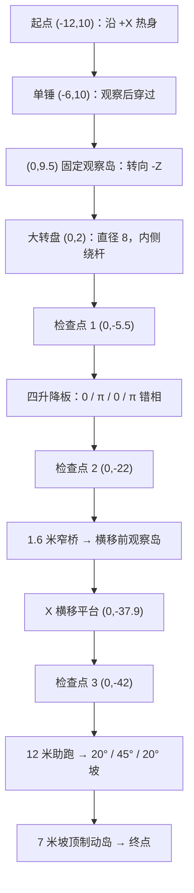

# 水上冲关 · 第二关设计与交接

任务 LEVEL-02-NEW。当前已完成首份可供美术排布的正式布局与静态几何检查；尚未创建运行配置、尚未可选或试玩。代码当前优先 GitHub/CI/CD/部署，关卡与美术按用户纠正继续独立制作，不等待部署结束再做布局。

唯一设计数据为 [water-rush-layout.json](/Users/zhongjijie/study/球球大作战/marble-lab/docs/levels/water-rush-layout.json)，单位米、Y-up，坐标为 [x,y,z]，尺寸为完整宽/厚/长。它明确不是 LevelConfig；新字段只能在代码明确就绪后转入 `src/levels/water-rush.ts`。首次建立后直接维护这些正式文件，不建 candidate、v1/v2 或备份，不覆盖第一关。

## 设计目标与路线草图

用户最新要求是“建模和第一关一样，只是加了障碍物”。轨道、护栏、底座、支撑与现有环境沿用第一关同款，不添加节目式水上主题包装、额外视觉分区或新池体造型；新机关只做玩法所需几何和必要方向提示。稳定名称/id water-rush 保持。

比第一关更难的来源是大转盘上的站位、四块错相升降板的接驳、较窄控线和惯性冲坡。每段有固定观察空间，难点之间可恢复节奏。首版熟悉后的 60–100 秒只作内容长度目标，不拿计算距离或强制等待拼成既定通关时间，不预设最终奖牌。

图中的位置为 X/Z，不按比例。标准行驶面 Y=3.4，坡顶行驶面 Y≈7.08348。静态台面共 12 块，另有三段真实倾斜坡体和五根有碰撞的护栏；新机关没有借用第一关运行场景。

## 六段尺寸、目的与失败代价

1. **入口单锤**：起点台 4×4 米，中心 (-12,10)；锤通道宽 3.2、长 12，沿 +X。锤中心 [-6,4.3,10]、锚点 [-6,7.9,8.4]，沿用当前平端头 [0.9,0.9,1.36] 及原摆动参数。观察点 [-8.5,3.825,10] 位于固定路面，在头 X 范围以外。两根入口护栏只到 X=-8.5，不延进锤击开放区或转弯处。失败回起点；这一段较短，不先堆多个相同锤子。
2. **大转盘**：中心 [0,3.15,2]，半径 4、厚 0.5，顶面仍 Y=3.4。入口固定岛中心 (0,9.5)，再通过宽 1.6、长 1 的短舌登盘；出口有同样短舌。正中接缝 0.15，短舌最外侧接缝约 0.23082 米。不能把整块宽岛都画成能直接接上圆边。盘后为检查点一固定岛，中心 (0,-5.5)，4×4.7 米。转盘失败仍回起点，需重过单锤；该代价必须在首次试玩记录中核对，暂不增加第四检查点。
3. **交替升降路**：四板中心 Z=-9.4/-12.35/-15.3/-18.25，X=0，板尺寸 [3.2,0.32,2.8]，相邻及两岸水平缝均 0.15 米。检查点一岛提供登板前观察，检查点二岛中心 (0,-22)，4×4.4 米，承接结束后的恢复。失败回检查点一，不重跑转盘。板面本身是动态承托，不能称为固定安全点。
4. **窄桥与横移缺口**：窄桥中心 (0,-28.2)，宽 1.6、长 8，范围 Z=[-32.2,-24.2]；保守要求整颗直径 0.85 的球投影留在台面时，每侧仅余 0.375 米，比第一关更紧。窄桥末为 3.6×4 米的观察岛，Z=[-36.2,-32.2]，观察点 (0,-34.8)。之后横移缺口范围 Z=[-39.6,-36.2]。失败回检查点二，只重跑窄桥和横移，不重跑升降路。
5. **助跑与惯性坡**：横移后固定岛中心 (0,-42)，4×4.8 米，为检查点三；岛后接宽 3.4、长 12 的直线助跑，Z=[-56.4,-44.4]。坡脚从 (0,3.4,-56.4) 开始，依次为 20°缓入、45°主坡、20°缓出，斜长 1.25/4/1.25 米。低速失败可滑回助跑区再试，若落水回检查点三，不重跑机关段。没有速度门槛、加速带或自动弹射。
6. **坡顶终点**：坡顶为 Y≈7.08348、Z≈-61.57766；固定落脚台宽 4.4、长 7，给自然离坡和制动留余量。终点中心 Z≈-66.37766，在末端护栏之前；两侧栏从坡顶后 0.5 米才开始，端部与后栏平接，不在坡口做挡球横杆。坡顶掉落回检查点三，不在斜坡中重生。

## 三个检查点与标记

三个真实检测/重生中心分别为 [0,3.95,-5.5]、[0,3.95,-22]、[0,3.95,-42]，均在完整固定岛中央、远离运动包络。圆环中心 Y=3.46，半径 0.8；按现有管半径 0.045，其整个外缘都位于各自台面内。水平检测半径 1.35、垂直容差 1.2 暂沿用当前值；重生初始球底距台面 0.125 米，不出现在缺角或运动板上。

窄桥用配置唯一生成两列断续线：X=±0.66，Z=-24.9/-26.2/-27.5/-28.8/-30.1/-31.4，中心 Y=3.413，尺寸 [0.1,0.008,0.65]，无碰撞；距窄桥裸边至少 0.09 米，避免倒角处悬浮。不在 GLB 再烘焙同位置警示线。圆环、水面也由运行时配置生成。

## 转盘与升降的真实通行要求

转盘角速度首版 0.55 rad/s，周期约 11.424 秒，外缘线速度 2.2 米/秒。盘是闭合 Y 向圆柱，原点在盘体中心；附一根同转挡杆，局部中心 [2.1,0.39,0]、尺寸 [1.8,0.28,0.22]，从半径 1.2 延至 3.0，顶面 Y=3.68。挡杆必须有同姿态运动学碰撞，不能只烘焙外观。

推荐从固定岛观察再登盘、走挡杆内侧靠近盘心、择机离盘。盘心半径 0.65 只是几何上避开挡杆的候选区域，不是保证静止安全的固定岛；旋转接触可能改变球的位置，需玩家控制和实测。外缘绕杆的空间更窄，可成为熟练玩家减少等待的策略，但不作为必须通过的近道。首先验证无杆时的真实旋转接触，再验证同动杆的推挤与绕行，不能用纹理转动冒充转盘功能。

升降板基准盒中心 Y=3.24，振幅 0.45、角速度 0.7 rad/s；相位 0/π/0/π。顶面范围 [2.95,3.85]，相邻最大高差 0.9；周期约 8.976 秒。以相邻高差不超过 0.12 米作为**观察量而非隐藏判定条件**，每次等高附近窗口约 0.38209 秒；与固定岸高差不超过 0.12 时约 0.77124 秒。相邻可对接机会约每 4.488 秒一次。

Y 最大速度 0.315 米/秒、最大加速度 0.2205 米/秒²，小于重力 16，是避免下落板急速甩脱的首版依据；实际是否始终承托、接缝能否滚过不能由这些数值保证。允许玩家在单板上等下一次相邻对齐，不要求一口气跑完四板，更不能新增跳跃键或传送粘球。首版若反复在对接处被夹落，优先调本关相位速度/振幅或缝宽，保留球体参数。

## 横移平台、支撑与机关包络

横移仍复用现有平台模型和行为，中心 X=0/Z=-37.9，A=3.6、角速度 1.25，完整尺寸 [3,0.36,2.9]。中心极值 ±3.6、整件 X 扫掠 [-5.1,5.1]；相对宽 3.6 的固定岸通道，每端完全露空余量 0.3 米、窗口约 0.65782 秒，比第一关约 0.784 秒更紧。两岸接缝均 0.25 米。登离台仍需真实接触验证，不拿第一关通关记录直接覆盖。

两根显示导轨中心 [0,2.95,-39.45]/[0,2.95,-36.35]，尺寸 [10.6,0.08,0.08]，无碰撞；与平台边缘各余 0.06 米，与按当前底座加宽方式计算的固定岸底座约余 0.07 米。

布局 JSON 分别给出锤头、转盘、升降板和横移台的保守扫掠范围。转盘固定轴承上缘不高于 Y=2.84，盘底 Y=2.9，留 0.06 米；升降板盒体扫掠 Y=[2.63,3.85]，若美术添加下挂杆则使用已保留的 Y≥1.2 区间，并明确伸缩套筒的结构关系，不让普通支撑穿进活动台面。固定支撑尽量放岛中央，不放接缝、登板入口或横移通道；最终 GLB 交付后仍需实际网格与运动包络复核。

环境直接沿用第一关已有风格与水面体系，不要求 ART 新做池体或包装模型；已从布局 JSON 撤下独立新池尺寸制作要求。第二关长路线远端超出现有第一关池面的覆盖范围，这是后续接入时需核对的显示覆盖事项，不是重做池体的授权；届时只评估复用既有平面所需的覆盖调整，保持无碰撞、fallY=-0.5 与第一关几何不变。当前代码仍优先 Git/部署，不为此恢复机关开发。

## 惯性坡的计算和对照实验

三个旋转盒体已在 JSON 给出精确 bodyCenter/bodySize、X 欧拉角及顶面起终点。每段按局部顶面端点 [0,厚/2,±长/2] 旋转后对接，静态计算接缝误差小于 1e-10 米，不能直接拿盒中心或未旋转包围盒对齐。坡面、基础显示和真实碰撞必须同角度；美术可合并静态内部面，但不能将不同角度烘焙成与代理不符的弧形可行走面。

按当前默认灵敏度 1、水平力 12、质量 1、重力 16，坡向合力近似为 `12*cos(角度)-16*sin(角度)`：20°为 +5.804 N，45°为 -2.828 N。主坡在持续上坡输入下仍有下坡向合力，因此可能自然产生“低速难上、带速度可上”。三段净外力做功约 +7.255/-11.314/+7.255 J；从近静止通过第一缓坡所积累的理想能量不足以独自克服主坡消耗。速度 7 时实心球无滑动的理想动能约 34.3 J，但这不是撞坡后必能利用的能量。

实际实验使用同一设置和原输入：

- **低速对照**：在坡脚 Z≈-56.25（容差±0.1）附近自然刹到速度≤0.5，再释放刹车并保持上坡输入；记录是否停住/滑回及最高点。不要从足够远的平地起步却称作低速对照。
- **助跑对照**：从检查点三后的固定区沿完整助跑道加速，记录坡脚速度、主坡速度、坡顶到达和制动落脚；不能注入速度或自动弹射。
- 记录实际灵敏度；首版计算针对 1，不宣称整个 0.5–1.5 设置范围难度相同。低速也能轻易上去、充分助跑仍失败、坡脚卡台阶或坡顶必飞出时，记录轨迹后只调整本关坡角/长度、接缝或落脚空间。

当前仍未进行真实坡面对照，未保证该首版一定可达；仅凭能量守恒或渲染坡形不能验收。

## 代码协议和美术交接

已读取 [level-02-contract.md](/Users/zhongjijie/study/球球大作战/marble-lab/docs/integration/level-02-contract.md)。它已定义拟用字段和挂载约定，但没有运行时就绪通知：

- 静态 `water-rush-track.glb` 根节点 TrackStatic、世界原点 0；坡面用拟实现 Primitive.rotation，向 -Z 上坡为 +X 角。
- 动态转盘一份 `water-rush-turntable.glb` / TurntableVisual，盘体中心原点，包含与配置一致的一根挡杆；碰撞由代码同步。
- 四升降板复用 `water-rush-lift.glb` / LiftVisual，盒体中心原点；每块独立 Y 相位，不复制四份资源。
- 平端锤/柄及横移台复用当前第一关正式资产；水池、圆环、窄桥配置线不烘焙。
- 关卡 id=water-rush，规则 standard，成绩键 water-rush/standard。代码负责选择、完整卸载加载和历史第一关成绩保留；本关不能直接复用第一关排行榜。

首段先沿 X 再沿 Z，已有 Z 进度在横向段会停滞。JSON 已提供 routeWaypoints；若代码只支持分段轴向粗估，应明确使用阶段进度并补首段轴向，不宣称精确路程。此项不能通过乱移检查点或直接给满进度掩盖。

第一份静态尺寸已经发送美术；按该布局做可编辑分件，可在协议明确的原点下准备模型，最终行为未实现前不将动画当玩法。第一关文件和当前 5177 服务不改；这些设计文件不自动进入部署游戏或关卡目录。

## 验证记录与后续交付

本次通过的只有设计数据检查：JSON 可解析、三处圆环完整落在固定岛、三段坡面端点精确相接、基础坐标/尺寸与理论窗口已计算。没有运行 npm test/build 来冒充第二关测试；当前没有 water-rush.ts、没有新机关真实通关。

后续试玩每次记录：设置/设备、开始检查点、机关进入时间、等候时间、失败位置/原因、重生位置、是否使用自然输入、完整通关时间。第一次全路线优先证明可玩；难度比较需同一试玩者、同一设置下与第一关对照，并另做多次熟悉后跑线，区分自然失误与主动验收掉落。

奖牌先不填死 35/55/90 或其他数值。待新机关可通、坡面助跑对照成立，再以熟悉后的多次有效成绩和初见失败分布给金银铜候选；不把最长机关等待或一次工具成绩当成普遍玩家水平。

当前剩余依赖：代码新字段/真实行为/两关选择和成绩隔离就绪 → 关卡写正式 TS 并冻结 → 美术配套正式资源 → 代码实际通关/第一关必要回归 → 产品与用户验收。代码暂转 Git/部署不阻塞本次设计和可编辑模型准备，但运行配置不能越过就绪门槛。本设计交付不是第二关可玩完成。
