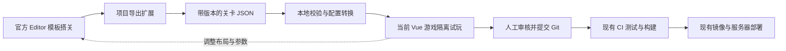

# PlayCanvas 可视化关卡制作接入方案

日期：2026-09-14。状态：**方案完成，Editor接入尚未实施**。依据当前项目源码、资源结构和本次读取的PlayCanvas官方文档制定。两条新赛道开发独立继续，不以编辑器接入为前置条件。

## 1. 决策与目标

采用官方PlayCanvas Editor作为关卡制作工具，增加项目专用模板、参数和数据导出适配。第一阶段仍使用当前Vue游戏进行真实试玩，保留现有游戏运行时、皮肤商城、设置、成绩和CI/CD。

关卡作者最终可以：拖入直路/弯道/坡和机关，调整位置、方向与开放参数，标记起点/检查点/终点，导出后在当前游戏中试玩。后续加入端口吸附、运动范围显示和分支关系辅助，不从零制作整套3D编辑器。

本方案面向项目内部制作关卡。面向普通玩家的站内创作功能、完全离线编辑、实时多人游戏、在线关卡市场不属于首期目标。官方网站的Editor和游戏内的渲染画布是两个入口，首期不在本站新增一个假装完整Editor的页面。

## 2. 已核实的官方能力与项目缺口

官方已提供3D视口、变换工具、层级、属性面板、资源导入、模板/实例覆盖、协作、版本管理、Launch运行和自托管应用导出。Script Attributes能把脚本参数显示为Inspector字段；官方推荐ESM脚本，使用.mjs与JSDoc声明属性。

Import Hierarchy会把已有模型层级导入为Template/Render等资源，保留可操作的网格节点。它不会把已经合并的网格自动还原为道路组件。当前三关静态track GLB均为一个TrackStatic节点和一个mesh；共享五机关库则有五个独立根、34节点、18mesh，可作为模板的基础。

需要我们补充的部分包括：轨道模块与碰撞的一致描述、机关参数封装、稳定实例标识、项目JSON导出转换、分支进度数据、试玩入口，以及后续端口吸附/扫掠显示。Editor不会自动理解当前LevelConfig，也不会自动实现蹦床、喷气等新行为。

官方Editor API可扩展界面和操作数据，但文档仍标Beta；其示例部分界面挂载涉及私有API，应将扩展集中隔离。官方MCP可协助操作已打开的Editor项目，但不是项目JSON导出器或物理正确性的替代品。

## 3. 制作与发布流程



导出扩展的首版操作是下载JSON文件；本地导入通过明确的文件选择或开发命令完成。浏览器不直接写入项目目录。官方应用ZIP自托管是另一条完整应用发布路径，不把ZIP当本项目关卡JSON，也不将官方生成的index.html覆盖现有Vue入口。

GitHub Actions继续构建仓库中的代码和审核后的资源；首期不在CI里登录在线Editor或每次自动下载“最新场景”，避免同一提交构建出不同关卡。

## 4. 数据归属与版本

- 已接入Editor制作的关卡，其可编辑布局源以Editor场景为准；导出JSON是版本化产物，进入Git后可审查和复现。
- 玩法、模板描述、导出器与转换器源码以Git为准。首期不做Editor与本地TS的双向布局同步。
- 现有三关继续使用原有配置/GLB，不一次性迁移。两条正在开发的新关优先复用其多实例/分支协议，后续再导入或按模块重组为Editor制作源。
- `docs/integration/course-authoring-contract.md`由代码任务在两关开发中制定。Editor导出应适配这份正式协议，不能再创造一套互不兼容的机关或分支执行模型。本方案中的字段是建议草案，不是已存在API。
- 区分关卡id、关卡规则版本、导出schema版本和资产版本。调整规则不能把旧成绩混入新桶；调整制作工具schema不应无故更改玩法版本。
- 每次导出记录来源场景/制作版本、schema版本、组件目录版本和使用的资产清单指纹。Editor数值asset ID仅作来源信息，运行资源使用稳定逻辑键，不写成不可移植的运行地址。

## 5. 模板与可编辑参数

建议在Editor项目里分为Tracks、Obstacles、Markers和AuthoringTools四类资源文件夹。

首期只制作直路、90度弯路、伸缩推墙、起点、检查点、终点六类模板。验证成功后扩到坡、细梁、蛇形模块及全部13类机关。导入五机关共享包后，为目标根分别建外层模板，复用底层Render/材质；不要每次拖一个机关都实例化五个重叠根，也不要重新上传五份完整GLB。

每个模板结构建议为：

```text
实例根：稳定 instanceId / kind / 制作参数
├─ Visual：真实外观或明确标注的制作预览
├─ Ports：入口、出口或多个分流出口标记
└─ Guides：碰撞代理/轴心/扫掠范围的制作辅助显示
```

模板根使用米制Y-up。移动整个组件修改根位置；已有机关先开放绕Y的方向，内部枢轴保持原定义。禁止利用任意非均匀缩放把长窄板、圆筒或机关支架拉变形后继续使用旧碰撞；尺寸通过组件支持的明确参数改变，不支持的缩放在导出时指出。

可编辑字段按类别开放：

- 通用：实例id、类型、位置、支持的方向、资源逻辑键。
- 推墙：行程、五阶段时长、时间相位；杆身由同一端点/半径数据决定外观与真实碰撞。
- 翻板：开角、四阶段时长、预告时长、相位。
- 跷跷板：已支持的板参数、质量、恢复力/阻尼、限角；角度仍由真实负载驱动，不增加定时摆动字段。
- 十字/平台/升降/摆锤：按正式多实例协议开放速度、相位、振幅等，不在Editor重复另一套公式。
- 标记：检查顺序或条件节点、重生位置、终点要求；分支节点单独说明。

玩家质量、直径、重力、控制、摩擦、刹车、速度限制和镜头手感不作为普通关卡作者随手修改的字段。

ESM属性脚本只承担制作参数声明和必要预览。若源码用TypeScript维护，发布为Editor可识别的.mjs并保留属性声明所需JSDoc；构建裁剪/压缩不能删除这些声明。Import Map用于本项目已上传的模块别名，不因方便而新增运行CDN依赖。

## 6. 轨道模块化和外观/碰撞一致性

已有整关静态模型可作为只读参考背景，不能宣称导入后已经能任意拆改其中的S弯。真正搭路采用以下两类组件：

1. 固定规格组件：直段、固定半径弯、支撑和短接头，模型与代理在组件定义中绑定。
2. 有限参数组件：允许明确范围内的长度/坡角/曲率，统一几何描述生成外观与碰撞，或选择已经配套的规格。不能只拉模型外观。

每个组件目录条目绑定逻辑资源、局部原点、主体/固定代理、可编辑参数和端口。端口至少描述局部位置、朝向、通行宽度和名义高度；动态端口还引用运动部件与参数，不能用零姿态判断所有时刻都接平。

静态路面生成沿用已经修复白层缺面的稳定方案，保留蛇形内侧空区。不同制作语言若需生成同一组件，必须消费同一几何数据并做对齐检查，不维护两套独立手调尺寸。

编辑辅助线和半透明代理只用于制作显示，不与正式运行体重复参与碰撞。材质继续保留现有语义名与警示分区，确保七款主题可用；小球皮肤和水面材质仍由现有运行时管理。

## 7. 导出协议和校验

导出器从选定的关卡根读取实例、标记与连接，输出规范化的纯数据。格式在代码任务正式authoring协议上确定，建议包含：

```json
{
  "schemaVersion": 1,
  "courseId": "editor-sample",
  "rulesVersion": "standard",
  "catalogVersion": "1",
  "source": { "sceneId": "制作来源标识", "revision": "制作版本" },
  "instances": [
    {
      "id": "piston-01",
      "kind": "piston-wall",
      "position": [0, 0, 0],
      "yaw": 0,
      "parameters": { "travel": 3.7, "stages": [0.9, 0.45, 0.22, 0.65, 0.25] }
    }
  ]
}
```

以上仅展示字段职责，不是完整可玩关卡或已经支持的配置。起终点、CP、静态轨道和分支字段在正式协议确定后补齐，不把占位例子注册进游戏。

导出需要：稳定排序、有限数值、正确单位/角度转换、唯一id、支持的kind/参数、明确父子变换处理、存在的资源与端口引用。复制模板后instanceId不能重复；由显式“补齐/更新实例id”操作处理并参与Editor撤销，不在只读导出时偷偷修改场景。受支持实例的位置可以展开为世界坐标；遇到不支持的父级缩放/旋转应报错，不能悄悄丢弃。

本地转换器再次校验schema和资源清单，拒绝未知关键字段或不支持行为；错误定位到实例/字段，保留原文件。它将制作数据转换为当前正式运行配置，不执行导入文本里的JavaScript，也不根据外部任意路径加载资产。

## 8. 三路分流和连续机关

Editor首期用普通标记实体与Inspector关系字段表达分支：分流入口、A/B/C出口、支路检查标记、可重生CP、汇合和共同终点。可绘制连接线，但首期不再开发一套节点图编辑软件。

导出稳定节点id和有向连接，运行时复用正在开发的第四关状态机：只要求所选合法分支、落水保留支路与最近CP、汇合后进入公共尾段、重开清空。制作关系不能替代真实路线几何，禁止用进度判定掩盖穿模或错误接岸。

后续端口吸附应区分静态与动态：静态检查位置/方向/宽度，动态显示一个周期内的接平窗口和扫掠范围。时间窗口推导是辅助信息，跷跷板不能套固定周期。工具可以报告接头风险，不能自动承诺可通关。

## 9. 试玩方式

第一阶段：本地开发环境提供“导入制作JSON并试玩”的入口，使用当前runtime、PlayCanvas2.22.1和项目Ammo。预览关卡使用独立临时状态，不注册为正式关卡，不写个人最佳/最后游玩关卡，不触发发布；退出后恢复原菜单与用户选择。先采用本地文件导入，不引入跨站自动控制服务。

第二阶段：可增加“一键导出并打开本地试玩”的操作，但仍需用户明确加载文件或经过授权的本地桥接，不能假定浏览器能随意访问磁盘。

官方Launch直接试玩作为可选后续阶段。当前createGame会创建自己的Application和物理世界，不能把它直接塞进Editor已经创建的Application。届时抽取可复用运行核心，明确Application/物理世界/资源的所有权，通过一个轻量启动脚本接入；禁止两套世界、两个球或两份机关逻辑。实际引擎版本、色调映射、sRGB和Ammo差异必须验证。

## 10. 同步与发布

官方VS Code扩展处理文本资产，不是整个本地Git仓库与Editor资产库的自动镜像。外部工具/AI修改脚本时采用官方Pull/Push模式，先拉取、处理冲突、审查后推送；Realtime默认模式会忽略外部对未打开文件的修改，不能用它假设代码已同步。

场景修改在Editor中进行，模板脚本与导出扩展源码在Git中维护，构建后的制作工具同步到在线项目。模板更新可能传播实例覆盖；结构更新前先确认影响范围，保持网格名和父节点稳定。官方Import Hierarchy按网格及父级名称判断更新，随意重命名可能改变实例结构。

CI消费已审核JSON和资源：执行转换校验、相关测试、npm test、npm run build，之后仍走当前镜像和服务器流程。测试要覆盖导出转换、旧关兼容、实例方向/相位、分支CP和资源释放；模型/碰撞对齐与关键通路必须试玩验证。本次只写方案，不运行或修改流水线。

## 11. 分阶段实施与验收

### P0：小样接通

使用独立Editor试验场景，六类最小模板搭一个短关。完成拖摆、复制推墙实例、修改周期/方向、下载JSON、本地转换和真实试玩。

交付：模板清单、属性脚本、导出器、转换器、小样数据和实际验证记录。通过条件：外观/碰撞一起移动，复制id不冲突，参数实际生效，旧游戏与成绩未受影响，失败导入有明确报错。尚未完成账号/试验前不估算全量迁移完成率。

### P1：可日常制作

扩到13类、常用路段、制作代理显示、基础端口吸附和稳定导入错误提示。关卡作者能独立完成一个新短关并交代码审核，不再手工编辑每个坐标。

### P2：长关与分支

复用两条新赛道的正式协议，加入三路关系、分支CP、连续机关窗口与扫掠显示、长关资源分组。不能为引入Editor而重写刚完成的多实例/分支运行逻辑。

### P3：提高制作效率

视实际瓶颈考虑官方MCP批量搭建、模板批量参数、官方Launch复用运行核心、快捷试玩桥接。站内面向玩家的自建编辑器需另立产品需求，不作为本方案顺手扩展。

## 12. 文件与职责建议

以下为未来实施目录建议，均尚未创建，最终由代码任务在接入协议里确认：

- CODE：`tools/playcanvas-editor/`的属性声明与导出扩展，`src/game/authoring/`的适配/校验及开发试玩入口，正式公共接口和测试。优先复用两关authoring协议，避免平行格式。
- LEVEL：模板参数需求、端口/连接规则、示范关和分支验收路线，`docs/levels/`内制作规范。
- ART：可复用路段/机关模板外观、固定原点与材质语义、代理和模型配套数据；当前源/GLB按既有职责维护。
- 产品统筹：阶段范围、阻塞项、验收标准与是否进入下一阶段。本方案文档位于docs/product，不代替CODE正式技术接口。

## 13. 账号、成本与当前范围

使用官方托管Editor需要PlayCanvas账号和项目。官网当前Free提供公开项目，Personal $15/月支持私有项目；实际费用/容量以开通页面为准。不要把试验自动设成公开并上传现有资产；实施P0前确定项目归属、公开/私有选择和版本流。本次没有创建账号/项目、安装扩展、配置MCP、上传文件、开通付费或开发编辑器代码。

官方MCP文档要求Node≥22.18，且一次连接一个已打开Editor会话。MCP是操作辅助；数据导出、运行校验和Git审核仍需上述正式链路。现有GitHub远程和用户自行提交/推送的偏好保持。

## 14. 官方依据

- [Editor概览](https://developer.playcanvas.com/user-manual/editor/)
- [Templates与实例覆盖](https://developer.playcanvas.com/user-manual/editor/templates/)
- [导入流程](https://developer.playcanvas.com/user-manual/editor/assets/import-pipeline/)
- [Import Hierarchy及模型更新匹配规则](https://developer.playcanvas.com/user-manual/editor/assets/import-pipeline/import-hierarchy/)
- [脚本系统与.mjs示例](https://developer.playcanvas.com/user-manual/scripting/)
- [Script Attributes与Inspector](https://developer.playcanvas.com/user-manual/scripting/script-attributes/)
- [Import Maps](https://developer.playcanvas.com/user-manual/editor/scripting/import-maps/)
- [VS Code扩展与Pull/Push](https://developer.playcanvas.com/user-manual/editor/scripting/vscode-extension/)
- [Editor API](https://developer.playcanvas.com/user-manual/editor/editor-api/)
- [Editor MCP](https://developer.playcanvas.com/user-manual/editor/mcp-server/)
- [引擎兼容性](https://developer.playcanvas.com/user-manual/editor/engine-compatibility/)
- [自托管导出](https://developer.playcanvas.com/user-manual/editor/publishing/web/self-hosting/)
- [官方Plans](https://playcanvas.com/plans)

基础取舍与本地GLB结构证据见 [编辑器评估](editor-evaluation.md)。本方案明确区分已查证的官方能力、当前项目事实与拟实施功能，尚无Editor接入试验或发布通过结论。
